# FinchBot — A Lightweight, Flexible, Self-Extending AI Agent Framework

<p align="center">
  
</p>

<p align="center">
  <em>Built on LangChain v1.2 & LangGraph v1.0<br>
  with persistent memory, dynamic prompts, autonomous capability extension</em>
</p>

<p align="center">🌐 <strong>Language</strong>: <a href="README.md">English</a> | <a href="README_CN.md">中文</a></p>

<p align="center">
  <a href="https://blog.csdn.net/Yunyi_Chi">
    
  </a>
  <a href="https://github.com/xt765/FinchBot">
    
  </a>
  <a href="https://gitee.com/xt765/FinchBot">
    
  </a>
  
  <a href="https://gitcode.com/xt765/FinchBot">
    
  </a>
</p>

<p align="center">
  
  
  
  
  
</p>

**FinchBot** is an AI Agent framework that empowers agents with true autonomy, built on **LangChain v1.2** and **LangGraph v1.0**. With fully async architecture, agents gain the ability to self-decide, self-extend, and self-evolve:

1. **Capability Self-Extension** — Agent can use built-in tools to configure MCP and create skills when hitting capability boundaries
2. **Task Self-Scheduling** — Agent can self-set background tasks and scheduled execution without blocking conversations
3. **Memory Self-Management** — Agent can self-remember, self-retrieve, and self-forget with Agentic RAG + Weighted RRF hybrid retrieval
4. **Behavior Self-Evolution** — Both Agent and users can self-modify prompts, continuously iterating and optimizing behavior

---

## The Capability Boundary Problem

| What User Asks | Traditional AI Response | FinchBot Response |
|:---|:---|:---|
| "Analyze this database" | "I don't have database tools" | Self-configures SQLite MCP, then analyzes |
| "Learn to do X" | "Wait for developer to add feature" | Self-creates skill via skill-creator |
| "Monitor this for 24 hours" | "I can only respond when you ask" | Creates scheduled task, monitors autonomously |
| "Process this large file" | Blocks conversation, user waits | Runs in background, user continues |
| "Remember my preferences" | "I'll forget next conversation" | Persistent memory with Agentic RAG + Weighted RRF |
| "Adjust your behavior" | "Prompts are fixed" | Dynamically modifies prompts, hot reload |

---

## System Architecture

**Core Philosophy**: FinchBot agents don't just respond — they self-execute, self-plan, and self-extend.

### Autonomy Pyramid

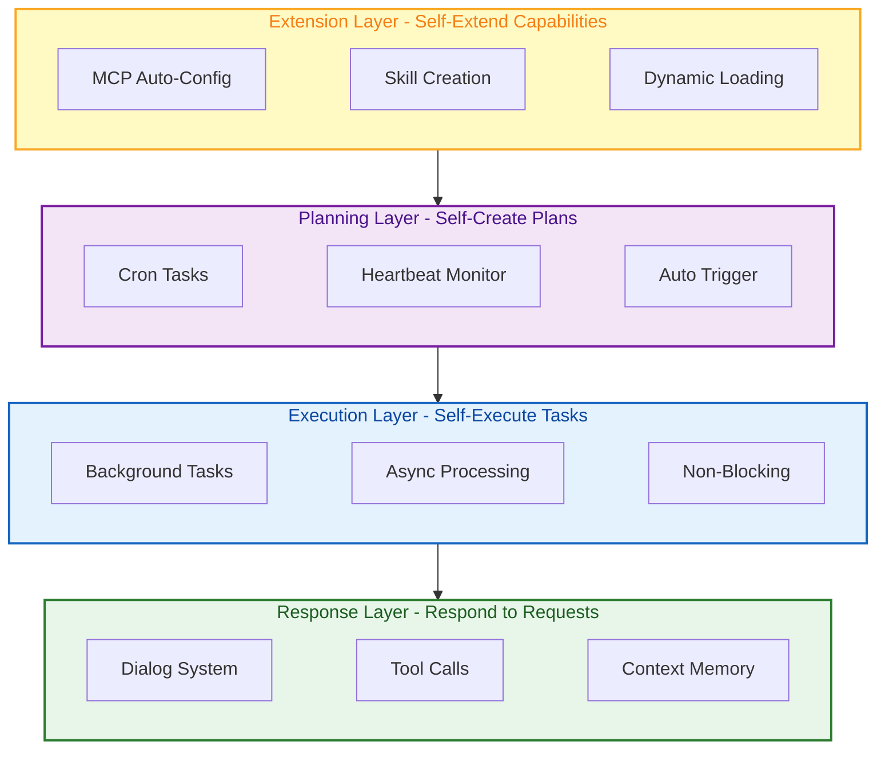

| Layer | Capability | Implementation | User Value |
|:---:|:---|:---|:---|
| **Response Layer** | Respond to user requests | Dialog system + Tool calls | Basic interaction |
| **Execution Layer** | Self-execute tasks | Background task system | Non-blocking dialog |
| **Planning Layer** | Self-create plans | Scheduled tasks + Heartbeat | Automated execution |
| **Extension Layer** | Self-extend capabilities | MCP config + Skill creation | Infinite extension |

### Overall Architecture

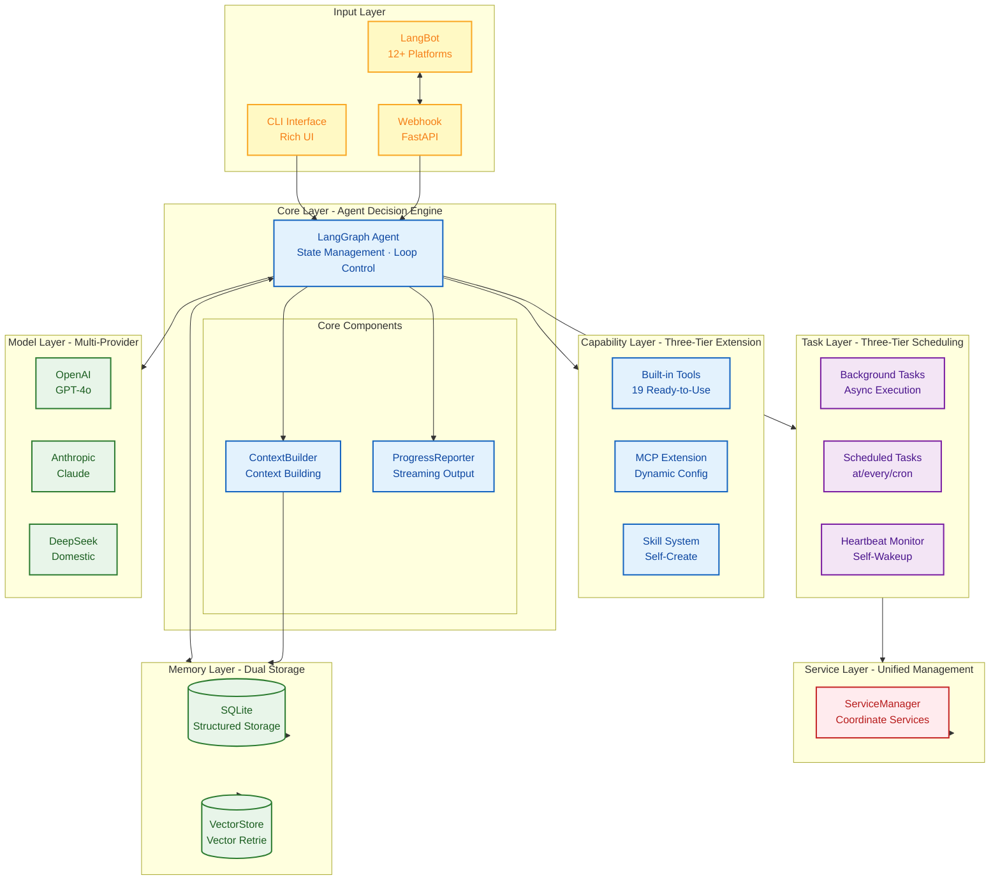

### Data Flow

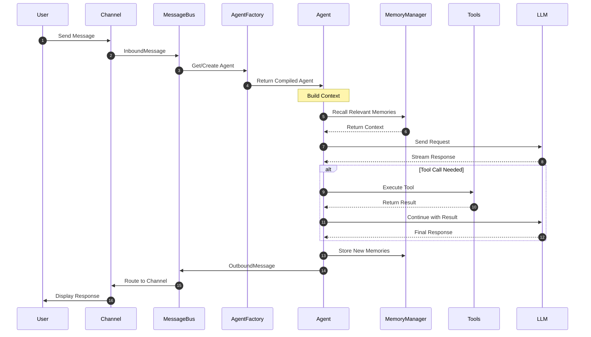

### Safety Mechanisms

**Agent autonomy doesn't mean agent anarchy.** FinchBot implements multiple safety layers:

| Safety Mechanism | Status | What It Does |
|:---|:---:|:---|
| **Path Restrictions** | ✅ Implemented | File operations limited to workspace directory |
| **Shell Command Blacklist** | ✅ Implemented | Blocks dangerous commands like `rm -rf`, `format`, `shutdown` |
| **Tool Registration** | ✅ Implemented | Only registered tools can be executed |

**Philosophy**: Give agents the freedom to solve problems, but within well-defined boundaries.

---

## Core Components

### 1. Capability Self-Extension: Built-in Tools + MCP Config + Skill Creation

FinchBot provides a three-layer capability extension mechanism, allowing agents to self-extend when hitting capability boundaries.

#### Three-Layer Extension Mechanism

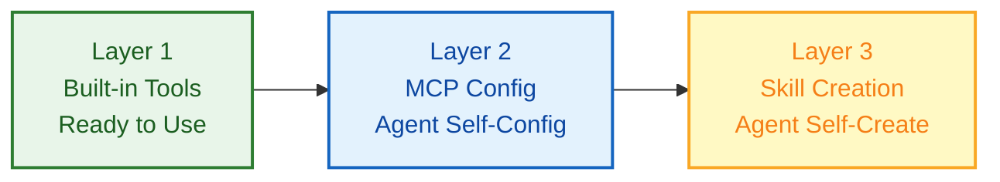

| Layer | Method | Autonomy | Description |
|:---:|:---|:---:|:---|
| Layer 1 | Built-in Tools | Ready to use | 19 built-in tools, no configuration needed |
| Layer 2 | MCP Config | Agent self-config | Dynamically add external capabilities via `configure_mcp` |
| Layer 3 | Skill Creation | Agent self-create | Create new skills via `skill-creator` |

#### Built-in Tools

| Category | Tool | Function |
| :--- | :--- | :--- |
| **File Ops** | `read_file` | Read local files |
| | `write_file` | Write local files |
| | `edit_file` | Edit file content |
| | `list_dir` | List directory contents |
| **Web** | `web_search` | Web search (Tavily/Brave/DDG) |
| | `web_extract` | Extract web content |
| **Memory** | `remember` | Store memory |
| | `recall` | Retrieve memory |
| | `forget` | Delete/archive memory |
| **System** | `exec` | Execute shell commands safely |
| **Config** | `configure_mcp` | Configure MCP servers dynamically |
| | `refresh_capabilities` | Refresh capability description |
| **Background** | `start_background_task` | Start background task |
| | `check_task_status` | Check task status |
| | `get_task_result` | Get task result |
| | `cancel_task` | Cancel task |
| **Schedule** | `create_cron` | Create scheduled task |
| | `list_crons` | List all scheduled tasks |
| | `delete_cron` | Delete scheduled task |

##### Web Search

`web_search` tool uses a three-engine fallback design, ensuring it always works:

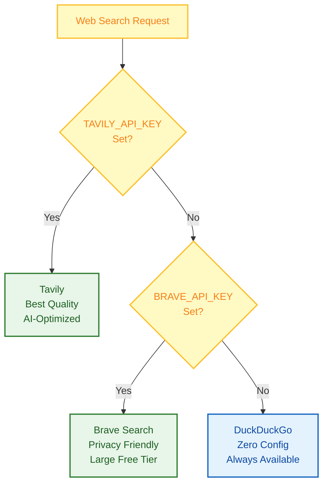

| Priority |         Engine         |   API Key   | Features                                |
| :------: | :--------------------: | :----------: | :-------------------------------------- |
|    1    |    **Tavily**    |   Required   | Best quality, AI-optimized, deep search |
|    2    | **Brave Search** |   Required   | Large free tier, privacy-friendly       |
|    3    |  **DuckDuckGo**  | Not required | Always available, zero config           |

##### Session Management

`session_title` tool makes session naming smart:

|         Method         | Description                                                        | Example                                  |
| :---------------------: | :----------------------------------------------------------------- | :--------------------------------------- |
| **Auto Generate** | After 2-3 turns, AI automatically generates title based on content | "Python Async Programming Discussion"    |
| **Agent Modify** | Tell Agent "Change session title to XXX"                           | Agent calls tool to modify automatically |
| **Manual Rename** | Press `r` key in session manager to rename                       | User manually enters new title           |

#### MCP Configuration

Agents can autonomously manage MCP servers through the `configure_mcp` tool:

| Operation | Description |
| :--- | :--- |
| `add` | Add new MCP server |
| `update` | Update existing server configuration |
| `remove` | Delete MCP server |
| `enable` | Enable disabled MCP server |
| `disable` | Temporarily disable MCP server |
| `list` | List all configured servers |

**Dynamic Capability Updates**:

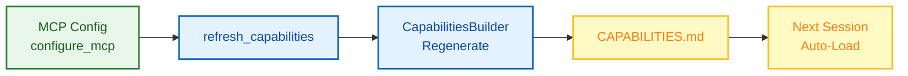

#### Skill Creation

FinchBot includes a built-in **skill-creator** skill, allowing agents to autonomously create new skills:

```
User: Help me create a translation skill that can translate Chinese to English

Agent: Okay, I'll create a translation skill for you...
       [Invokes skill-creator skill]
       ✅ Created skills/translator/SKILL.md
       You can now use the translation feature directly!
```

No manual file creation, no coding—**extend Agent capabilities with just one sentence**!

#### Skill File Structure

```
skills/
├── skill-creator/        # Skill creator (Built-in) - Core of out-of-the-box
│   └── SKILL.md
├── summarize/            # Intelligent summarization (Built-in)
│   └── SKILL.md
├── weather/              # Weather query (Built-in)
│   └── SKILL.md
└── my-custom-skill/      # Agent auto-created or user-defined
    └── SKILL.md
```

#### Design Highlights

|            Feature            | Description                                       |
| :---------------------------: | :------------------------------------------------ |
|  **Agent Auto-Create**  | Tell Agent your needs, auto-generates skill files |
|  **Dual Skill Source**  | Workspace skills first, built-in skills fallback  |
|  **Dependency Check**  | Auto-check CLI tools and environment variables    |
| **Cache Invalidation** | Smart caching based on file modification time     |
| **Progressive Loading** | Always-on skills first, others on demand          |

### 2. Task Self-Scheduling: Background Tasks + Scheduled Tasks + Heartbeat Service

FinchBot implements a three-layer task scheduling mechanism, enabling agents to autonomously execute, plan, and monitor tasks.

#### Three-Layer Scheduling Mechanism

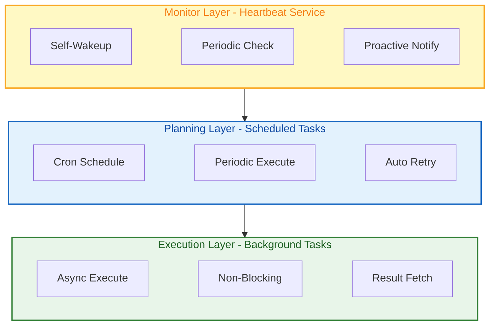

| Layer | Function | Features | Use Case |
|:---:|:---|:---|:---|
| Execution Layer | Background Tasks | Async execution, non-blocking dialog | Long-running tasks |
| Planning Layer | Scheduled Tasks | Periodic execution, automated running | Regular reminders, scheduled reports |
| Monitor Layer | Heartbeat Service | Proactive check, self-wakeup | Condition monitoring, status tracking |

#### Background Tasks

FinchBot implements a **four-tool pattern** for asynchronous task execution:

| Tool | Function | Agent Autonomy |
| :--- | :--- | :--- |
| `start_background_task` | Start background task | Agent self-determines if background execution needed |
| `check_task_status` | Check task status | Agent self-decides when to check |
| `get_task_result` | Get task result | Agent self-decides when to get result |
| `cancel_task` | Cancel task | Agent self-decides whether to cancel |

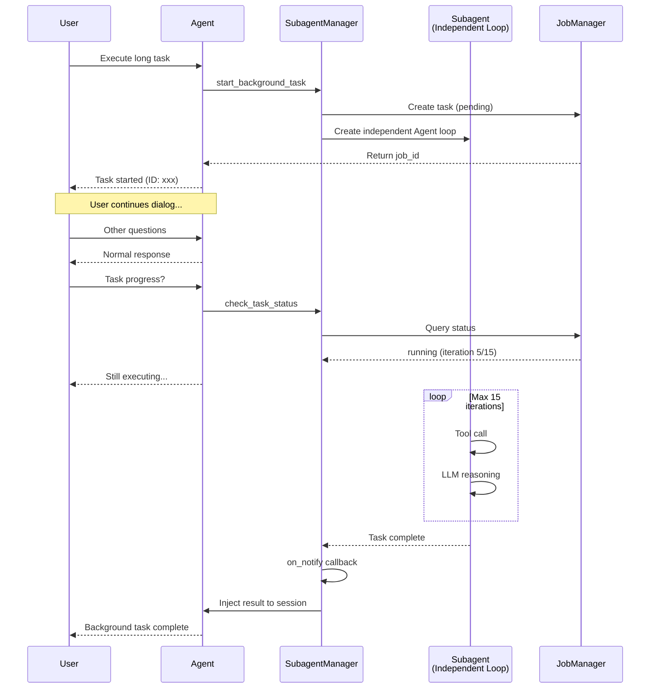

#### Scheduled Tasks

FinchBot's scheduled task system enables agents to autonomously create and manage periodic tasks:

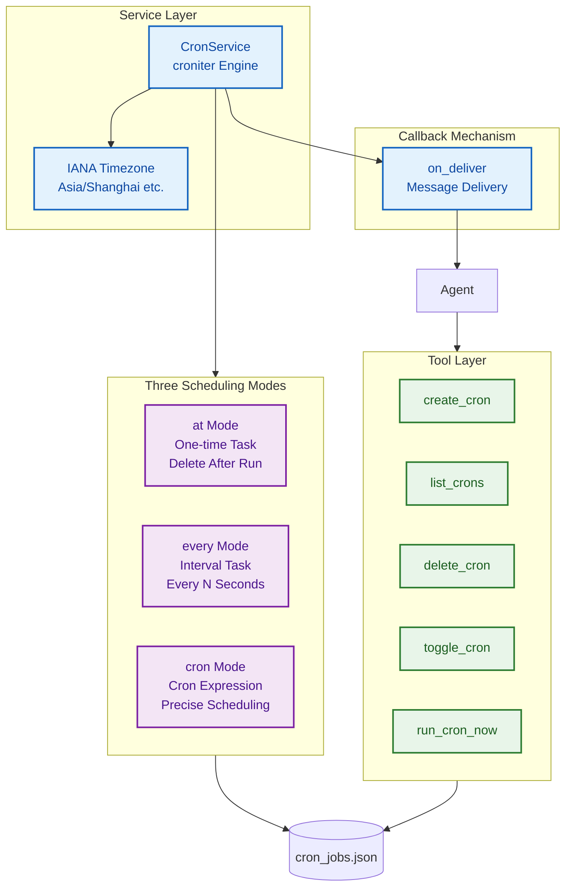

**Core Features**:

| Feature | Description |
| :--- | :--- |
| **Three Scheduling Modes** | `at` (one-time), `every` (interval), `cron` (Cron expression) |
| **IANA Timezone Support** | Specify timezone like `Asia/Shanghai`, `America/New_York` |
| **Cron Expressions** | Standard Cron syntax for flexible scheduling |
| **Persistent Storage** | Tasks saved in JSON, auto-recover after restart |
| **Auto Retry** | Automatic retry on failure for reliability |
| **Status Tracking** | Execution history for audit and debugging |
| **Message Delivery** | `on_deliver` callback injects results into session |

**Three Scheduling Modes**:

| Mode | Parameter | Description | Example |
| :--- | :--- | :--- | :--- |
| **at** | `at="2025-01-15T10:30:00"` | One-time task, deleted after execution | Meeting reminder |
| **every** | `every_seconds=3600` | Interval task, runs every N seconds | Health check every hour |
| **cron** | `cron_expr="0 9 * * *"` | Cron expression for precise scheduling | Daily report at 9 AM |

**Common Cron Expressions**:

| Expression | Description |
| :--- | :--- |
| `0 9 * * *` | Daily at 9:00 AM |
| `0 */2 * * *` | Every 2 hours |
| `30 18 * * 1-5` | Weekdays at 6:30 PM |
| `0 0 1 * *` | First day of month at midnight |
| `0 0 * * 0` | Every Sunday at midnight |

**Usage Example**:

```
User: Remind me to check emails every morning at 9

Agent: Okay, I'll create a scheduled task...
       [Invokes create_cron tool]
       ✅ Scheduled task created
       - Trigger: Daily at 09:00
       - Task: Remind to check emails
       - Next run: Tomorrow 09:00
```

#### Heartbeat Service

The heartbeat service enables the Agent to periodically "wake up" and check for pending tasks, achieving true autonomous operation.

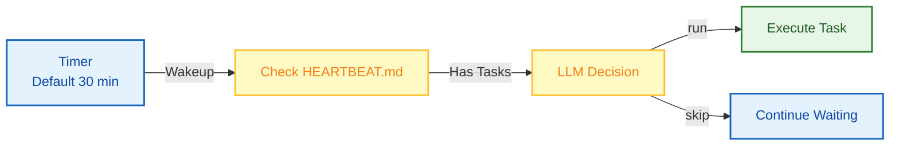

**Core Features**:

| Feature | Description |
| :--- | :--- |
| **Self-Wakeup** | Agent proactively checks without user trigger |
| **LLM Decision** | LLM intelligently decides whether to execute tasks |
| **Flexible Config** | Customizable check interval (default 30 minutes) |
| **Session Bound** | Starts and stops with chat session |

**Workflow**:

1. Agent automatically starts heartbeat service during conversation
2. Periodically checks `HEARTBEAT.md` file at specified intervals
3. If content exists, LLM decides whether to execute
4. LLM returns `run` to execute, `skip` to wait for next check

**Usage Example**:

```
User: Monitor stock price for me, notify when it drops below 100

Agent: Okay, I'll record this task in HEARTBEAT.md...
       The heartbeat service will periodically check the stock price
       You'll be notified when the condition is met
```

### 3. Memory Self-Management: Agentic RAG + Weighted RRF Hybrid Retrieval

FinchBot implements an advanced dual-layer memory architecture, enabling agents to autonomously remember, retrieve, and forget.

#### Agentic RAG Advantages

|          Dimension          | Traditional RAG         | Agentic RAG (FinchBot)                       |
| :--------------------------: | :---------------------- | :------------------------------------------- |
| **Retrieval Trigger** | Fixed pipeline          | Agent autonomous decision                    |
| **Retrieval Strategy** | Single vector retrieval | Hybrid retrieval + dynamic weight adjustment |
| **Memory Management** | Passive storage         | Active remember/recall/forget                |
|   **Classification**   | None                    | Auto-classification + importance scoring     |
|  **Update Mechanism**  | Full rebuild            | Incremental sync                             |

#### Memory Tools

Agents can autonomously manage memory through three core tools:

| Tool | Function | Use Case |
| :--- | :--- | :--- |
| `remember` | Proactively store memories | User preferences, important info, context |
| `recall` | Retrieve memories | Find historical info, recall context |
| `forget` | Delete/archive memories | Expired info, wrong memories, privacy cleanup |

**Usage Example**:

```
User: Remember I prefer to communicate in Chinese

Agent: Okay, I'll remember this preference.
       [Invokes remember tool]
       ✅ Stored: User preference - Language: Chinese

User: What language preference did I mention?

Agent: [Invokes recall tool]
       You told me you prefer to communicate in Chinese.
```

#### Dual-Layer Storage Architecture

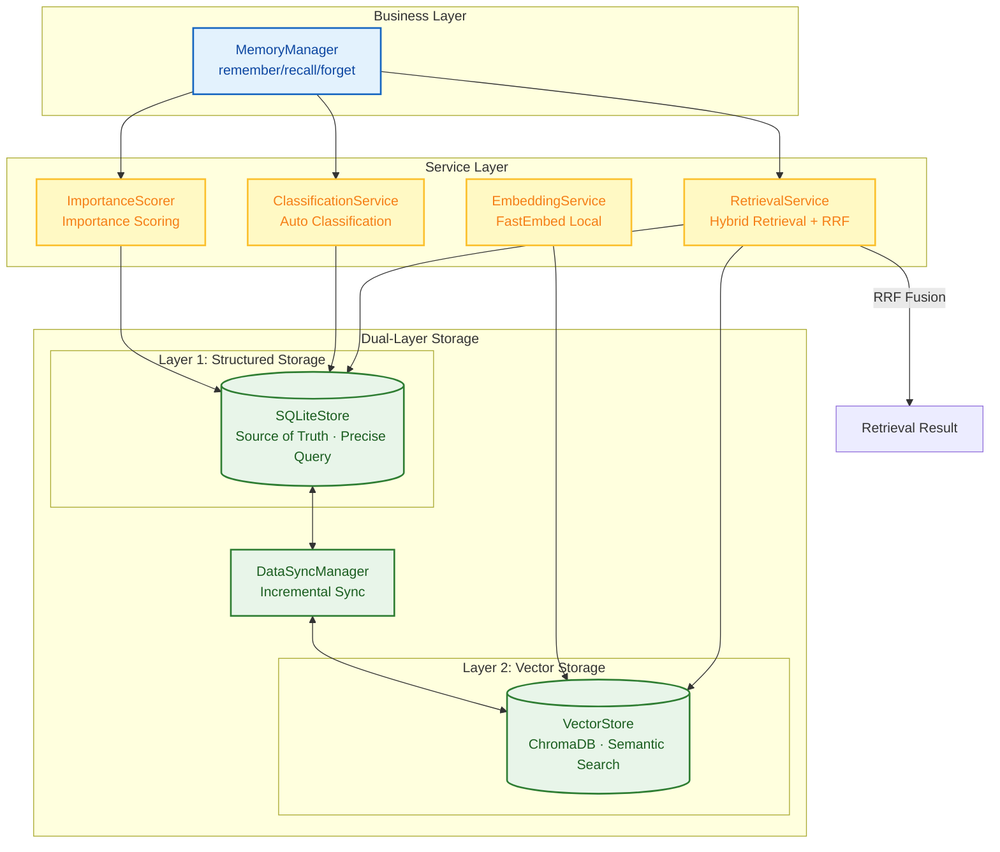

#### Hybrid Retrieval Strategy

FinchBot uses **Weighted RRF (Weighted Reciprocal Rank Fusion)** strategy:

| Advantage | Description |
| :--- | :--- |
| **Normalization-Free** | Calculates based on rank position only, no need to understand vector or BM25 score distributions |
| **Outlier-Resistant** | Insensitive to anomalous results from single retrievers, more stable |
| **Consensus-First** | Rewards documents recognized by multiple retrievers, not single outliers |
| **Controllable Weights** | Dynamically adjust keyword/semantic retrieval weights by query type |

**Query Type Adaptive Weights**:

```python
class QueryType(StrEnum):
    """Query type determines retrieval weights (keyword weight / semantic weight)"""
    KEYWORD_ONLY = "keyword_only"      # Pure keyword (1.0/0.0)
    SEMANTIC_ONLY = "semantic_only"    # Pure semantic (0.0/1.0)
    FACTUAL = "factual"                # Factual (0.8/0.2)
    CONCEPTUAL = "conceptual"          # Conceptual (0.2/0.8)
    COMPLEX = "complex"                # Complex (0.5/0.5)
    AMBIGUOUS = "ambiguous"            # Ambiguous (0.3/0.7)
```

**RRF Formula**:

```
RRF(d) = Σ (weight_r / (k + rank_r(d)))

Where:
- d is a document
- k is a smoothing constant (typically 60)
- rank_r(d) is the rank of document d in retriever r
- weight_r is the weight for retriever r
```

#### Design Highlights

| Feature | Description |
| :--- | :--- |
| **Autonomous Decision** | Agent selects appropriate retrieval weights based on query content |
| **Dynamic Adjustment** | Factual queries favor keywords, conceptual queries favor semantics |
| **Iterative Validation** | If results are unsatisfactory, adjust strategy and retry |
| **Explainability** | Each retrieval decision has clear weight-based justification |

### 4. Behavior Self-Evolution: Dynamic Prompt System

FinchBot's prompt system uses file system + modular assembly design, enabling both agents and users to autonomously modify behavior.

#### Dynamic Prompt Advantages

| Traditional Approach | FinchBot Approach |
| :--- | :--- |
| Prompts hardcoded in source | Prompts stored in file system |
| Changes require redeployment | Changes take effect on next conversation |
| Users cannot customize | Users can customize by editing files |
| Agent cannot adjust its behavior | Agent can autonomously optimize prompts |

#### Bootstrap File System

```
~/.finchbot/
├── config.json              # Main configuration file
└── workspace/
    ├── bootstrap/           # Bootstrap files directory
    │   ├── SYSTEM.md        # Role definition (identity, duties, constraints)
    │   ├── MEMORY_GUIDE.md  # Memory usage guide (when to store/retrieve)
    │   ├── SOUL.md          # Personality settings (tone, style)
    │   └── AGENT_CONFIG.md  # Agent configuration (model params, behavior)
    ├── config/              # Configuration directory
    │   └── mcp.json         # MCP server configuration
    ├── generated/           # Auto-generated files
    │   ├── TOOLS.md         # Tool documentation (auto-generated)
    │   └── CAPABILITIES.md  # Capabilities info (auto-generated)
    ├── skills/              # Custom skills
    ├── memory/              # Memory storage
    └── sessions/            # Session data
```

**Bootstrap Files Explained**:

| File | Purpose | Example Content |
| :--- | :--- | :--- |
| `SYSTEM.md` | Define Agent's identity and duties | "You are an intelligent assistant skilled at..." |
| `MEMORY_GUIDE.md` | Guide Agent on memory usage | "User preferences should be stored in long-term memory..." |
| `SOUL.md` | Define Agent's personality | "Your responses should be concise and friendly..." |
| `AGENT_CONFIG.md` | Agent behavior configuration | Default language, response style, etc. |

#### Prompt Building Flow

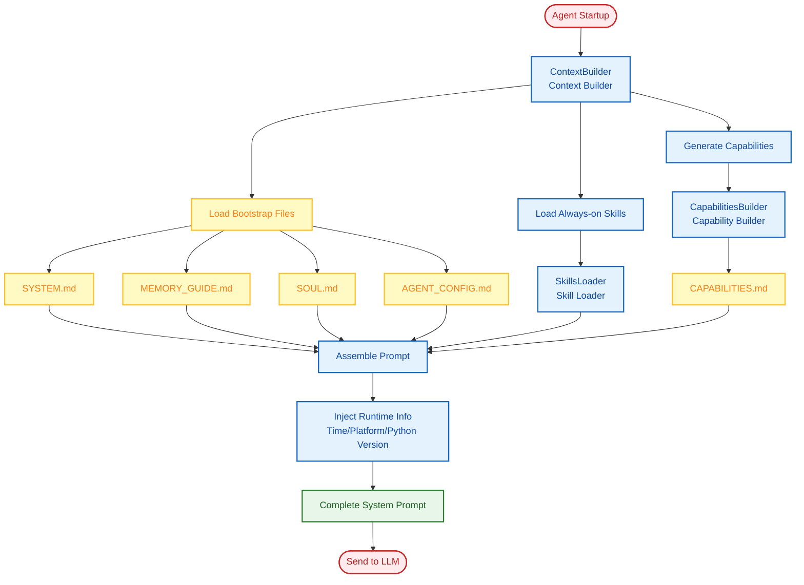

#### Auto-Generated Capabilities

`CapabilitiesBuilder` automatically generates capability descriptions, letting the Agent "know" its abilities:

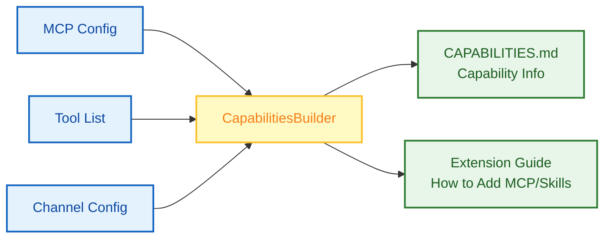

**Generated CAPABILITIES.md Contains**:

1. **MCP Server Status** — Configured servers list, enabled/disabled state
2. **MCP Tool List** — Available tools grouped by server
3. **Channel Configuration** — LangBot connection status
4. **Extension Guide** — How to add new MCP servers and skills

#### Hot Reload Mechanism

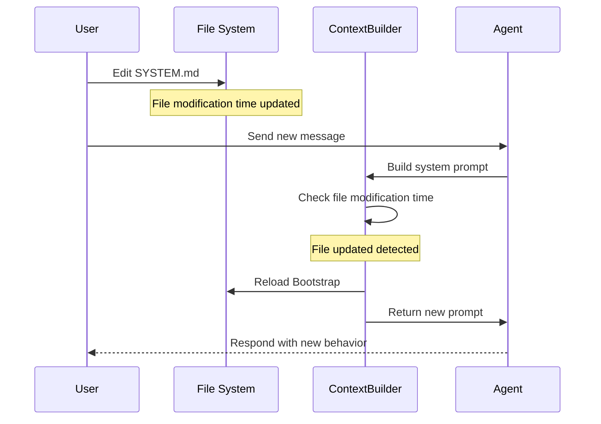

**Core Features**:

| Feature | Description |
| :--- | :--- |
| **User Customizable** | Edit Bootstrap files to customize Agent behavior |
| **Agent Adjustable** | Agent can modify its own prompts via `write_file` tool |
| **Immediate Effect** | Changes auto-load on next conversation, no restart needed |
| **Smart Caching** | File modification time-based caching, avoids redundant builds |

#### Usage Examples

**User Customizing Agent Personality**:

```bash
# Edit SOUL.md file
echo "You are a witty assistant who likes to use metaphors to explain complex concepts." > ~/.finchbot/workspace/bootstrap/SOUL.md

# Takes effect on next conversation
```

**Agent Self-Optimizing Prompts**:

```
User: Your responses are too verbose, be more concise

Agent: Okay, I'll adjust my response style.
       [Calls write_file tool to update SOUL.md]
       ✅ Updated my behavior configuration, I'll be more concise now.
```

### 5. Channel System: Multi-Platform Messaging

FinchBot integrates with LangBot for production-grade multi-platform messaging.

#### LangBot Integration

**Why LangBot?**
- 15k+ GitHub Stars, actively maintained
- Supports 12+ platforms: QQ, WeChat, WeCom, Feishu, DingTalk, Discord, Telegram, Slack, LINE, KOOK, Satori
- Built-in WebUI for easy configuration
- Plugin ecosystem with MCP support

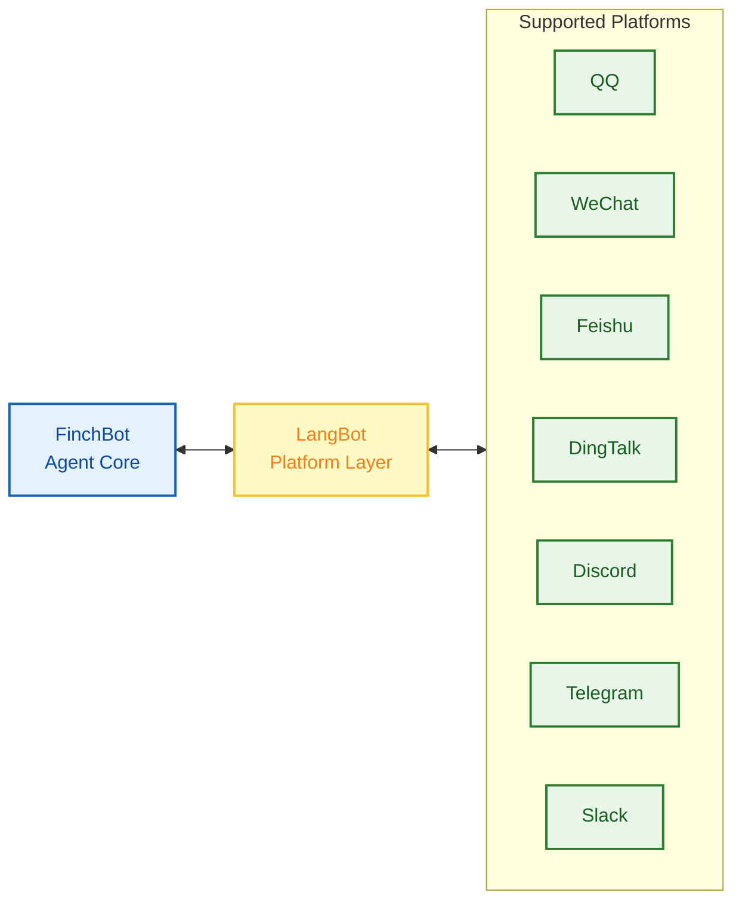

#### Webhook Integration Flow

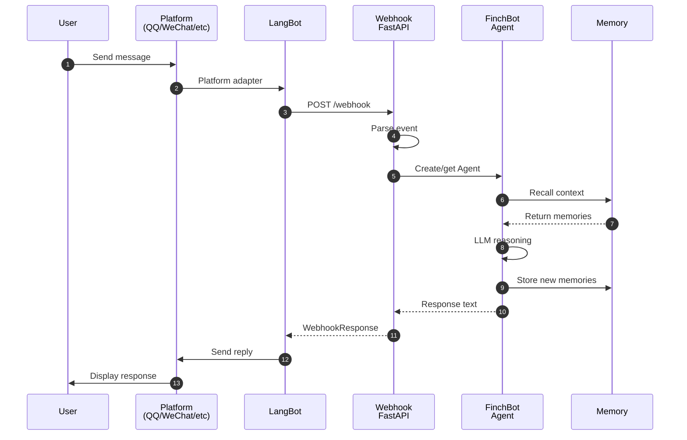

#### Quick Start with LangBot

```bash
# Terminal 1: Start FinchBot Webhook Server
uv run finchbot webhook --port 8000

# Terminal 2: Start LangBot
uvx langbot

# Access LangBot WebUI at http://localhost:5300
# Configure your platform and set webhook URL:
# http://localhost:8000/webhook
```

#### Webhook Configuration

| Setting | Description | Default |
| :--- | :--- | :--- |
| `langbot_url` | LangBot API URL | `http://localhost:5300` |
| `langbot_api_key` | LangBot API Key | - |
| `langbot_webhook_path` | Webhook endpoint path | `/webhook` |

For more details, see [LangBot Documentation](https://docs.langbot.app).

---

## Quick Start

### Prerequisites

|      Item      | Requirement             |
| :-------------: | :---------------------- |
|       OS       | Windows / Linux / macOS |
|     Python     | 3.13+                   |
| Package Manager | uv (Recommended)        |

### Installation

```bash
# Clone repository (choose one)
# Gitee (recommended for users in China)
git clone https://gitee.com/xt765/finchbot.git
# or GitHub
git clone https://github.com/xt765/finchbot.git

cd finchbot

# Install dependencies
uv sync
```

> **Note**: The embedding model (~95MB) will be automatically downloaded to the local cache when you run the application for the first time.

<details>
<summary>Development Installation</summary>

```bash
uv sync --extra dev
```

This includes: pytest, ruff, basedpyright

</details>

### Basic Usage

```bash
# Step 1: Configure API keys
uv run finchbot config

# Step 2: Start chatting
uv run finchbot chat

# Step 3: Manage sessions
uv run finchbot sessions

# Step 4: Manage scheduled tasks
uv run finchbot cron

# Step 5: Start webhook server (for LangBot integration)
uv run finchbot webhook --port 8000
```

| Command | Function |
| :--- | :--- |
| `finchbot config` | Interactive configuration for LLM providers, API keys |
| `finchbot chat` | Start or continue an interactive conversation |
| `finchbot sessions` | Full-screen session manager |
| `finchbot cron` | Scheduled task manager |
| `finchbot webhook` | Start webhook server for LangBot integration |

### Docker Deployment

```bash
# 1. Clone repository
git clone https://github.com/xt765/finchbot.git
cd finchbot

# 2. Configure environment
cp .env.example .env
# Edit .env and add your API keys

# 3. Start service
docker-compose up -d

# 4. Enter container to use
docker exec -it finchbot finchbot chat
```

### Environment Variables

```bash
# Method 1: Set directly
export OPENAI_API_KEY="your-api-key"
uv run finchbot chat

# Method 2: Use .env file
cp .env.example .env
# Edit .env and add your API keys
```

### Log Level

```bash
finchbot chat          # Default: WARNING and above
finchbot -v chat       # INFO and above
finchbot -vv chat      # DEBUG and above (debug mode)
```

---

## Tech Stack

|       Layer       | Technology        | Version |
| :----------------: | :---------------- | :------: |
|   Core Language   | Python            |  3.13+  |
|  Agent Framework  | LangChain         | 1.2.10+ |
|  State Management  | LangGraph         |  1.0.8+  |
|  Data Validation  | Pydantic          |    v2    |
|   Vector Storage   | ChromaDB          |  0.5.0+  |
|  Local Embedding  | FastEmbed         |  0.4.0+  |
|   CLI Framework   | Typer             | 0.23.0+ |
|     Rich Text     | Rich              | 14.3.0+ |
|      Logging      | Loguru            |  0.7.3+  |

---

## Extension Guide

### Adding Tools

**Built-in Tools**: Use the `@tool` decorator to define tools, automatically registered to the `ToolRegistry` singleton.

```python
from finchbot.tools.decorator import tool
from finchbot.tools.core import ToolCategory

@tool(
    name="my_tool",
    description="Tool description",
    category=ToolCategory.FILE,
)
async def my_tool(param: str) -> str:
    """Tool implementation"""
    return "result"
```

**MCP Tools**: Configure MCP servers in `finchbot config`, or edit `~/.finchbot/workspace/config/mcp.json`.

### Adding Skills

Create a `SKILL.md` file in `~/.finchbot/workspace/skills/{skill-name}/`, or let Agent create via `skill-creator`.

### Adding LLM Providers

Add a new Provider class in `providers/factory.py`.

### Multi-Platform Support

Use [LangBot](https://github.com/langbot-app/LangBot) for multi-platform messaging support, see [LangBot Documentation](https://docs.langbot.app).

---

## Documentation

[User Guide](docs/en-US/guide/usage.md) • [API Reference](docs/en-US/api.md) • [Configuration](docs/en-US/config.md) • [Extension Guide](docs/en-US/guide/extension.md) • [Architecture](docs/en-US/architecture.md) • [Deployment](docs/en-US/deployment.md) • [Development](docs/en-US/development.md) • [Contributing](docs/en-US/contributing.md)

---

## Contributing

Contributions are welcome! Please read the [Contributing Guide](docs/en-US/contributing.md) for more information.

---

## License

This project is licensed under the [MIT License](LICENSE).
