# FinchBot (雀翎) — 轻量灵活，自主扩展的 AI Agent 框架

<p align="center">
  
</p>

<p align="center">
  <em>基于 LangChain v1.2 与 LangGraph v1.0 构建<br>
  具备持久记忆、动态提示词、自主能力扩展</em>
</p>

<p align="center">🌐 <strong>Language</strong>: <a href="README.md">English</a> | <a href="README_CN.md">中文</a></p>

<p align="center">
  <a href="https://blog.csdn.net/Yunyi_Chi">
    
  </a>
  <a href="https://github.com/xt765/FinchBot">
    
  </a>
  <a href="https://gitee.com/xt765/FinchBot">
    
  </a>
  
</p>

<p align="center">
  
  
  
  
  
</p>

**FinchBot (雀翎)** 是一个赋予智能体真正自主性的 AI Agent 框架，基于 **LangChain v1.2** 和 **LangGraph v1.0** 构建。全异步架构设计，让智能体具备自主决策、自主扩展、自主进化的能力：

1. **能力自扩展** — Agent 遇到能力边界时，可使用内置工具配置 MCP、创建技能
2. **任务自调度** — Agent 可自主设定后台任务、定时执行，不阻塞对话
3. **记忆自管理** — Agent 可自主记忆、检索、遗忘，Agentic RAG + 加权 RRF 混合检索，智能召回
4. **行为自进化** — Agent 和用户都可自主修改提示词，持续迭代优化行为

---

## 能力边界问题

| 用户请求 | 传统 AI 回应 | FinchBot 回应 |
|:---|:---|:---|
| "分析这个数据库" | "我没有数据库工具" | 自主配置 SQLite MCP，然后分析 |
| "学会做某事" | "等开发者添加功能" | 通过 skill-creator 自主创建技能 |
| "帮我监控 24 小时" | "我只能在你问的时候响应" | 创建定时任务，自主监控 |
| "处理这个大文件" | 阻塞对话，用户等待 | 后台执行，用户继续 |
| "记住我的偏好" | "下次对话就忘了" | 持久记忆，Agentic RAG + 加权 RRF 混合检索 |
| "调整你的行为" | "提示词是固定的" | 动态修改提示词，热加载 |

---

## 系统架构

**核心理念**：FinchBot 智能体不只是响应 — 它们自主执行、自主规划、自主扩展。

### 自主性金字塔

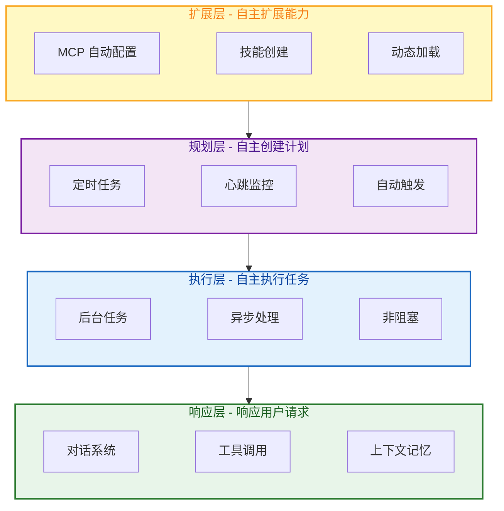

| 层级 | 能力 | 实现方式 | 用户价值 |
|:---:|:---|:---|:---|
| **响应层** | 响应用户请求 | 对话系统 + 工具调用 | 基础交互 |
| **执行层** | 自主执行任务 | 后台任务系统 | 对话不阻塞 |
| **规划层** | 自主创建计划 | 定时任务 + 心跳服务 | 自动化执行 |
| **扩展层** | 自主扩展能力 | MCP 配置 + 技能创建 | 无限扩展 |

### 整体架构

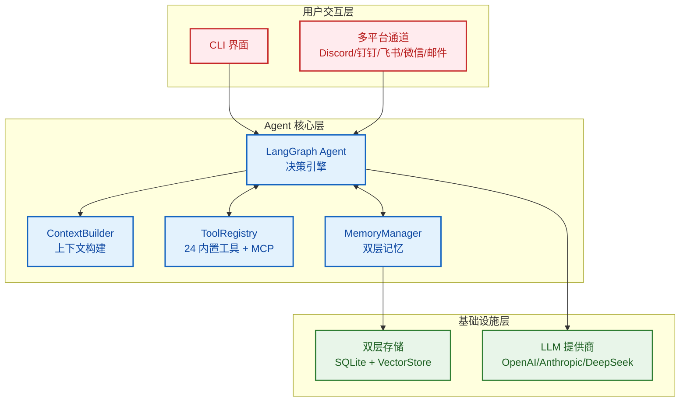

### 数据流

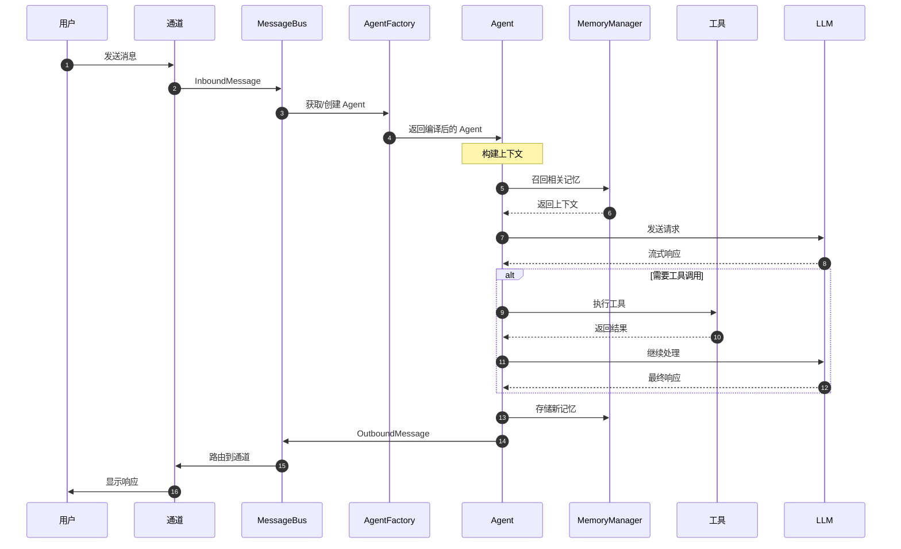

### 安全机制

**智能体自主 ≠ 智能体乱来。** FinchBot 实现了多重安全机制：

| 安全机制 | 状态 | 作用 |
|:---|:---:|:---|
| **路径限制** | ✅ 已实现 | 文件操作限定在 workspace 目录内 |
| **Shell 命令黑名单** | ✅ 已实现 | 阻止 `rm -rf`、`format`、`shutdown` 等危险命令 |
| **工具注册机制** | ✅ 已实现 | 只有注册的工具可被调用 |

**理念**：给智能体解决问题的自由，但在明确的边界内。

---

## 核心组件

### 1. 能力自扩展：内置工具 + MCP 配置 + 技能创建

FinchBot 提供三层能力扩展机制，让智能体遇到能力边界时可以自主扩展。

#### 内置工具

|        类别        | 工具              | 功能                        |
| :----------------: | :---------------- | :-------------------------- |
| **文件操作** | `read_file`     | 读取本地文件                |
|                    | `write_file`    | 写入本地文件                |
|                    | `edit_file`     | 编辑文件内容                |
|                    | `list_dir`      | 列出目录内容                |
| **网络能力** | `web_search`    | 联网搜索 (Tavily/Brave/DDG) |
|                    | `web_extract`   | 网页内容提取                |
| **记忆管理** | `remember`      | 主动存储记忆                |
|                    | `recall`        | 检索记忆                    |
|                    | `forget`        | 删除/归档记忆               |
| **系统控制** | `exec`          | 安全执行 Shell 命令         |
|                    | `session_title` | 管理会话标题                |
| **配置管理** | `configure_mcp` | 动态配置 MCP 服务器（支持启用/禁用/添加/更新/删除/列出） |
|                    | `refresh_capabilities` | 刷新能力描述文件   |
|                    | `get_capabilities` | 获取当前能力描述        |
|                    | `get_mcp_config_path` | 获取 MCP 配置路径    |
| **后台任务** | `start_background_task` | 启动后台任务       |
|                    | `check_task_status` | 检查任务状态         |
|                    | `get_task_result` | 获取任务结果           |
|                    | `cancel_task`   | 取消任务                    |
| **定时任务** | `create_cron`   | 创建定时任务                |
|                    | `list_crons`    | 列出所有定时任务            |
|                    | `delete_cron`   | 删除定时任务                |
|                    | `toggle_cron`   | 启用/禁用定时任务           |
|                    | `run_cron_now`  | 立即执行定时任务            |

#### 会话标题：智能命名，开箱即用

`session_title` 工具体现了 FinchBot 的开箱即用理念：

|       操作方式       | 说明                                   | 示例                   |
| :------------------: | :------------------------------------- | :--------------------- |
|  **自动生成**  | 对话 2-3 轮后，AI 自动根据内容生成标题 | "Python 异步编程讨论"  |
| **Agent 修改** | 告诉 Agent "把会话标题改成 XXX"        | Agent 调用工具自动修改 |
| **手动重命名** | 在会话管理器中按 `r` 键重命名        | 用户手动输入新标题     |

这个设计让用户**无需关心技术细节**，无论是自动还是手动，都能轻松管理会话。

#### 网页搜索：三引擎降级设计

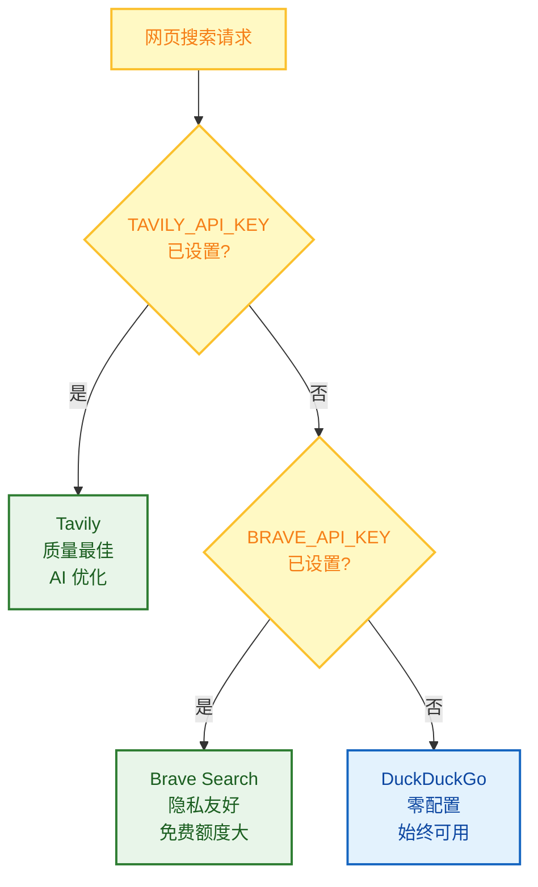

| 优先级 |          引擎          | API Key | 特点                             |
| :----: | :--------------------: | :-----: | :------------------------------- |
|   1   |    **Tavily**    |  需要  | 质量最佳，专为 AI 优化，深度搜索 |
|   2   | **Brave Search** |  需要  | 免费额度大，隐私友好             |
|   3   |  **DuckDuckGo**  |  无需  | 始终可用，零配置                 |

**工作原理**：

1. 如果设置了 `TAVILY_API_KEY` → 使用 Tavily（质量最佳）
2. 否则如果设置了 `BRAVE_API_KEY` → 使用 Brave Search
3. 否则 → 使用 DuckDuckGo（无需 API Key，始终可用）

这个设计确保**即使没有任何 API Key 配置，网页搜索也能开箱即用**！

#### MCP 配置

智能体可通过 `configure_mcp` 工具自主管理 MCP 服务器：

| 操作 | 说明 |
| :--- | :--- |
| `add` | 添加新 MCP 服务器 |
| `update` | 更新现有服务器配置 |
| `remove` | 删除 MCP 服务器 |
| `enable` | 启用已禁用的 MCP 服务器 |
| `disable` | 暂时禁用 MCP 服务器 |
| `list` | 列出所有已配置的服务器 |

**动态提示词更新**：

当 MCP 配置变更时，Agent 可通过 `refresh_capabilities` 刷新能力描述，确保系统提示词始终反映当前能力。

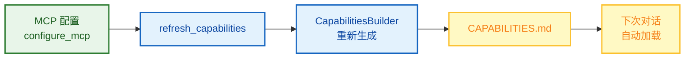

#### 技能创建

FinchBot 内置 **skill-creator** 技能，智能体可自主创建新技能：

```
用户: 帮我创建一个翻译技能，可以把中文翻译成英文

Agent: 好的，我来为你创建翻译技能...
       [调用 skill-creator 技能]
       ✅ 已创建 skills/translator/SKILL.md
       现在你可以直接使用翻译功能了！
```

无需手动创建文件、无需编写代码，**一句话就能扩展 Agent 能力**！

#### 技能文件结构

```
skills/
├── skill-creator/        # 技能创建器（内置）- 开箱即用的核心
│   └── SKILL.md
├── summarize/            # 智能总结（内置）
│   └── SKILL.md
├── weather/              # 天气查询（内置）
│   └── SKILL.md
└── my-custom-skill/      # Agent 自动创建或用户自定义
    └── SKILL.md
```

#### 核心设计亮点

|           特性           | 说明                              |
| :----------------------: | :-------------------------------- |
| **Agent 自动创建** | 告诉 Agent 需求，自动生成技能文件 |
|   **双层技能源**   | 工作区技能优先，内置技能兜底      |
|    **依赖检查**    | 自动检查 CLI 工具和环境变量       |
|  **缓存失效检测**  | 基于文件修改时间，智能缓存        |
|   **渐进式加载**   | 常驻技能优先，按需加载其他        |

### 2. 任务自调度：后台任务 + 定时任务

#### 后台任务系统

FinchBot 实现了**四工具模式**用于异步任务执行：

| 工具 | 功能 | 智能体自主性 |
| :--- | :--- | :--- |
| `start_background_task` | 启动后台任务 | 智能体自主判断是否需要后台执行 |
| `check_task_status` | 检查任务状态 | 智能体自主决定何时检查 |
| `get_task_result` | 获取任务结果 | 智能体自主决定何时获取结果 |
| `cancel_task` | 取消任务 | 智能体自主决定是否取消 |

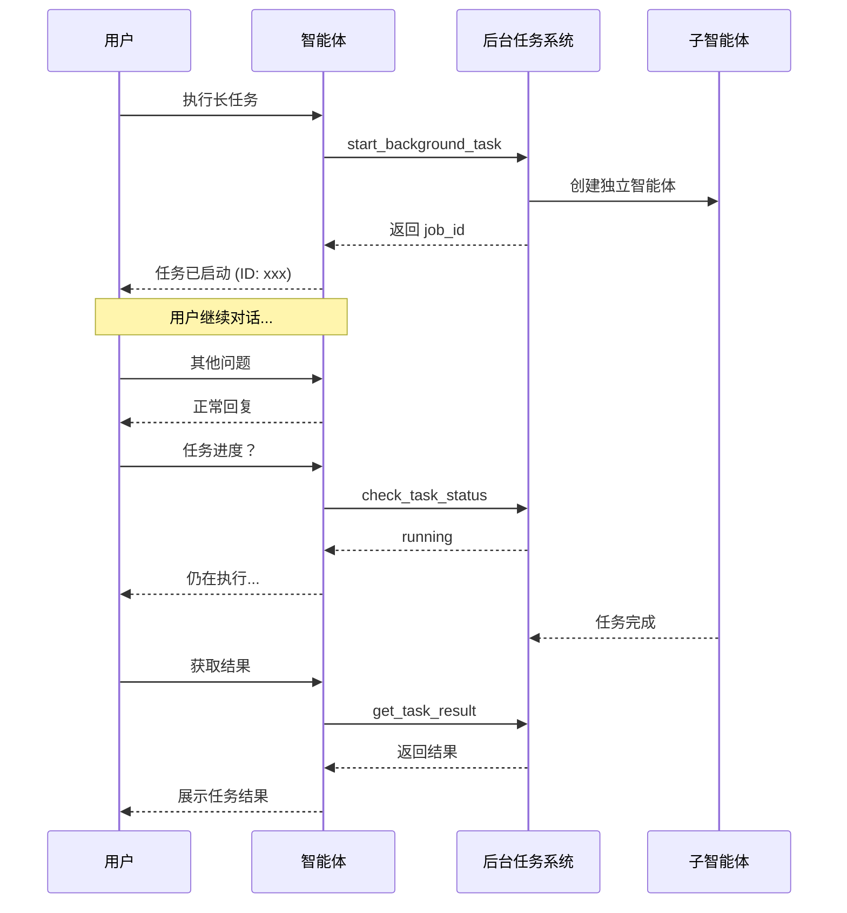

#### 定时任务系统

FinchBot 的定时任务系统让智能体能够自主创建和管理周期性任务，实现真正的自动化运行。

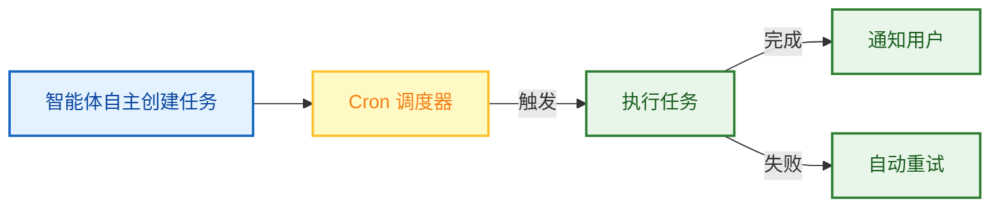

**核心特性**：

| 特性 | 说明 |
| :--- | :--- |
| **Cron 表达式** | 支持标准 Cron 语法，灵活配置执行时间 |
| **持久化存储** | 任务配置保存在 SQLite，重启后自动恢复 |
| **自动重试** | 任务失败时自动重试，确保可靠性 |
| **状态追踪** | 记录每次执行结果，便于审计和调试 |

**常用 Cron 表达式示例**：

| 表达式 | 说明 |
| :--- | :--- |
| `0 9 * * *` | 每天上午 9:00 |
| `0 */2 * * *` | 每 2 小时 |
| `30 18 * * 1-5` | 工作日下午 6:30 |
| `0 0 1 * *` | 每月 1 日午夜 |
| `0 0 * * 0` | 每周日午夜 |

**使用场景**：

```
用户: 每天早上 9 点提醒我查看邮件

Agent: 好的，我来创建一个定时任务...
       [调用 create_cron_task 工具]
       ✅ 已创建定时任务
       - 触发时间: 每天 09:00
       - 任务内容: 提醒查看邮件
       - 下次执行: 明天 09:00
```

#### 心跳服务：自主唤醒，主动检查

心跳服务让 Agent 能够定期"醒来"检查是否有待处理任务，实现真正的自主运行。

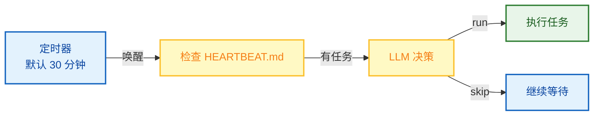

**核心特性**：

| 特性 | 说明 |
| :--- | :--- |
| **自主唤醒** | 无需用户触发，Agent 定期主动检查 |
| **LLM 决策** | 通过 LLM 智能判断是否需要执行任务 |
| **灵活配置** | 可自定义检查间隔（默认 30 分钟） |
| **会话绑定** | 随 chat 会话启动和停止 |

**工作流程**：

1. Agent 在对话时自动启动心跳服务
2. 每隔指定时间检查 `HEARTBEAT.md` 文件
3. 如果有内容，通过 LLM 决定是否执行
4. LLM 返回 `run` 则执行任务，返回 `skip` 则等待下次检查

**使用场景**：

```
用户: 帮我监控股票价格，跌破 100 元时通知我

Agent: 好的，我会在 HEARTBEAT.md 中记录这个任务...
       心跳服务会定期检查股票价格
       当条件满足时会主动通知你
```

### 3. 记忆自管理：Agentic RAG + 加权 RRF 混合检索

FinchBot 实现了先进的**双层记忆架构**，彻底解决了 LLM 上下文窗口限制和长期记忆遗忘问题。

#### 为什么是 Agentic RAG？

|      对比维度      | 传统 RAG     | Agentic RAG (FinchBot)      |
| :----------------: | :----------- | :-------------------------- |
| **检索触发** | 固定流程     | Agent 自主决策              |
| **检索策略** | 单一向量检索 | 混合检索 + 权重动态调整     |
| **记忆管理** | 被动存储     | 主动 remember/recall/forget |
| **分类能力** | 无           | 自动分类 + 重要性评分       |
| **更新机制** | 全量重建     | 增量同步                    |

#### 双层存储架构

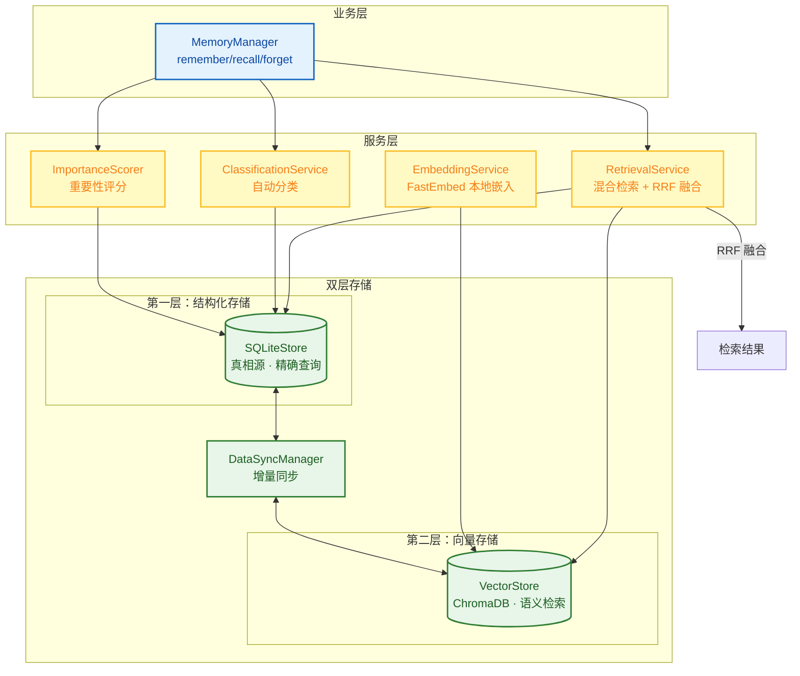

#### 混合检索策略

FinchBot 采用**加权 RRF (Weighted Reciprocal Rank Fusion)** 策略，这是 Agentic RAG 的核心优势之一。

**为什么选择加权 RRF？**

| 优势 | 说明 |
| :--- | :--- |
| **无需归一化** | 仅基于排名位置计算，无需了解向量或 BM25 分数分布 |
| **抗异常值** | 对单个检索器的异常结果不敏感，更稳定 |
| **共识优先** | 奖励多个检索器都认可的文档，而非单一异常 |
| **权重可控** | 可根据查询类型动态调整关键词/语义检索权重 |

**查询类型自适应权重**：

```python
class QueryType(StrEnum):
    """查询类型，决定检索权重（关键词权重 / 语义权重）"""
    KEYWORD_ONLY = "keyword_only"      # 纯关键词 (1.0/0.0)
    SEMANTIC_ONLY = "semantic_only"    # 纯语义 (0.0/1.0)
    FACTUAL = "factual"                # 事实型 (0.8/0.2)
    CONCEPTUAL = "conceptual"          # 概念型 (0.2/0.8)
    COMPLEX = "complex"                # 复杂型 (0.5/0.5)
    AMBIGUOUS = "ambiguous"            # 歧义型 (0.3/0.7)
```

**RRF 公式**：

```
RRF(d) = Σ (weight_r / (k + rank_r(d)))

其中：
- d 是文档
- k 是平滑常数（通常为 60）
- rank_r(d) 是文档 d 在检索器 r 中的排名
- weight_r 是检索器 r 的权重
```

**Agentic RAG 的核心优势**：

传统 RAG 使用固定的检索策略，而 Agentic RAG 让 Agent 能够：

1. **自主决策** — 根据查询内容选择合适的检索权重
2. **动态调整** — 事实型查询偏向关键词，概念型查询偏向语义
3. **迭代验证** — 如果结果不满意，可以调整策略重试
4. **可解释性** — 每个检索决策都有明确的权重依据

### 4. 行为自进化：动态提示词系统

FinchBot 的提示词系统采用**文件系统 + 模块化组装**的设计，让智能体和用户都能自主修改行为。

#### 为什么需要动态提示词？

| 传统方式 | FinchBot 方式 |
| :--- | :--- |
| 提示词硬编码在代码中 | 提示词存储在文件系统中 |
| 修改需要重新部署 | 修改后下次对话自动生效 |
| 用户无法自定义 | 用户可通过编辑文件自定义 |
| Agent 无法调整自身行为 | Agent 可自主优化提示词 |

#### Bootstrap 文件系统

```
~/.finchbot/
├── config.json              # 主配置文件
└── workspace/
    ├── bootstrap/           # Bootstrap 文件目录
    │   ├── SYSTEM.md        # 角色设定（身份、职责、约束）
    │   ├── MEMORY_GUIDE.md  # 记忆使用指南（何时存储/检索）
    │   ├── SOUL.md          # 灵魂设定（性格、语气、风格）
    │   └── AGENT_CONFIG.md  # Agent 配置（模型参数、行为选项）
    ├── config/              # 配置目录
    │   └── mcp.json         # MCP 服务器配置
    ├── generated/           # 自动生成文件
    │   ├── TOOLS.md         # 工具文档（自动生成）
    │   └── CAPABILITIES.md  # 能力信息（自动生成）
    ├── skills/              # 自定义技能
    ├── memory/              # 记忆存储
    └── sessions/            # 会话数据
```

**Bootstrap 文件说明**：

| 文件 | 作用 | 示例内容 |
| :--- | :--- | :--- |
| `SYSTEM.md` | 定义 Agent 的身份和职责 | "你是一个智能助手，擅长..." |
| `MEMORY_GUIDE.md` | 指导 Agent 如何使用记忆 | "用户偏好应存储在长期记忆中..." |
| `SOUL.md` | 定义 Agent 的性格特征 | "你的回复应该简洁、友好..." |
| `AGENT_CONFIG.md` | Agent 行为配置 | 默认语言、响应风格等 |

#### 提示词构建流程

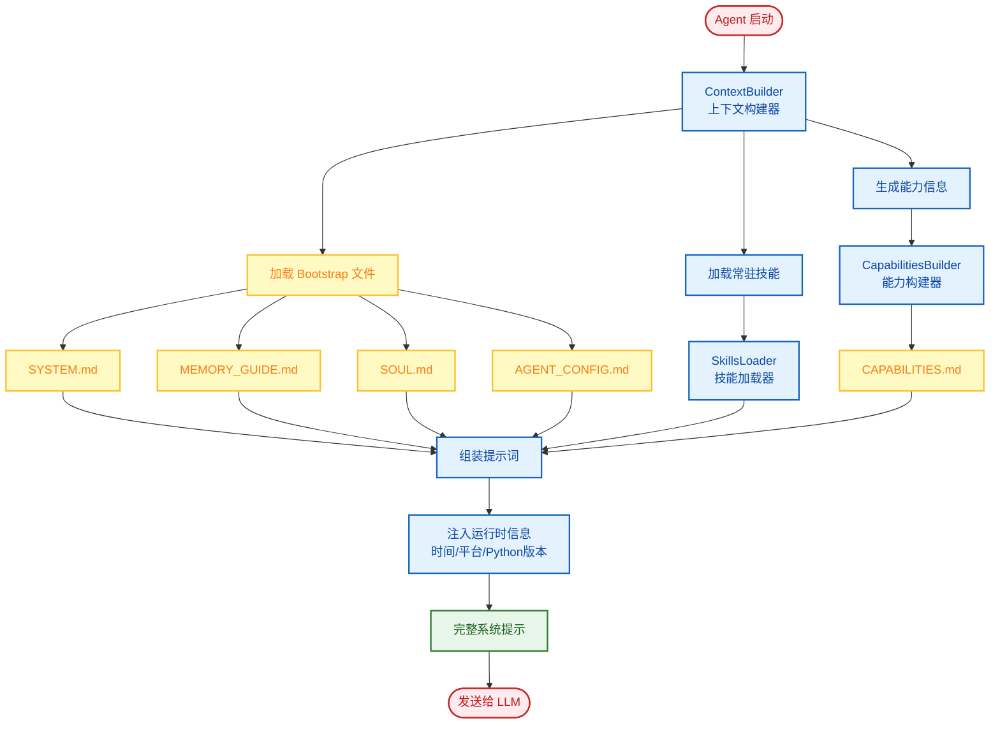

#### 能力信息自动生成

`CapabilitiesBuilder` 会自动生成能力说明，让 Agent "知道"自己的能力：

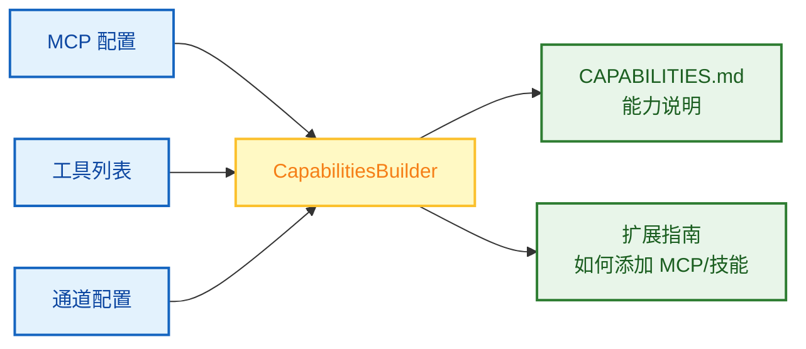

**生成的 CAPABILITIES.md 包含**：

1. **MCP 服务器状态** — 已配置的服务器列表、启用/禁用状态
2. **MCP 工具列表** — 按服务器分组的可用工具
3. **通道配置** — LangBot 连接状态
4. **扩展指南** — 如何添加新的 MCP 服务器和技能

#### 热加载机制

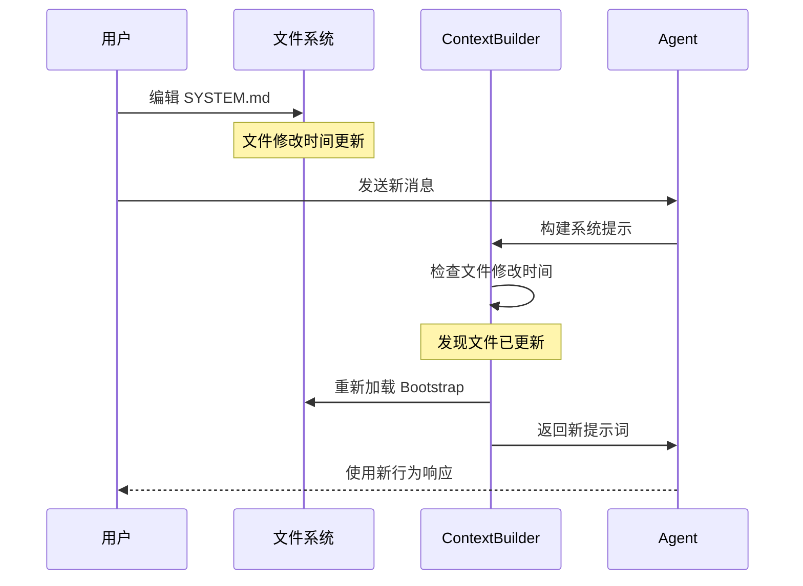

**核心特性**：

| 特性 | 说明 |
| :--- | :--- |
| **用户可定制** | 编辑 Bootstrap 文件即可自定义 Agent 行为 |
| **Agent 可调整** | Agent 可通过 `write_file` 工具修改自身提示词 |
| **立即生效** | 修改后下次对话自动加载，无需重启服务 |
| **智能缓存** | 基于文件修改时间的缓存机制，避免重复构建 |

#### 使用示例

**用户自定义 Agent 性格**：

```bash
# 编辑 SOUL.md 文件
echo "你是一个幽默风趣的助手，喜欢用比喻来解释复杂概念。" > ~/.finchbot/workspace/bootstrap/SOUL.md

# 下次对话立即生效
```

**Agent 自主优化提示词**：

```
用户: 你回复太啰嗦了，简洁一点

Agent: 好的，我会调整我的回复风格。
       [调用 write_file 工具更新 SOUL.md]
       ✅ 已更新我的行为配置，以后会更简洁。
```

### 5. 通道系统：多平台消息支持

FinchBot 集成 [LangBot](https://github.com/langbot-app/LangBot) 实现生产级多平台消息支持。

**为什么选择 LangBot？**
- 15k+ GitHub Stars，活跃维护
- 支持 12+ 平台：QQ、微信、企业微信、飞书、钉钉、Discord、Telegram、Slack、LINE、KOOK、Satori
- 内置 WebUI，可视化配置
- 插件生态，支持 MCP 等扩展

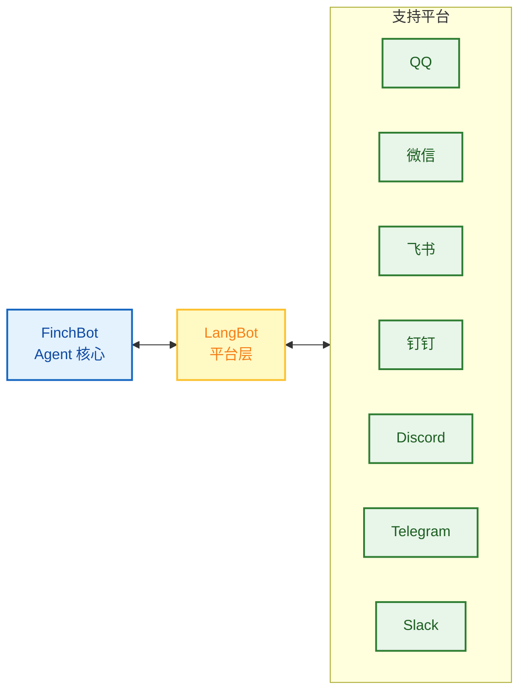

#### LangBot 快速开始

```bash
# 安装 LangBot
uvx langbot

# 访问 WebUI http://localhost:5300
# 配置你的平台并连接到 FinchBot
```

更多详情请参阅 [LangBot 文档](https://docs.langbot.app)。

---

## 快速开始

### 前置要求

|   项目   | 要求                    |
| :------: | :---------------------- |
| 操作系统 | Windows / Linux / macOS |
|  Python  | 3.13+                   |
| 包管理器 | uv (推荐)               |

### 安装步骤

```bash
# 克隆仓库（二选一）
# Gitee（国内推荐）
git clone https://gitee.com/xt765/finchbot.git
# 或 GitHub
git clone https://github.com/xt765/finchbot.git

cd finchbot

# 安装依赖
uv sync
```

> **注意**：嵌入模型（约 95MB）会在首次运行时（如运行 `finchbot chat`）自动下载到本地。无需手动干预。

<details>
<summary>开发环境安装</summary>

如需参与开发，安装开发依赖：

```bash
uv sync --extra dev
```

包含：pytest、ruff、basedpyright

</details>

### 最佳实践：四步上手

```bash
# 第一步：配置 API 密钥和默认模型
uv run finchbot config

# 第二步：管理你的会话
uv run finchbot sessions

# 第三步：开始对话
uv run finchbot chat

# 第四步：管理定时任务
uv run finchbot cron
```

就这么简单！这四个命令覆盖了完整的工作流程：

- `finchbot config` — 交互式配置 LLM 提供商、API 密钥和设置
- `finchbot sessions` — 全屏会话管理器，创建、重命名、删除会话
- `finchbot chat` — 开始或继续交互式对话
- `finchbot cron` — 交互式定时任务管理器，支持键盘导航

### Docker 部署

FinchBot 提供完整的 Docker 支持，适合生产环境部署：


**快速部署**：

```bash
# 1. 克隆仓库
git clone https://gitee.com/xt765/finchbot.git
cd finchbot

# 2. 配置环境变量
cp .env.example .env
# 编辑 .env 填入 API 密钥

# 3. 启动服务
docker-compose up -d

# 4. 进入容器使用
docker exec -it finchbot finchbot chat
```

**Docker Compose 配置**：

```yaml
services:
  finchbot:
    build: .
    volumes:
      - finchbot-data:/root/.finchbot  # 持久化工作区
      - model-cache:/root/.cache        # 模型缓存
    environment:
      - OPENAI_API_KEY=${OPENAI_API_KEY}
    restart: unless-stopped
    stdin_open: true
    tty: true

volumes:
  finchbot-data:
  model-cache:
```

| 特性 | 说明 |
| :--- | :--- |
| **一键部署** | `docker-compose up -d` 快速启动 |
| **数据持久化** | 工作区、模型缓存通过卷持久化 |
| **交互式终端** | 支持 `docker exec` 进入容器使用 |
| **多架构支持** | 支持 x86_64 和 ARM64 |
| **环境隔离** | 通过 .env 文件管理敏感配置 |

### 备选方案：环境变量

```bash
# 或直接设置环境变量
export OPENAI_API_KEY="your-api-key"
uv run finchbot chat
```

### 日志级别控制

```bash
# 默认：显示 WARNING 及以上日志
finchbot chat

# 显示 INFO 及以上日志
finchbot -v chat

# 显示 DEBUG 及以上日志（调试模式）
finchbot -vv chat
```

### 可选：下载本地嵌入模型

```bash
# 用于记忆系统的语义搜索（可选但推荐）
uv run finchbot models download
```

---

## 技术栈

|    层级    | 技术              |  版本  |
| :--------: | :---------------- | :-----: |
|  基础语言  | Python            |  3.13+  |
| Agent 框架 | LangChain         | 1.2.10+ |
|  状态管理  | LangGraph         | 1.0.8+ |
|  数据验证  | Pydantic          |   v2   |
|  向量存储  | ChromaDB          | 0.5.0+ |
|  本地嵌入  | FastEmbed         | 0.4.0+ |
|  搜索增强  | BM25              | 0.2.2+ |
|  CLI 框架  | Typer             | 0.23.0+ |
|   富文本   | Rich              | 14.3.0+ |
|    日志    | Loguru            | 0.7.3+ |
|  配置管理  | Pydantic Settings | 2.12.0+ |
| Web 后端  | FastAPI           | 0.115.0+ |
| Web 前端  | React + Vite      | Latest  |

---

## 扩展指南

### 添加新工具

继承 `FinchTool` 基类，实现 `_run()` 方法，然后注册到 `ToolRegistry`。

### 添加 MCP 工具

在 `finchbot config` 中配置 MCP 服务器，或直接编辑配置文件。MCP 工具通过 `langchain-mcp-adapters` 自动加载。

### 添加新技能

在 `~/.finchbot/workspace/skills/{skill-name}/` 下创建 `SKILL.md` 文件。

### 添加新的 LLM 提供商

在 `providers/factory.py` 中添加新的 Provider 类。

### 添加新语言

在 `i18n/locales/` 下添加新的 `.toml` 文件。

### 多平台消息支持

使用 [LangBot](https://github.com/langbot-app/LangBot) 实现多平台支持。详见 [LangBot 文档](https://docs.langbot.app)。

---

## 项目优势

| 能力自扩展 | 任务自调度 | 记忆自管理 | 行为自进化 |
|:---:|:---:|:---:|:---:|
| 内置工具 + MCP 配置 + 技能创建 | 后台任务 + 定时任务 | Agentic RAG + 加权 RRF | 动态提示词 + 热加载 |
| 智能体遇到能力边界时自主扩展 | 智能体自主设定后台/定时任务 | 智能体自主记忆、检索、遗忘 | 智能体和用户都可修改提示词 |

| 安全自主 | 隐私优先 | 生产级稳定 | 多平台支持 |
|:---:|:---:|:---:|:---:|
| 文件操作限制在 workspace | FastEmbed 本地生成向量 | 双重检查锁 + 自动重试 | 通过 LangBot 支持 12+ 平台 |
| 危险 Shell 命令被阻止 | 无需上传云端数据 | 超时控制机制 | QQ/微信/飞书/钉钉/Discord/Telegram/Slack |

---

## 文档

[使用指南](docs/zh-CN/guide/usage.md) • [API 文档](docs/zh-CN/api.md) • [配置指南](docs/zh-CN/config.md) • [扩展指南](docs/zh-CN/guide/extension.md) • [系统架构](docs/zh-CN/architecture.md) • [部署指南](docs/zh-CN/deployment.md) • [开发环境](docs/zh-CN/development.md) • [贡献指南](docs/zh-CN/contributing.md)

---

## 贡献

欢迎提交 Issue 和 Pull Request。请阅读 [贡献指南](docs/zh-CN/contributing.md) 了解更多信息。

---

## 许可证

本项目采用 [MIT 许可证](LICENSE)。

---

## Star History

如果这个项目对你有帮助，请给个 Star ⭐️
