# System Architecture

This document provides an in-depth introduction to FinchBot's system architecture, core components, and their interactions.

## Table of Contents

1. [Overall Architecture](#1-overall-architecture)
2. [Core Components](#2-core-components)
   - [2.1 Agent Core](#21-agent-core)
   - [2.2 Skill System](#22-skill-system)
   - [2.3 Memory System](#23-memory-system)
   - [2.4 Tool Ecosystem](#24-tool-ecosystem)
   - [2.5 Channel System](#25-channel-system)
   - [2.6 Dynamic Prompt System](#26-dynamic-prompt-system)
   - [2.7 I18n System](#27-i18n-system-internationalization)
   - [2.8 Configuration System](#28-configuration-system)
   - [2.9 Agent Autonomy Architecture](#29-agent-autonomy-architecture)
   - [2.10 Background Task System](#210-background-task-system-subagent)
   - [2.11 Scheduled Task System](#211-scheduled-task-system-cron)
   - [2.12 Heartbeat Service](#212-heartbeat-service)
   - [2.13 MCP Self-Configuration](#213-mcp-self-configuration)
3. [Data Flow](#3-data-flow)
4. [Design Principles](#4-design-principles)
5. [Extension Points](#5-extension-points)

---

## 1. Overall Architecture

FinchBot is built on **LangChain v1.2** + **LangGraph v1.0**, featuring persistent memory, dynamic tool scheduling, multi-platform messaging, and **fully asynchronous concurrent startup**. The system consists of four core components:

1. **Agent Core (Brain)**: Responsible for decision-making, planning, and tool scheduling, supporting async streaming output.
2. **Memory System**: Responsible for long-term information storage and retrieval, utilizing a hybrid architecture of SQLite + FastEmbed + ChromaDB.
3. **Tool Ecosystem**: Responsible for interacting with the external world, supporting lazy loading and thread-pool concurrent initialization, with MCP protocol support.
4. **Channel System**: Responsible for multi-platform message routing, supporting Discord, DingTalk, Feishu, WeChat, Email, etc.

### 1.1 Overall Architecture Diagram

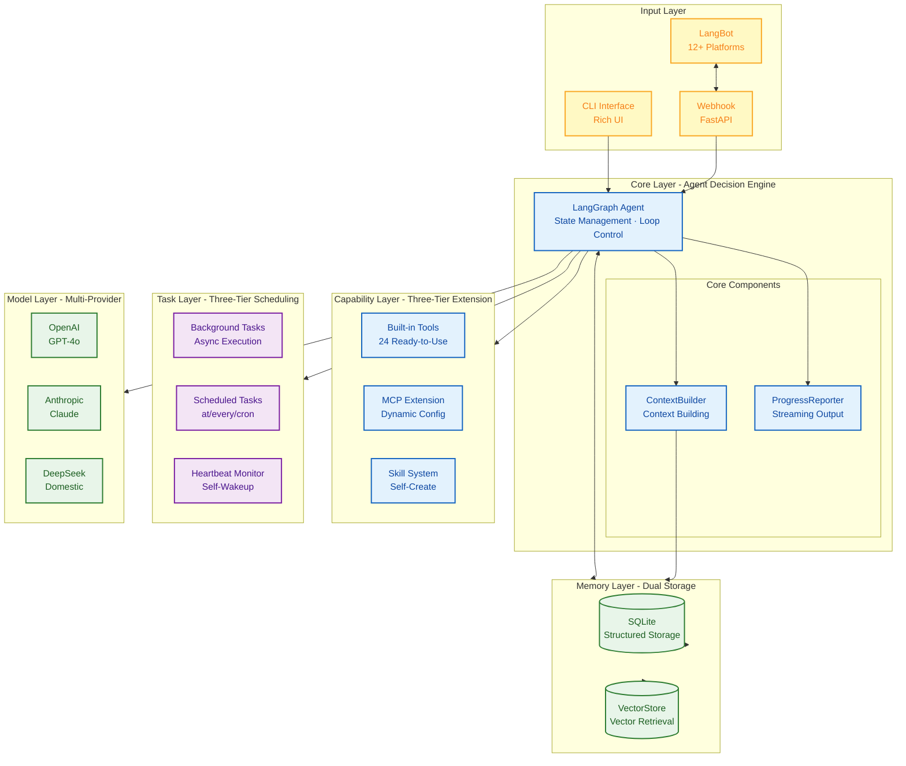
```mermaid
flowchart TB
    classDef input fill:#fff9c4,stroke:#f9a825,stroke-width:2px,color:#f57f17;
    classDef core fill:#e3f2fd,stroke:#1565c0,stroke-width:2px,color:#0d47a1;
    classDef task fill:#f3e5f5,stroke:#7b1fa2,stroke-width:2px,color:#4a148c;
    classDef infra fill:#e8f5e9,stroke:#2e7d32,stroke-width:2px,color:#1b5e20;

    subgraph Input [Input Layer]
        direction LR
        CLI[CLI Interface<br/>Rich UI]:::input
        LB[LangBot<br/>12+ Platforms]:::input
        Webhook[Webhook<br/>FastAPI]:::input
    end

    subgraph Core [Core Layer - Agent Decision Engine]
        direction TB
        Agent[LangGraph Agent<br/>State Management · Loop Control]:::core
        subgraph CoreModules [Core Components]
            direction LR
            Context[ContextBuilder<br/>Context Building]:::core
            Streaming[ProgressReporter<br/>Streaming Output]:::core
        end
    end

    subgraph Capabilities [Capability Layer - Three-Tier Extension]
        direction LR
        BuiltIn[Built-in Tools<br/>24 Ready-to-Use]:::core
        MCP[MCP Extension<br/>Dynamic Config]:::core
        Skills[Skill System<br/>Self-Create]:::core
    end

    subgraph Task [Task Layer - Three-Tier Scheduling]
        direction LR
        BG[Background Tasks<br/>Async Execution]:::task
        Cron[Scheduled Tasks<br/>at/every/cron]:::task
        Heart[Heartbeat Monitor<br/>Self-Wakeup]:::task
    end

    subgraph Memory [Memory Layer - Dual Storage]
        direction LR
        SQLite[(SQLite<br/>Structured Storage)]:::infra
        Vector[(VectorStore<br/>Vector Retrieval)]:::infra
    end

    subgraph LLM [Model Layer - Multi-Provider]
        direction LR
        OpenAI[OpenAI<br/>GPT-4o]:::infra
        Anthropic[Anthropic<br/>Claude]:::infra
        DeepSeek[DeepSeek<br/>Domestic]:::infra
    end

    CLI --> Agent
    LB <--> Webhook
    Webhook --> Agent

    Agent --> Context
    Agent --> Streaming
    Agent --> Capabilities
    Agent --> Task
    Agent <--> Memory
    Agent --> LLM

    Context --> Memory
    Memory --> SQLite
    Memory --> Vector
```

### 1.2 Directory Structure

```
finchbot/
├── agent/              # Agent Core
│   ├── core.py        # Agent creation and execution (Async Optimized)
│   ├── factory.py     # AgentFactory (Concurrent Thread Pool)
│   ├── context.py     # ContextBuilder for prompt assembly
│   ├── capabilities.py # CapabilitiesBuilder for capability info
│   ├── skills.py      # SkillsLoader for Markdown skills
│   └── streaming.py   # ProgressReporter for real-time progress
├── background/         # Background Task System
│   ├── __init__.py
│   ├── store.py       # JobStore task storage
│   └── tools.py       # Background task tools
├── cron/               # Scheduled Task System
│   ├── __init__.py
│   ├── service.py     # CronService scheduling service
│   ├── selector.py    # CronSelector interactive UI
│   └── tools.py       # Scheduled task tools
├── heartbeat/          # Heartbeat Service
│   ├── __init__.py
│   └── service.py     # HeartbeatService background service
├── channels/           # Multi-Platform Messaging (via LangBot)
│   ├── base.py        # BaseChannel abstract class
│   ├── bus.py         # MessageBus async router
│   ├── manager.py     # ChannelManager coordinator
│   ├── schema.py      # Message models
│   ├── langbot_integration.py  # LangBot integration guide
│   └── webhook_server.py  # Webhook Server (FastAPI)
├── cli/                # CLI Interface
│   ├── chat_session.py # Async Session Management
│   ├── config_manager.py
│   ├── providers.py
│   └── ui.py
├── config/             # Configuration Management
│   ├── loader.py
│   ├── schema.py      # Includes MCPConfig, ChannelsConfig
│   └── utils.py
├── constants.py        # Unified constants definition
├── i18n/               # Internationalization
│   ├── loader.py      # Language loader
│   └── locales/
├── memory/             # Memory System
│   ├── manager.py
│   ├── types.py
│   ├── services/       # Service Layer
│   ├── storage/        # Storage Layer
│   └── vector_sync.py
├── providers/          # LLM Providers
│   └── factory.py
├── sessions/           # Session Management
│   ├── metadata.py
│   ├── selector.py
│   └── title_generator.py
├── skills/             # Skill System
│   ├── skill-creator/
│   ├── summarize/
│   └── weather/
├── tools/              # Tool System
│   ├── base.py
│   ├── registry.py
│   ├── factory.py     # ToolFactory (MCP tools via langchain-mcp-adapters)
│   ├── config_tools.py # Configuration tools (configure_mcp, etc.)
│   ├── tools_generator.py # Tool documentation generator
│   ├── filesystem.py
│   ├── memory.py
│   ├── shell.py
│   ├── web.py
│   ├── session_title.py
│   ├── background.py  # Background task tools
│   ├── cron.py        # Scheduled task tools
│   └── search/
└── utils/              # Utility Functions
    ├── cache.py
    ├── logger.py
    └── model_downloader.py
```

---

### 1.3 Async Startup Process

FinchBot introduces a fully asynchronous startup architecture, leveraging `asyncio` and `concurrent.futures.ThreadPoolExecutor` to execute time-consuming operations concurrently, significantly improving startup speed.

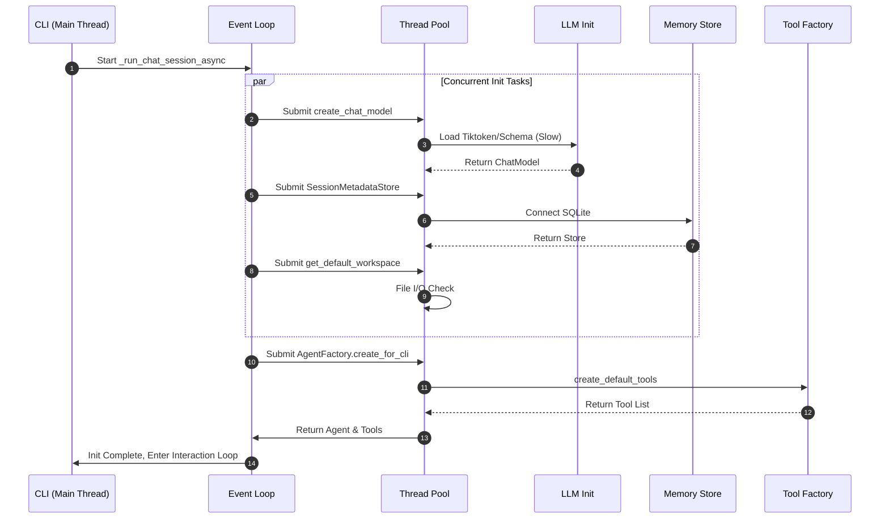
```mermaid
sequenceDiagram
    autonumber
    participant CLI as CLI (Main Thread)
    participant EventLoop as Event Loop
    participant Pool as Thread Pool
    participant LLM as LLM Init
    participant Mem as Memory Store
    participant Tools as Tool Factory

    CLI->>EventLoop: Start _run_chat_session_async
    
    par Concurrent Init Tasks
        EventLoop->>Pool: Submit create_chat_model
        Pool->>LLM: Load Tiktoken/Schema (Slow)
        LLM-->>Pool: Return ChatModel
        
        EventLoop->>Pool: Submit SessionMetadataStore
        Pool->>Mem: Connect SQLite
        Mem-->>Pool: Return Store
        
        EventLoop->>Pool: Submit get_default_workspace
        Pool->>Pool: File I/O Check
    end
    
    EventLoop->>Pool: Submit AgentFactory.create_for_cli
    Pool->>Tools: create_default_tools
    Tools-->>Pool: Return Tool List
    Pool->>EventLoop: Return Agent & Tools
    
    EventLoop->>CLI: Init Complete, Enter Interaction Loop
```

---

## 2. Core Components

### 2.1 Agent Core

**Implementation**: `src/finchbot/agent/`

Agent Core is the brain of FinchBot, responsible for decision-making, planning, and tool scheduling. It now uses a factory pattern to decouple creation logic.

#### Core Components

* **AgentFactory (`factory.py`)**: Responsible for assembling the Agent, coordinating ToolFactory to create toolsets, and initializing Checkpointer.
* **Agent Core (`core.py`)**: Responsible for Agent runtime logic.
    * **State Management**: Based on `LangGraph`'s `StateGraph`, maintaining conversation state (`messages`)
    * **Persistence**: Uses `SqliteSaver` (`checkpoints.db`) to save state snapshots, supporting resume and history rollback
* **ContextBuilder (`context.py`)**: Dynamically assembles the system prompt, including:
    * **Identity**: `SYSTEM.md` (Role definition)
    * **Memory Guide**: `MEMORY_GUIDE.md` (Memory usage guidelines)
    * **Soul**: `SOUL.md` (Soul definition)
    * **Skills**: Dynamically loaded skill descriptions
    * **Tools**: `TOOLS.md` (Tool documentation)
    * **Capabilities**: `CAPABILITIES.md` (MCP and capability info)
    * **Runtime Info**: Current time, OS, Python version, etc.

#### Key Classes and Functions

| Function/Class | Description |
|:---|:---|
| `AgentFactory.create_for_cli()` | Static factory method to create a configured Agent for CLI |
| `create_finch_agent()` | Creates and configures LangGraph Agent |
| `build_system_prompt()` | Builds the complete system prompt |
| `get_sqlite_checkpointer()` | Gets SQLite persistence checkpoint |

#### Thread Safety Mechanism

Tool registration uses the **single-lock pattern** for lazy loading, ensuring thread safety:

```python
def _register_default_tools() -> None:
    global _default_tools_registered

    if _default_tools_registered:
        return

    with _tools_registration_lock:
        if _default_tools_registered:
            return
        # Actual registration logic...
```

---

### 2.2 Skill System

**Implementation**: `src/finchbot/agent/skills.py`

Skills are FinchBot's unique innovation—**defining Agent capabilities through Markdown files**.

#### Key Feature: Agent Auto-Creates Skills

FinchBot includes a built-in **skill-creator** skill, the ultimate expression of the out-of-the-box philosophy:

> **Just tell the Agent what skill you want, and it will create it automatically!**

```
User: Help me create a translation skill that can translate Chinese to English

Agent: Okay, I'll create a translation skill for you...
       [Invokes skill-creator skill]
        Created skills/translator/SKILL.md
       You can now use the translation feature directly!
```

No manual file creation, no coding—**extend Agent capabilities with just one sentence**!

#### Skill File Structure

```yaml
# SKILL.md example
---
name: weather
description: Query current weather and forecast (no API key required)
metadata:
  finchbot:
    emoji: 
    always: false
    requires:
      bins: [curl]
      env: []
---
# Skill content...
```

#### Core Design Patterns

| Pattern | Description |
|:---:|:---|
| **Dual Skill Source** | Workspace skills first, built-in skills fallback |
| **Dependency Check** | Auto-check CLI tools and environment variables |
| **Cache Invalidation** | Smart caching based on file modification time |
| **Progressive Loading** | Always-on skills first, others on demand |

---

### 2.3 Memory System

**Implementation**: `src/finchbot/memory/`

FinchBot implements an advanced **dual-layer memory architecture** designed to solve LLM context window limits and long-term forgetting issues.

#### Why Agentic RAG?

| Dimension | Traditional RAG | Agentic RAG (FinchBot) |
|:---:|:---|:---|
| **Retrieval Trigger** | Fixed pipeline | Agent autonomous decision |
| **Retrieval Strategy** | Single vector retrieval | Hybrid retrieval + dynamic weight adjustment |
| **Memory Management** | Passive storage | Active remember/recall/forget |
| **Classification** | None | Auto-classification + importance scoring |
| **Update Mechanism** | Full rebuild | Incremental sync |

#### Dual-Layer Storage Architecture

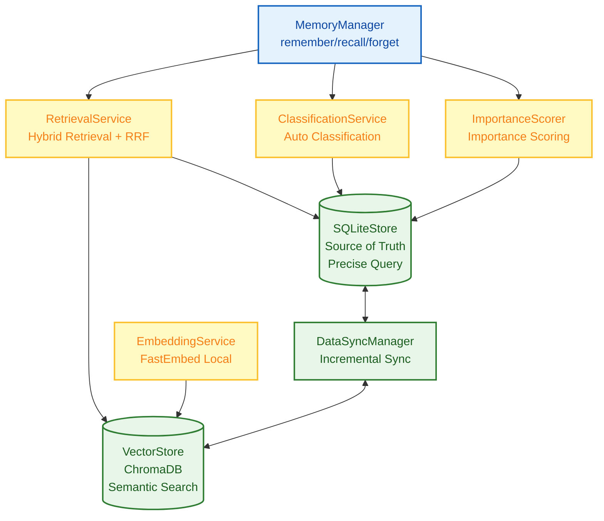
```mermaid
flowchart TB
    classDef businessLayer fill:#e3f2fd,stroke:#1565c0,stroke-width:2px,color:#0d47a1;
    classDef serviceLayer fill:#fff9c4,stroke:#fbc02d,stroke-width:2px,color:#f57f17;
    classDef storageLayer fill:#e8f5e9,stroke:#2e7d32,stroke-width:2px,color:#1b5e20;

    MM[MemoryManager<br/>remember/recall/forget]:::businessLayer

    RS[RetrievalService<br/>Hybrid Retrieval + RRF]:::serviceLayer
    CS[ClassificationService<br/>Auto Classification]:::serviceLayer
    IS[ImportanceScorer<br/>Importance Scoring]:::serviceLayer
    ES[EmbeddingService<br/>FastEmbed Local]:::serviceLayer

    SQLite[(SQLiteStore<br/>Source of Truth<br/>Precise Query)]:::storageLayer
    Vector[(VectorStore<br/>ChromaDB<br/>Semantic Search)]:::storageLayer
    DS[DataSyncManager<br/>Incremental Sync]:::storageLayer

    MM --> RS & CS & IS
    RS --> SQLite & Vector
    CS --> SQLite
    IS --> SQLite
    ES --> Vector
    
    SQLite <--> DS <--> Vector
```

#### Layered Design

1. **Structured Layer (SQLite)**:
    * **Role**: Source of Truth
    * **Content**: Full text, metadata (tags, source), category, importance score, access logs
    * **Advantage**: Supports precise queries (e.g., filtering by time, category)
    * **Implementation**: `SQLiteStore` class, using `aiosqlite` for async operations

2. **Semantic Layer (Vector Store)**:
    * **Role**: Fuzzy retrieval and association
    * **Content**: Embedding vectors of text
    * **Tech Stack**: ChromaDB + FastEmbed (Local lightweight models)
    * **Advantage**: Supports natural language semantic search (e.g., "that Python library I mentioned last time")
    * **Implementation**: `VectorMemoryStore` class

#### Core Services

| Service | Location | Function |
|:---|:---|:---|
| **DataSyncManager** | `memory/vector_sync.py` | Ensures eventual consistency between SQLite and Vector Store, with retry support |
| **ImportanceScorer** | `memory/services/importance.py` | Automatically evaluates memory importance (0.0-1.0) for cleanup and prioritization |
| **RetrievalService** | `memory/services/retrieval.py` | Hybrid retrieval strategy combining vector similarity and metadata filtering |
| **ClassificationService** | `memory/services/classification.py` | Automatic classification based on keywords and semantics |
| **EmbeddingService** | `memory/services/embedding.py` | Local embedding generation using FastEmbed |

#### Hybrid Retrieval Strategy

FinchBot uses **Weighted RRF (Weighted Reciprocal Rank Fusion)** strategy:

```python
class QueryType(StrEnum):
    """Query type determines retrieval weights"""
    KEYWORD_ONLY = "keyword_only"      # Pure keyword (1.0/0.0)
    SEMANTIC_ONLY = "semantic_only"    # Pure semantic (0.0/1.0)
    FACTUAL = "factual"                # Factual (0.8/0.2)
    CONCEPTUAL = "conceptual"          # Conceptual (0.2/0.8)
    COMPLEX = "complex"                # Complex (0.5/0.5)
    AMBIGUOUS = "ambiguous"            # Ambiguous (0.3/0.7)
```

---

### 2.4 Tool Ecosystem

**Implementation**: `src/finchbot/tools/`

#### Registration Mechanism and Factory Pattern

* **ToolFactory (`factory.py`)**: Responsible for creating and assembling the tool list based on configuration. It handles the auto-fallback logic for WebSearchTool (Tavily/Brave/DuckDuckGo) and loads MCP tools via `langchain-mcp-adapters`.
* **ToolRegistry**: Singleton registry managing all available tools.
* **Lazy Loading**: Default tools (File, Search, etc.) are created by the Factory and automatically registered when the Agent starts.
* **OpenAI Compatible**: Supports exporting tool definitions in OpenAI Function Calling format.
* **MCP Support**: Supports MCP protocol via official `langchain-mcp-adapters` library, supporting both stdio and HTTP transports.

#### Tool System Architecture

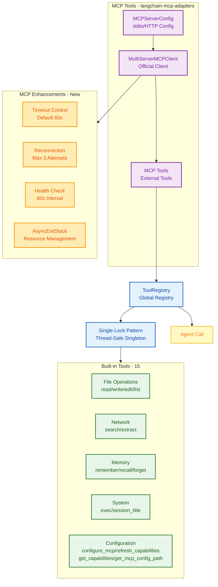
```mermaid
flowchart TB
    classDef registry fill:#e3f2fd,stroke:#1565c0,stroke-width:2px,color:#0d47a1;
    classDef builtin fill:#e8f5e9,stroke:#2e7d32,stroke-width:2px,color:#1b5e20;
    classDef mcp fill:#f3e5f5,stroke:#7b1fa2,stroke-width:2px,color:#7b1fa2;
    classDef agent fill:#fff9c4,stroke:#fbc02d,stroke-width:2px,color:#f57f17;
    classDef enhance fill:#ffecb3,stroke:#ff8f00,stroke-width:2px,color:#e65100;

    TR[ToolRegistry<br/>Global Registry]:::registry
    Lock[Single-Lock Pattern<br/>Thread-Safe Singleton]:::registry

    subgraph BuiltIn [Built-in Tools - 15]
        File[File Operations<br/>read/write/edit/list]:::builtin
        Web[Network<br/>search/extract]:::builtin
        Memory[Memory<br/>remember/recall/forget]:::builtin
        System[System<br/>exec/session_title]:::builtin
        Config[Configuration<br/>configure_mcp/refresh_capabilities<br/>get_capabilities/get_mcp_config_path]:::builtin
    end

    subgraph MCP [MCP Tools - langchain-mcp-adapters]
        MCPConfig[MCPServerConfig<br/>stdio/HTTP Config]:::mcp
        MCPClient[MultiServerMCPClient<br/>Official Client]:::mcp
        MCPTools[MCP Tools<br/>External Tools]:::mcp
    end

    subgraph Enhancements [MCP Enhancements - New]
        Timeout[Timeout Control<br/>Default 60s]:::enhance
        Reconnect[Reconnection<br/>Max 3 Attempts]:::enhance
        HealthCheck[Health Check<br/>60s Interval]:::enhance
        ExitStack[AsyncExitStack<br/>Resource Management]:::enhance
    end

    Agent[Agent Call]:::agent

    TR --> Lock
    Lock --> BuiltIn
    MCPConfig --> MCPClient --> MCPTools --> TR
    MCPClient --> Enhancements
    TR --> Agent
```

#### Tool Base Class

All tools inherit from the `FinchTool` base class and must implement:
- `name`: Tool name
- `description`: Tool description
- `parameters`: Parameter definition (JSON Schema)
- `_run()`: Execution logic

#### Security Sandbox

* **File Operations**: Restricted to the workspace (`workspace`) to prevent unauthorized system access
* **Shell Execution**: High-risk commands (rm -rf /) are disabled by default, with timeout control

#### Built-in Tools

| Tool Name | Category | File | Function |
|:---|:---|:---|:---|
| `read_file` | File | `filesystem.py` | Read file content |
| `write_file` | File | `filesystem.py` | Write file |
| `edit_file` | File | `filesystem.py` | Edit file (line-level) |
| `list_dir` | File | `filesystem.py` | List directory contents |
| `exec` | System | `shell.py` | Execute Shell command |
| `web_search` | Network | `web.py` / `search/` | Web search (supports Tavily/Brave/DuckDuckGo) |
| `web_extract` | Network | `web.py` | Extract web content (supports Jina AI fallback) |
| `remember` | Memory | `memory.py` | Store memory |
| `recall` | Memory | `memory.py` | Retrieve memory |
| `forget` | Memory | `memory.py` | Delete/archive memory |
| `session_title` | System | `session_title.py` | Manage session title |
| `configure_mcp` | Config | `config_tools.py` | Dynamically configure MCP servers (add/remove/update/enable/disable/list) |
| `refresh_capabilities` | Config | `config_tools.py` | Refresh capabilities file |
| `get_capabilities` | Config | `config_tools.py` | Get current capabilities |
| `get_mcp_config_path` | Config | `config_tools.py` | Get MCP config file path |

#### Web Search: Three-Engine Fallback Design

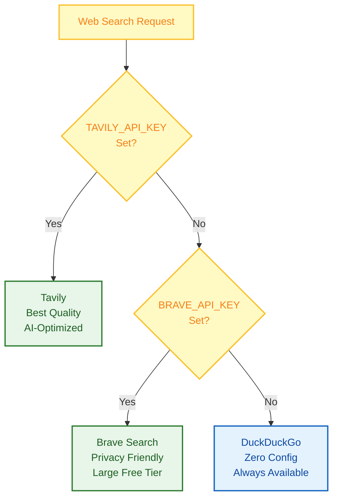
```mermaid
flowchart TD
    classDef check fill:#fff9c4,stroke:#fbc02d,stroke-width:2px,color:#f57f17;
    classDef engine fill:#e8f5e9,stroke:#2e7d32,stroke-width:2px,color:#1b5e20;
    classDef fallback fill:#e3f2fd,stroke:#1565c0,stroke-width:2px,color:#0d47a1;

    Start[Web Search Request]:::check
    
    Check1{TAVILY_API_KEY<br/>Set?}:::check
    Tavily[Tavily<br/>Best Quality<br/>AI-Optimized]:::engine
    
    Check2{BRAVE_API_KEY<br/>Set?}:::check
    Brave[Brave Search<br/>Privacy Friendly<br/>Large Free Tier]:::engine
    
    DDG[DuckDuckGo<br/>Zero Config<br/>Always Available]:::fallback

    Start --> Check1
    Check1 -->|Yes| Tavily
    Check1 -->|No| Check2
    Check2 -->|Yes| Brave
    Check2 -->|No| DDG
```

| Priority | Engine | API Key | Features |
|:---:|:---:|:---:|:---|
| 1 | **Tavily** | Required | Best quality, AI-optimized, deep search |
| 2 | **Brave Search** | Required | Large free tier, privacy-friendly |
| 3 | **DuckDuckGo** | Not required | Always available as fallback |

**How it works**:
1. If `TAVILY_API_KEY` is set → Use Tavily (best quality)
2. Else if `BRAVE_API_KEY` is set → Use Brave Search
3. Else → Use DuckDuckGo (no API key needed, always works)

This design ensures **web search works out of the box even without any API key configuration**!

#### Session Title: Smart Naming, Out of the Box

The `session_title` tool embodies FinchBot's out-of-the-box philosophy:

| Method | Description | Example |
|:---:|:---|:---|
| **Auto Generate** | After 2-3 turns, AI automatically generates title based on content | "Python Async Programming Discussion" |
| **Agent Modify** | Tell Agent "Change session title to XXX" | Agent calls tool to modify automatically |
| **Manual Rename** | Press `r` key in session manager to rename | User manually enters new title |

This design lets users **manage sessions without technical details**—whether automatic or manual.

---

### 2.5 Channel System

**Implementation**: `src/finchbot/channels/`

The channel system has been migrated to the [LangBot](https://github.com/langbot-app/LangBot) platform, providing production-grade multi-platform messaging support.

#### Why LangBot?

- **15k+ GitHub Stars**, actively maintained
- **Supports 12+ platforms**: QQ, WeChat, WeCom, Feishu, DingTalk, Discord, Telegram, Slack, LINE, KOOK, Satori
- **Built-in WebUI**: Visual configuration for all platforms
- **Plugin ecosystem**: Supports MCP and other extensions

#### LangBot Integration Architecture

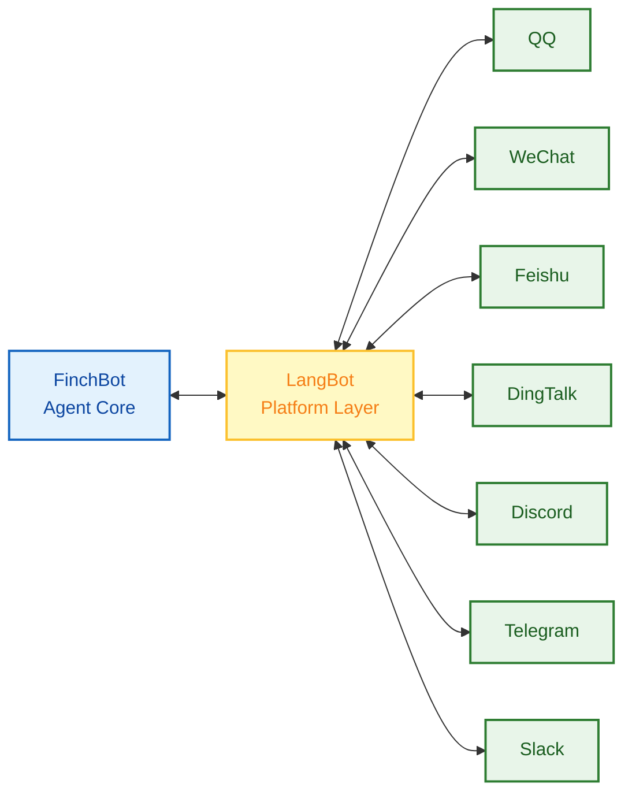
```mermaid
flowchart LR
    classDef bus fill:#e3f2fd,stroke:#1565c0,stroke-width:2px,color:#0d47a1;
    classDef manager fill:#fff9c4,stroke:#fbc02d,stroke-width:2px,color:#f57f17;
    classDef channel fill:#e8f5e9,stroke:#2e7d32,stroke-width:2px,color:#1b5e20;

    FinchBot[FinchBot<br/>Agent Core]:::bus
    LangBot[LangBot<br/>Platform Layer]:::manager

    QQ[QQ]:::channel
    WeChat[WeChat]:::channel
    Feishu[Feishu]:::channel
    DingTalk[DingTalk]:::channel
    Discord[Discord]:::channel
    Telegram[Telegram]:::channel
    Slack[Slack]:::channel

    FinchBot <--> LangBot
    LangBot <--> QQ & WeChat & Feishu & DingTalk & Discord & Telegram & Slack
```

#### Webhook Server

**Implementation**: `src/finchbot/channels/webhook_server.py`

FinchBot includes a built-in FastAPI Webhook server to receive messages from LangBot and return AI responses.

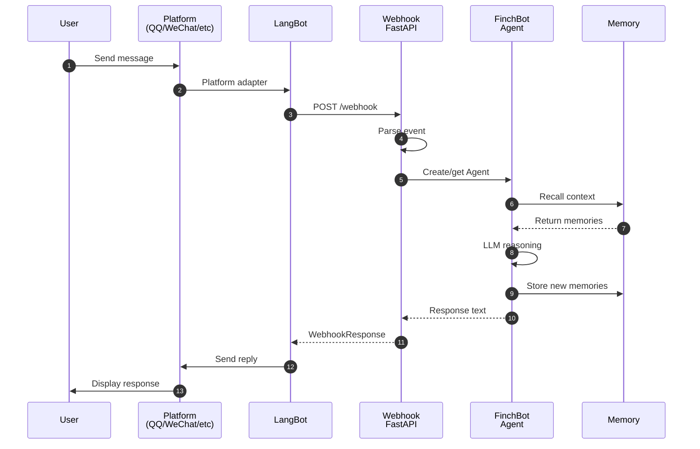
```mermaid
sequenceDiagram
    autonumber
    participant U as User
    participant P as Platform<br/>(QQ/WeChat/etc)
    participant L as LangBot
    participant W as Webhook<br/>FastAPI
    participant A as FinchBot<br/>Agent
    participant M as Memory

    U->>P: Send message
    P->>L: Platform adapter
    L->>W: POST /webhook
    W->>W: Parse event
    W->>A: Create/get Agent
    A->>M: Recall context
    M-->>A: Return memories
    A->>A: LLM reasoning
    A->>M: Store new memories
    A-->>W: Response text
    W-->>L: WebhookResponse
    L->>P: Send reply
    P->>U: Display response
```

#### Quick Start

```bash
# Terminal 1: Start FinchBot Webhook Server
uv run finchbot webhook --port 8000

# Terminal 2: Start LangBot
uvx langbot

# Access LangBot WebUI at http://localhost:5300
# Configure your platform and set webhook URL:
# http://localhost:8000/webhook
```

#### Webhook Configuration

| Setting | Description | Default |
| :--- | :--- | :--- |
| `langbot_url` | LangBot API URL | `http://localhost:5300` |
| `langbot_api_key` | LangBot API Key | - |
| `langbot_webhook_path` | Webhook endpoint path | `/webhook` |

For more details, see [LangBot Documentation](https://docs.langbot.app).

#### Core Components (Retained for Compatibility)

| Component | File | Function |
|:---|:---|:---|
| **BaseChannel** | `base.py` | Abstract base class defining channel interface (start, stop, send, receive) |
| **MessageBus** | `bus.py` | Async message router managing inbound/outbound message queues |
| **ChannelManager** | `manager.py` | Coordinates multiple channels, handles message routing and channel lifecycle |
| **InboundMessage** | `schema.py` | Standardized inbound message format |
| **OutboundMessage** | `schema.py` | Standardized outbound message format |

#### Message Models

```python
class InboundMessage(BaseModel):
    """Inbound message - from platform to Agent"""
    channel_id: str          # Channel identifier
    user_id: str             # User identifier
    content: str             # Message content
    session_id: str | None   # Session ID
    metadata: dict = {}      # Additional metadata

class OutboundMessage(BaseModel):
    """Outbound message - from Agent to platform"""
    channel_id: str          # Target channel
    user_id: str             # Target user
    content: str             # Response content
    session_id: str | None   # Session ID
    metadata: dict = {}      # Additional metadata
```

---

### 2.6 Dynamic Prompt System

**Implementation**: `src/finchbot/agent/context.py`

#### Bootstrap File System

```
~/.finchbot/
├── config.json              # Main configuration file
└── workspace/
    ├── bootstrap/           # Bootstrap files directory
    │   ├── SYSTEM.md        # Role definition
    │   ├── MEMORY_GUIDE.md  # Memory usage guide
    │   ├── SOUL.md          # Personality settings
    │   └── AGENT_CONFIG.md  # Agent configuration
    ├── config/              # Configuration directory
    │   └── mcp.json         # MCP server configuration
    ├── generated/           # Auto-generated files
    │   ├── TOOLS.md         # Tool documentation
    │   └── CAPABILITIES.md  # Capabilities info
    ├── skills/              # Custom skills
    ├── memory/              # Memory storage
    │   └── memory.db
    └── sessions/            # Session storage
        └── checkpoints.db
```

#### Prompt Loading Flow

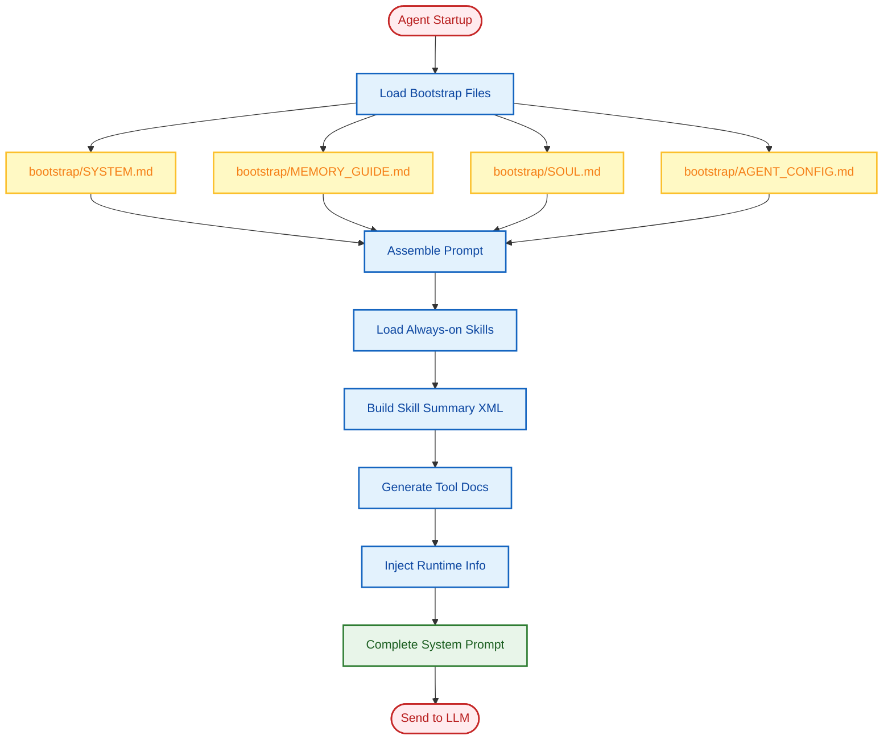
```mermaid
flowchart TD
    classDef startEnd fill:#ffebee,stroke:#c62828,stroke-width:2px,color:#b71c1c;
    classDef process fill:#e3f2fd,stroke:#1565c0,stroke-width:2px,color:#0d47a1;
    classDef file fill:#fff9c4,stroke:#fbc02d,stroke-width:2px,color:#f57f17;
    classDef output fill:#e8f5e9,stroke:#2e7d32,stroke-width:2px,color:#1b5e20;

    A([Agent Startup]):::startEnd --> B[Load Bootstrap Files]:::process
    
    B --> C[bootstrap/SYSTEM.md]:::file
    B --> D[bootstrap/MEMORY_GUIDE.md]:::file
    B --> E[bootstrap/SOUL.md]:::file
    B --> F[bootstrap/AGENT_CONFIG.md]:::file

    C --> G[Assemble Prompt]:::process
    D --> G
    E --> G
    F --> G

    G --> H[Load Always-on Skills]:::process
    H --> I[Build Skill Summary XML]:::process
    I --> J[Generate Tool Docs]:::process
    J --> K[Inject Runtime Info]:::process
    K --> L[Complete System Prompt]:::output

    L --> M([Send to LLM]):::startEnd
```

---

### 2.7 I18n System (Internationalization)

**Implementation**: `src/finchbot/i18n/`

#### Supported Languages

- `zh-CN`: Simplified Chinese
- `en-US`: English

#### Language Fallback Chain

The system implements a smart fallback mechanism:
```
zh-CN → zh → en-US
en-US → (no fallback)
```

#### Configuration Priority

1. Environment variable: `FINCHBOT_LANG`
2. User config: `~/.finchbot/config.json`
3. System language detection
4. Default: `en-US`

---

### 2.8 Configuration System

**Implementation**: `src/finchbot/config/`

Uses Pydantic v2 + Pydantic Settings for type-safe configuration management.

#### Configuration Structure

```
Config (Root)
├── language
├── default_model
├── agents
│   └── defaults (Agent defaults)
├── providers
│   ├── openai
│   ├── anthropic
│   ├── deepseek
│   ├── moonshot
│   ├── dashscope
│   ├── groq
│   ├── gemini
│   ├── openrouter
│   └── custom
├── tools
│   ├── web.search (Search config)
│   ├── exec (Shell execution config)
│   └── restrict_to_workspace
├── mcp                    # MCP Configuration (stored in workspace/config/mcp.json)
│   └── servers
│       └── {server_name}
│           ├── command    # stdio transport command
│           ├── args       # Command arguments
│           ├── env        # Environment variables
│           ├── url        # HTTP transport URL
│           ├── headers    # HTTP request headers
│           └── disabled   # Whether disabled
└── channels               # Channel Configuration (Migrated to LangBot)
    ├── discord
    ├── feishu
    ├── dingtalk
    ├── wechat
    ├── email
    └── langbot_enabled
```

**Workspace Directory Structure**:

```
workspace/
├── bootstrap/           # Bootstrap files (system prompts)
├── config/              # Configuration files
│   └── mcp.json         # MCP server configuration
├── generated/           # Auto-generated files
│   ├── TOOLS.md         # Tool documentation
│   └── CAPABILITIES.md  # Capabilities info
├── skills/              # Skills directory
├── memory/              # Memory storage
└── sessions/            # Session data
```

#### MCP Configuration Example

```python
class MCPServerConfig(BaseModel):
    """Single MCP server configuration
    
    Supports both stdio and HTTP transports.
    """
    command: str = ""           # Startup command for stdio transport
    args: list[str] = []        # Command arguments for stdio transport
    env: dict[str, str] | None = None  # Environment variables for stdio transport
    url: str = ""               # Server URL for HTTP transport
    headers: dict[str, str] | None = None  # Request headers for HTTP transport
    disabled: bool = False      # Whether to disable this server

class MCPConfig(BaseModel):
    """MCP total configuration
    
    Uses langchain-mcp-adapters official library to load MCP tools.
    """
    servers: dict[str, MCPServerConfig]
```

#### Channel Configuration Note

Channel functionality has been migrated to the LangBot platform. LangBot supports QQ, WeChat, Feishu, DingTalk, Discord, Telegram, Slack, and 12+ other platforms.

Please use LangBot's WebUI to configure platforms: https://langbot.app

This configuration is retained for compatibility and will be removed in future versions.

---

### 2.9 Agent Autonomy Architecture

**Core Philosophy**: FinchBot is designed to give agents **true autonomy**—not just responding to user requests, but self-deciding, self-executing, and self-extending.

#### Autonomy Pyramid

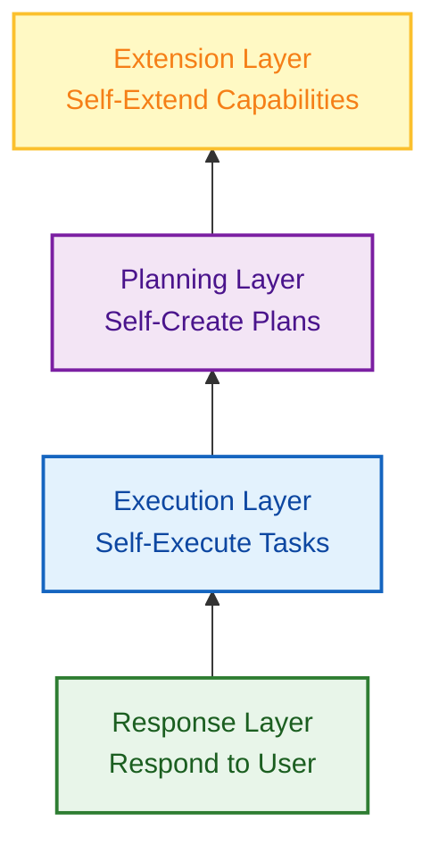
```mermaid
graph BT
    classDef level1 fill:#e8f5e9,stroke:#2e7d32,stroke-width:2px,color:#1b5e20;
    classDef level2 fill:#e3f2fd,stroke:#1565c0,stroke-width:2px,color:#0d47a1;
    classDef level3 fill:#f3e5f5,stroke:#7b1fa2,stroke-width:2px,color:#4a148c;
    classDef level4 fill:#fff9c4,stroke:#fbc02d,stroke-width:2px,color:#f57f17;

    L1[Response Layer<br/>Respond to User]:::level1
    L2[Execution Layer<br/>Self-Execute Tasks]:::level2
    L3[Planning Layer<br/>Self-Create Plans]:::level3
    L4[Extension Layer<br/>Self-Extend Capabilities]:::level4

    L1 --> L2 --> L3 --> L4
```

| Layer | Capability | Implementation | User Value |
|:---:|:---|:---|:---|
| **Response Layer** | Respond to user requests | Dialog system + Tool calls | Basic interaction |
| **Execution Layer** | Self-execute tasks | Background task system | Non-blocking dialog |
| **Planning Layer** | Self-create plans | Scheduled tasks + Heartbeat | Automated execution |
| **Extension Layer** | Self-extend capabilities | MCP config + Skill creation | Infinite extension |

#### Autonomy Architecture Diagram

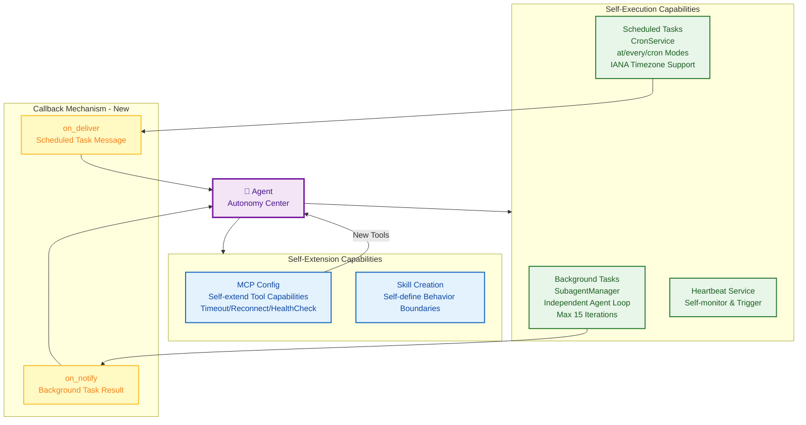
```mermaid
flowchart TB
    classDef core fill:#f3e5f5,stroke:#7b1fa2,stroke-width:3px,color:#4a148c;
    classDef auto fill:#e8f5e9,stroke:#2e7d32,stroke-width:2px,color:#1b5e20;
    classDef extend fill:#e3f2fd,stroke:#1565c0,stroke-width:2px,color:#0d47a1;
    classDef callback fill:#fff9c4,stroke:#fbc02d,stroke-width:2px,color:#f57f17;

    Agent[🤖 Agent<br/>Autonomy Center]:::core

    subgraph Auto [Self-Execution Capabilities]
        BG[Background Tasks<br/>SubagentManager<br/>Independent Agent Loop<br/>Max 15 Iterations]:::auto
        Cron[Scheduled Tasks<br/>CronService<br/>at/every/cron Modes<br/>IANA Timezone Support]:::auto
        Heartbeat[Heartbeat Service<br/>Self-monitor & Trigger]:::auto
    end

    subgraph Callback [Callback Mechanism - New]
        OnNotify[on_notify<br/>Background Task Result]:::callback
        OnDeliver[on_deliver<br/>Scheduled Task Message]:::callback
    end

    subgraph Extend [Self-Extension Capabilities]
        MCP[MCP Config<br/>Self-extend Tool Capabilities<br/>Timeout/Reconnect/HealthCheck]:::extend
        Skills[Skill Creation<br/>Self-define Behavior Boundaries]:::extend
    end

    Agent --> Auto
    Agent --> Extend
    BG --> OnNotify
    Cron --> OnDeliver
    OnNotify --> Agent
    OnDeliver --> Agent
    MCP --> |New Tools| Agent
```

#### Autonomy Comparison

| Capability | Traditional Agent | FinchBot Autonomous Agent |
|:---|:---|:---|
| **Task Execution** | User-triggered, blocking wait | Agent self-starts background tasks |
| **Task Scheduling** | User manually sets | Agent self-creates scheduled tasks |
| **Self-Monitoring** | None | Heartbeat service self-checks status |
| **Capability Extension** | Developer writes code | Agent self-configures MCP |
| **Behavior Definition** | Hardcoded prompts | Agent self-creates skills |

---

### 2.10 Background Task System (Subagent)

**Implementation**: `src/finchbot/background/`

FinchBot implements an advanced background task system using a **three-tool pattern** that allows agents to asynchronously execute long-running tasks.

#### Why Background Tasks?

| Scenario | Traditional Approach | Background Task Solution |
|:---:|:---|:---|
| **Long Research** | Blocks dialog, user waits | Background execution, continue dialog |
| **Batch Processing** | Timeout failure | Async processing, status tracking |
| **Code Generation** | Single-threaded blocking | Concurrent execution, improved efficiency |

#### Three-Tool Pattern

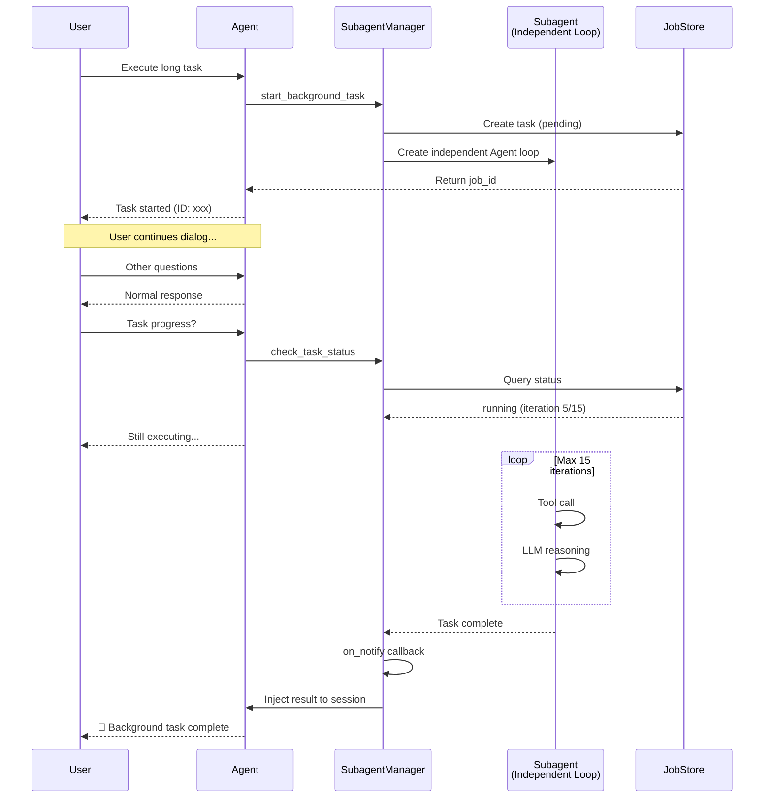
```mermaid
sequenceDiagram
    participant U as User
    participant A as Agent
    participant SM as SubagentManager
    participant SA as Subagent<br/>(Independent Loop)
    participant JS as JobStore

    U->>A: Execute long task
    A->>SM: start_background_task
    SM->>JS: Create task (pending)
    SM->>SA: Create independent Agent loop
    JS-->>A: Return job_id
    A-->>U: Task started (ID: xxx)
    
    Note over U,A: User continues dialog...
    
    U->>A: Other questions
    A-->>U: Normal response
    
    U->>A: Task progress?
    A->>SM: check_task_status
    SM->>JS: Query status
    JS-->>SM: running (iteration 5/15)
    A-->>U: Still executing...
    
    loop Max 15 iterations
        SA->>SA: Tool call
        SA->>SA: LLM reasoning
    end
    
    SA-->>SM: Task complete
    SM->>SM: on_notify callback
    SM->>A: Inject result to session
    A-->>U: 🔔 Background task complete
```

#### Core Components

| Component | File | Function |
| :--- | :--- | :--- |
| **SubagentManager** | `subagent.py` | Manages independent Agent loop, max 15 iterations |
| **JobStore** | `store.py` | In-memory task status storage |
| **BackgroundTools** | `tools.py` | Four tool implementations |
| **Subagent** | Agent instance | Independent task execution |

#### SubagentManager Mechanism

SubagentManager is the core of background tasks, implementing independent Agent loop execution:

| Feature | Description |
| :--- | :--- |
| **Independent Agent Loop** | Creates independent Agent instance for task execution |
| **Max 15 Iterations** | Prevents infinite loops, ensures task termination |
| **on_notify Callback** | Notifies main session when task completes |
| **Session-level Management** | Each session has independent task management |

#### Callback Mechanism

```python
# CLI callback implementation
async def notify_result(session_key: str, label: str, result: str) -> None:
    """Inject result to session when background task completes"""
    current_state = await agent.aget_state(config)
    messages = list(current_state.values.get("messages", []))
    messages.append(SystemMessage(content=f"[Background Task Complete]\n{label}: {result}"))
    agent.update_state(config, {"messages": messages})
```

#### Task State Flow

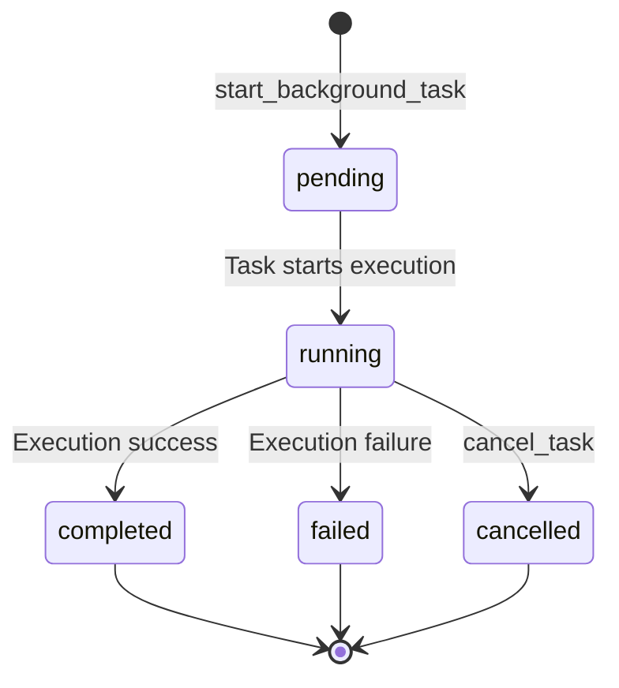
```mermaid
stateDiagram-v2
    [*] --> pending: start_background_task
    pending --> running: Task starts execution
    running --> completed: Execution success
    running --> failed: Execution failure
    running --> cancelled: cancel_task
    completed --> [*]
    failed --> [*]
    cancelled --> [*]
```

#### Background Task Tools

| Tool | Function | Agent Autonomy |
| :--- | :--- | :--- |
| `start_background_task` | Start background task (independent Agent loop, max 15 iterations) | Agent self-determines if background execution needed |
| `check_task_status` | Check task status | Agent self-decides when to check |
| `get_task_result` | Get task result | Agent self-decides when to get result |
| `cancel_task` | Cancel task | Agent self-decides whether to cancel |

---

### 2.11 Scheduled Task System (Cron)

**Implementation**: `src/finchbot/cron/`

FinchBot provides a complete scheduled task solution supporting both **CLI interactive management** and **tool calls**.

#### Three Scheduling Modes

| Mode | Parameter | Description | Use Case |
| :--- | :--- | :--- | :--- |
| **at** | `at="2025-01-15T10:30:00"` | One-time task, auto-deleted after execution | Meeting reminder, one-time notification |
| **every** | `every_seconds=3600` | Interval task, runs every N seconds | Health check, periodic sync |
| **cron** | `cron_expr="0 9 * * *"` | Cron expression for precise scheduling | Daily report, weekday reminder |

#### IANA Timezone Support

Supports IANA timezone identifiers, defaults to system timezone:

```python
# Create scheduled task with timezone
create_cron(
    name="NY Stock Market Open Reminder",
    message="US stock market opening soon",
    cron_expr="0 9:30 * * 1-5",  # Weekdays 9:30
    tz="America/New_York"        # New York timezone
)
```

#### Data Classes Definition

| Data Class | Description |
| :--- | :--- |
| **CronSchedule** | Schedule configuration, contains at/every/cron mode parameters |
| **CronPayload** | Task content, contains name, message, tz, etc. |
| **CronJobState** | Execution state, records last/next execution time |
| **CronJob** | Complete task, integrates Schedule, Payload, State |
| **CronStore** | Storage management, handles JSON persistence |

#### System Architecture

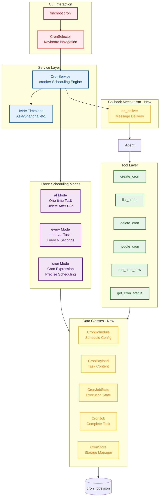
```mermaid
flowchart TB
    classDef cli fill:#ffebee,stroke:#c62828,stroke-width:2px,color:#b71c1c;
    classDef service fill:#e3f2fd,stroke:#1565c0,stroke-width:2px,color:#0d47a1;
    classDef tool fill:#e8f5e9,stroke:#2e7d32,stroke-width:2px,color:#1b5e20;
    classDef mode fill:#f3e5f5,stroke:#7b1fa2,stroke-width:2px,color:#4a148c;
    classDef data fill:#fff9c4,stroke:#fbc02d,stroke-width:2px,color:#f57f17;

    subgraph CLI [CLI Interaction]
        Command[finchbot cron]:::cli
        Selector[CronSelector<br/>Keyboard Navigation]:::cli
    end

    subgraph Service [Service Layer]
        CronService[CronService<br/>croniter Scheduling Engine]:::service
        TZ[IANA Timezone<br/>Asia/Shanghai etc.]:::service
    end

    subgraph Modes [Three Scheduling Modes]
        AtMode["at Mode<br/>One-time Task<br/>Delete After Run"]:::mode
        EveryMode["every Mode<br/>Interval Task<br/>Every N Seconds"]:::mode
        CronMode["cron Mode<br/>Cron Expression<br/>Precise Scheduling"]:::mode
    end

    subgraph Data [Data Classes - New]
        Schedule[CronSchedule<br/>Schedule Config]:::data
        Payload[CronPayload<br/>Task Content]:::data
        State[CronJobState<br/>Execution State]:::data
        Job[CronJob<br/>Complete Task]:::data
        Store[CronStore<br/>Storage Manager]:::data
    end

    subgraph Tools [Tool Layer]
        Create[create_cron]:::tool
        List[list_crons]:::tool
        Delete[delete_cron]:::tool
        Toggle[toggle_cron]:::tool
        RunNow[run_cron_now]:::tool
        GetStatus[get_cron_status]:::tool
    end

    subgraph Callbacks [Callback Mechanism - New]
        OnDeliver[on_deliver<br/>Message Delivery]:::data
    end

    Command --> Selector
    Selector --> CronService
    CronService --> TZ
    CronService --> Modes
    Modes --> Data
    Data --> Storage[(cron_jobs.json)]
    
    Agent[Agent] --> Tools
    Tools --> Data
    
    CronService --> OnDeliver
    OnDeliver --> Agent
```

#### CronSelector Interactive Interface

| Key | Action | Description |
|:---:|:---|:---|
| ↑ / ↓ | Navigate | Move through task list |
| Enter | Details | View task details |
| n | New | Create new scheduled task |
| d | Delete | Delete selected task |
| e | Toggle | Enable/disable task |
| r | Run | Execute immediately |
| q | Quit | Exit management interface |

#### Cron Expression Support

Uses `croniter` library to parse standard 5-field Cron expressions:

| Field | Range | Description |
|:---:|:---:|:---|
| Minute | 0-59 | Execution minute |
| Hour | 0-23 | Execution hour |
| Day | 1-31 | Day of month |
| Month | 1-12 | Month |
| Weekday | 0-6 | Day of week (0=Sunday) |

**Common Expression Examples**:

| Expression | Description |
|:---|:---|
| `0 9 * * *` | Daily at 9:00 AM |
| `0 */2 * * *` | Every 2 hours |
| `30 18 * * 1-5` | Weekdays at 6:30 PM |
| `0 0 1 * *` | First day of month at midnight |
| `0 9,18 * * *` | Daily at 9:00 AM and 6:00 PM |

#### Scheduled Task Tools

| Tool | Function | Agent Autonomy |
| :--- | :--- | :--- |
| `create_cron` | Create scheduled task (supports at/every/cron modes) | Agent self-parses time expressions and creates |
| `list_crons` | List all tasks | Agent self-views current tasks |
| `delete_cron` | Delete task | Agent self-decides to remove unneeded tasks |
| `toggle_cron` | Enable/disable task | Agent self-adjusts task status |
| `run_cron_now` | Execute task immediately | Agent self-triggers task execution |
| `get_cron_status` | Get task execution status | Agent self-queries task details |

---

### 2.12 Heartbeat Service

**Implementation**: `src/finchbot/heartbeat/`

The heartbeat service is FinchBot's background monitoring service, implementing automated task triggering through periodic reading of the `HEARTBEAT.md` file.

#### How It Works

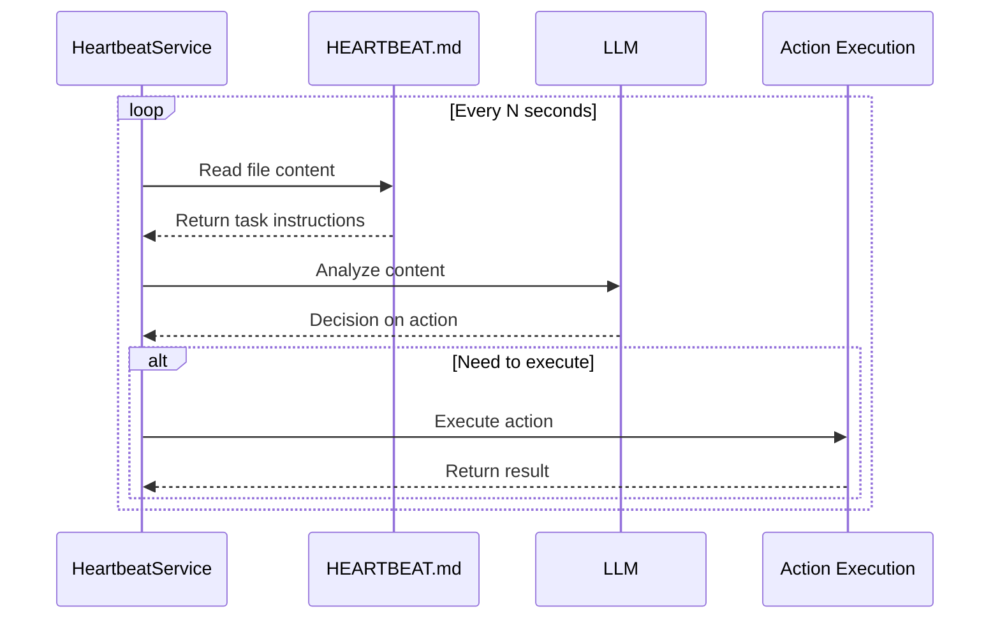
```mermaid
sequenceDiagram
    participant S as HeartbeatService
    participant F as HEARTBEAT.md
    participant L as LLM
    participant A as Action Execution

    loop Every N seconds
        S->>F: Read file content
        F-->>S: Return task instructions
        S->>L: Analyze content
        L-->>S: Decision on action
        alt Need to execute
            S->>A: Execute action
            A-->>S: Return result
        end
    end
```

#### HEARTBEAT.md File Format

```markdown
# Heartbeat Tasks

## To-Do Items
- [ ] Check if scheduled tasks need execution
- [ ] Check background task status
- [ ] Remind user of important items

## User Instructions
- Remind me to check email every day at 9
- Notify me when background task completes
```

#### Supported Action Types

| Action | Description |
|:---|:---|
| `check_cron` | Check and execute due scheduled tasks |
| `check_background` | Check background task status |
| `remind_user` | Send reminder to user |
| `custom_action` | Custom action |

#### Integration with Other Components

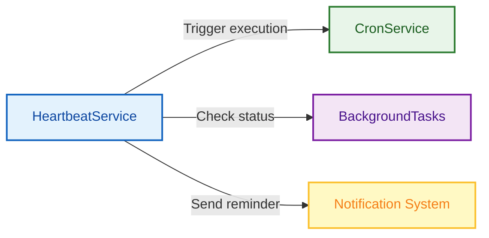
```mermaid
flowchart LR
    classDef heartbeat fill:#e3f2fd,stroke:#1565c0,stroke-width:2px,color:#0d47a1;
    classDef cron fill:#e8f5e9,stroke:#2e7d32,stroke-width:2px,color:#1b5e20;
    classDef background fill:#f3e5f5,stroke:#7b1fa2,stroke-width:2px,color:#4a148c;
    classDef notify fill:#fff9c4,stroke:#fbc02d,stroke-width:2px,color:#f57f17;

    H[HeartbeatService]:::heartbeat
    C[CronService]:::cron
    B[BackgroundTasks]:::background
    N[Notification System]:::notify

    H --> |Trigger execution| C
    H --> |Check status| B
    H --> |Send reminder| N
```

---

### 2.13 MCP Self-Configuration

**Core Philosophy**: Enable agents to autonomously configure MCP servers, dynamically extending their tool capabilities.

#### Self-Extension Architecture

```mermaid
flowchart TB
    classDef need fill:#fff9c4,stroke:#fbc02d,stroke-width:2px,color:#f57f17;
    classDef config fill:#e8f5e9,stroke:#2e7d32,stroke-width:2px,color:#1b5e20;
    classDef tool fill:#e3f2fd,stroke:#1565c0,stroke-width:2px,color:#0d47a1;
    classDef use fill:#f3e5f5,stroke:#7b1fa2,stroke-width:2px,color:#4a148c;

    Need[Agent Discovers Need<br/>"I need database capability"]:::need
    Search[Search Available MCP Servers]:::config
    Config[configure_mcp<br/>Self-Configure]:::config
    Load[Dynamically Load New Tools]:::tool
    Use[Agent Uses New Tools]:::use

    Need --> Search --> Config --> Load --> Use
```

#### Agent Self-Extension Example

```
User: Help me analyze this SQLite database

Agent thinks:
1. Current tool check: No database operation tools
2. Capability gap: Need SQLite operation capability
3. Solution: Configure SQLite MCP server

Agent acts:
1. Call configure_mcp(
     action="add",
     server_name="sqlite",
     command="mcp-server-sqlite",
     args=["--db-path", "/path/to/db"]
   )
2. Call refresh_capabilities() to refresh capability description
3. New tools auto-loaded: query_sqlite, list_tables, ...

Agent uses new capability:
1. Call list_tables() to view schema
2. Call query_sqlite("SELECT * FROM users LIMIT 10")
3. Return to user: Database analysis results...
```

#### Supported MCP Operations

| Operation | Function | Agent Autonomy |
|:---|:---|:---|
| `add` | Add new server | Agent self-discovers need and adds |
| `update` | Update configuration | Agent self-adjusts config parameters |
| `remove` | Remove server | Agent self-removes unneeded capabilities |
| `enable` | Enable server | Agent self-activates configured capabilities |
| `disable` | Disable server | Agent self-temporarily disables capabilities |
| `list` | List all servers | Agent self-views current configuration |

#### MCP Ecosystem

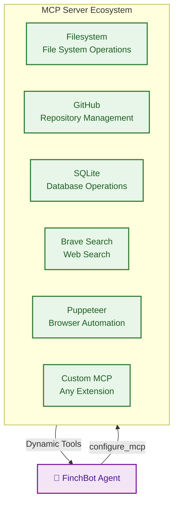
```mermaid
flowchart TB
    classDef core fill:#f3e5f5,stroke:#7b1fa2,stroke-width:2px,color:#4a148c;
    classDef mcp fill:#e8f5e9,stroke:#2e7d32,stroke-width:2px,color:#1b5e20;

    Agent[🤖 FinchBot Agent]:::core

    subgraph MCPServers [MCP Server Ecosystem]
        Filesystem[Filesystem<br/>File System Operations]:::mcp
        GitHub[GitHub<br/>Repository Management]:::mcp
        SQLite[SQLite<br/>Database Operations]:::mcp
        Brave[Brave Search<br/>Web Search]:::mcp
        Puppeteer[Puppeteer<br/>Browser Automation]:::mcp
        Custom[Custom MCP<br/>Any Extension]:::mcp
    end

    Agent --> |configure_mcp| MCPServers
    MCPServers --> |Dynamic Tools| Agent
```

**MCP Servers Agent Can Self-Add**:
- **Filesystem**: File system operations
- **GitHub**: Repository management, Issues, PRs
- **SQLite**: Database queries
- **Brave Search**: Web search
- **Puppeteer**: Browser automation
- **Custom**: Any server following MCP protocol

---

## 3. Data Flow

### 3.1 Complete Data Flow

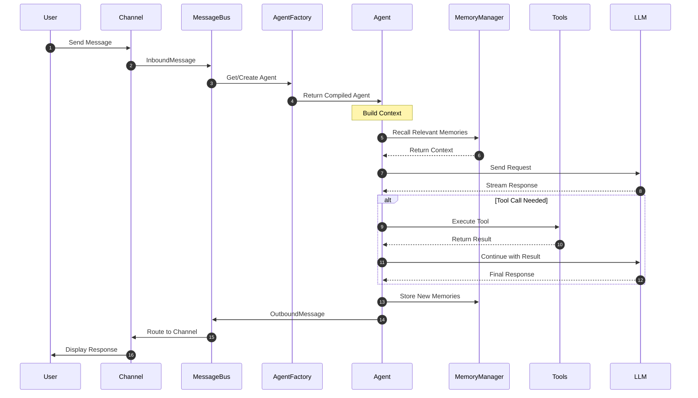
```mermaid
sequenceDiagram
    autonumber
    participant U as User
    participant C as Channel
    participant B as MessageBus
    participant F as AgentFactory
    participant A as Agent
    participant M as MemoryManager
    participant T as Tools
    participant L as LLM

    U->>C: Send Message
    C->>B: InboundMessage
    B->>F: Get/Create Agent
    F->>A: Return Compiled Agent
    
    Note over A: Build Context
    A->>M: Recall Relevant Memories
    M-->>A: Return Context
    
    A->>L: Send Request
    L-->>A: Stream Response
    
    alt Tool Call Needed
        A->>T: Execute Tool
        T-->>A: Return Result
        A->>L: Continue with Result
        L-->>A: Final Response
    end
    
    A->>M: Store New Memories
    A->>B: OutboundMessage
    B->>C: Route to Channel
    C->>U: Display Response
```

### 3.2 Conversation Flow

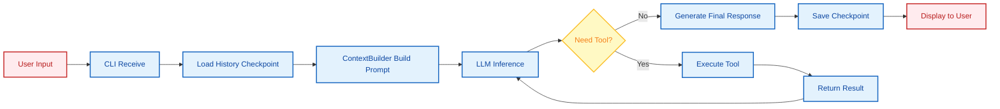
```mermaid
flowchart LR
    classDef startEnd fill:#ffebee,stroke:#c62828,stroke-width:2px,color:#b71c1c;
    classDef process fill:#e3f2fd,stroke:#1565c0,stroke-width:2px,color:#0d47a1;
    classDef decision fill:#fff9c4,stroke:#fbc02d,stroke-width:2px,color:#f57f17;

    A[User Input]:::startEnd --> B[CLI Receive]:::process
    B --> C[Load History Checkpoint]:::process
    C --> D[ContextBuilder Build Prompt]:::process
    D --> E[LLM Inference]:::process
    E --> F{Need Tool?}:::decision
    F -->|No| G[Generate Final Response]:::process
    F -->|Yes| H[Execute Tool]:::process
    H --> I[Return Result]:::process
    I --> E
    G --> J[Save Checkpoint]:::process
    J --> K[Display to User]:::startEnd
```

1. User input -> Received by CLI
2. Agent loads history state (Checkpoint)
3. ContextBuilder constructs current Prompt (including relevant memory)
4. LLM generates response or tool call request
5. If tool call -> Execute tool -> Return result to LLM -> Loop
6. LLM generates final response -> Display to user

### 3.3 Memory Write Flow (Remember)

1. Agent calls `remember` tool
2. `MemoryManager` receives content
3. Automatically calculates `category` (ClassificationService)
4. Automatically calculates `importance` (ImportanceScorer)
5. Writes to SQLite, generating unique ID
6. Synchronously calls Embedding service, writing vector to ChromaDB
7. Records access log

### 3.4 Memory Retrieval Flow (Recall)

1. Agent calls `recall` tool (Query: "What is my API Key")
2. `RetrievalService` converts query to vector
3. Searches Top-K similar results in Vector Store
4. (Optional) Combines with SQLite for metadata filtering (category, time range, etc.)
5. Returns results to Agent

---

## 4. Design Principles

### 4.1 Modularity

Each component has clear responsibility boundaries:
- `MemoryManager` doesn't directly handle storage details, delegates to `SQLiteStore` and `VectorMemoryStore`
- `ToolRegistry` only handles registration and lookup, doesn't care about tool implementation
- `I18n` system is independent of business logic
- `ChannelManager` coordinates multiple channels, decoupled from Agent core

### 4.2 Dependency Inversion

High-level modules don't depend on low-level modules, both depend on abstractions:
```
AgentCore → MemoryManager (Interface)
                ↓
         SQLiteStore / VectorStore (Implementation)
```

### 4.3 Privacy First

- Embedding generation happens locally (FastEmbed), no cloud upload
- Configuration files stored in user directory `~/.finchbot`
- File operations restricted to workspace

### 4.4 Out of the Box

FinchBot makes "Out of the Box" a core design principle:

| Feature | Description |
|:---:|:---|
| **Three-Step Start** | `config` → `sessions` → `chat`, complete workflow in three commands |
| **Environment Variables** | All configurations can be set via environment variables |
| **Rich CLI Interface** | Full-screen keyboard navigation, interactive operation |
| **i18n Support** | Built-in Chinese/English support, auto-detects system language |
| **Auto Fallback** | Web search automatically falls back: Tavily → Brave → DuckDuckGo |
| **Agent Auto-Create Skills** | Tell Agent your needs, auto-generates skill files |

### 4.5 Defensive Programming

- Single-lock pattern prevents concurrency issues
- Vector store failure doesn't affect SQLite writes (degradation strategy)
- Timeout control prevents tool hanging
- Complete error logging (Loguru)

---

## 5. Extension Points

### 5.1 Adding New Tools

Inherit from `FinchTool` base class, implement the `_run()` method, then register with `ToolRegistry`.

### 5.2 Adding MCP Tools

Add MCP server configuration to the config file, supporting both stdio and HTTP transports. MCP tools are automatically loaded via `langchain-mcp-adapters`.

### 5.3 Adding New Skills

Create a `SKILL.md` file under `~/.finchbot/workspace/skills/{skill-name}/`.

### 5.4 Adding New LLM Providers

Add a new Provider class in `providers/factory.py`.

### 5.5 Multi-Platform Messaging Support

Use [LangBot](https://github.com/langbot-app/LangBot) for multi-platform support. LangBot supports QQ, WeChat, Feishu, DingTalk, Discord, Telegram, Slack, and 12+ other platforms.

See [LangBot Documentation](https://docs.langbot.app) for details.

### 5.6 Customizing Memory Retrieval Strategy

Inherit from `RetrievalService` or modify the `search()` method.

### 5.7 Adding New Languages

Add a new `.toml` file under `i18n/locales/`.

---

## Summary

FinchBot's architecture design focuses on:
- **Extensibility**: Clear component boundaries and interfaces
- **Reliability**: Fallback strategies, retry mechanisms, thread safety
- **Maintainability**: Type safety, comprehensive logging, modular design
- **Privacy**: Sensitive data processed locally
- **Multi-Platform Support**: Via LangBot supporting QQ, WeChat, Feishu, DingTalk, Discord, Telegram, Slack, and 12+ platforms
- **MCP Support**: Via official langchain-mcp-adapters supporting both stdio and HTTP transports
