<div align="center"> 
   
  <h1><strong>Xuantong 765</strong></h1> 
  <p><strong>LLM Development Engineer | Communication University of China · Digital Media Technology (Intelligent Interaction & Game Design)</strong></p> 
  <p> 
    <a href="https://blog.csdn.net/Yunyi_Chi" target="_blank" style="text-decoration: none;"> 
      <span style="background-color: #f39c12; color: white; padding: 2px 8px; border-radius: 4px; font-size: 12px; font-weight: bold; display: inline-block;">CSDN · Profile |</span> 
    </a> 
    <a href="https://github.com/xt765" target="_blank" style="text-decoration: none; margin-left: 8px;"> 
      <span style="background-color: #24292e; color: white; padding: 2px 8px; border-radius: 4px; font-size: 12px; font-weight: bold; display: inline-block;">GitHub · Follow</span> 
    </a> 
  </p> 
</div> 

--- 

### **About the Author** 

- **Deep Focus**: LLM Development / RAG Knowledge Base / AI Agent Implementation / Model Fine-tuning 
- **Tech Stack**: Python | RAG (LangChain / Dify + Milvus) | FastAPI + Docker 
- **Engineering**: Model Deployment, Knowledge Base Optimization, Full-stack Solutions 

> **「Make AI interaction smarter, make technology implementation more efficient」** 
> Welcome for technical exchanges and project cooperation!

---

# FinchBot — When AI Says "Let Me Figure It Out" Instead of "I Can't"

<p align="center"> 
    
 </p>

<p align="center">
  <em>Built on LangChain v1.2 and LangGraph v1.0<br>
  With persistent memory, dynamic prompts, autonomous capability extension</em>
</p>

**🎉 Gitee Official Recommended Project** — FinchBot has received official recommendation from Gitee!

---

## Abstract

Consider this conversation:

> User: "Help me analyze this SQLite database."
> 
> **Traditional AI**: "Sorry, I don't have database operation capabilities. I cannot complete this task."
> 
> **FinchBot**: *[Thinking: I don't have database tools yet...]* 
> "Let me configure the database tool for you." 
> *[Calls configure_mcp to add SQLite MCP]* 
> *[New tools loaded: query_sqlite, list_tables...]* 
> "Done! Now I can analyze your database. It contains 3 tables..."

**This is FinchBot's core difference**: When hitting capability boundaries, it doesn't give up — it figures out how to extend itself.

Built on **LangChain v1.2** and **LangGraph v1.0**, FinchBot gives agents true autonomy:

| Boundary | Traditional AI | FinchBot |
|:---|:---|:---|
| **Capability** | "I don't have this ability" | Self-configures MCP, extends capabilities |
| **Time** | Blocks conversation, waits | Runs in background, continues dialog |
| **Planning** | "You need to set it up" | Self-creates scheduled tasks |

**And it's safe**: All autonomous actions operate within security boundaries — file operations are restricted to workspace directory, dangerous shell commands are blocked by blacklist, and only registered tools can be executed.

---

## 1. Why Choose FinchBot?

### The Capability Boundary Problem

| What User Asks | Traditional AI Response | FinchBot Response |
|:---|:---|:---|
| "Analyze this database" | "I don't have database tools" | Self-configures SQLite MCP, then analyzes |
| "Monitor this for 24 hours" | "I can only respond when you ask" | Creates scheduled task, monitors autonomously |
| "Process this large file" | Blocks conversation, user waits | Runs in background, user continues |
| "Learn to do X" | "Wait for developer to add feature" | Self-creates skill via skill-creator |

### Design Philosophy

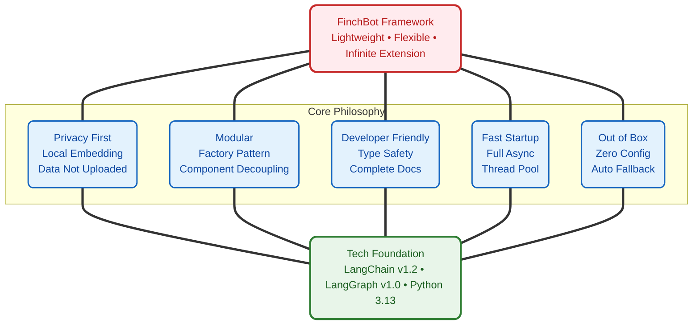

### Multi-Platform Messaging Support

FinchBot provides production-grade multi-platform support via [LangBot](https://github.com/langbot-app/LangBot):

**Supported Platforms**: QQ, WeChat (Official/Enterprise), Feishu, DingTalk, Discord, Telegram, Slack, LINE, KOOK, and 12+ more platforms

```bash
# Install LangBot
uvx langbot

# Access WebUI at http://localhost:5300
# Configure your platforms and connect to FinchBot
```

### MCP (Model Context Protocol) Support

FinchBot uses the official `langchain-mcp-adapters` library for MCP integration, supporting both **stdio** and **HTTP** transports:

```bash
# Install dependency
uv add langchain-mcp-adapters

# Configure MCP servers
finchbot config
# Select "MCP Configuration" option
```

MCP Features:
- Dynamic tool discovery and registration
- stdio and HTTP transports
- Standardized tool calling interface
- Support for multiple MCP servers

### Command Line Interface

FinchBot provides a fully functional CLI — four commands to get started:

```bash
# Step 1: Configure API Key and default model
uv run finchbot config

# Step 2: Manage sessions
uv run finchbot sessions

# Step 3: Start chatting
uv run finchbot chat

# Step 4: Manage scheduled tasks
uv run finchbot cron
```

|          Feature          | Description                                                                         |
| :----------------------: | :---------------------------------------------------------------------------------- |
| **Environment Variables** | All configurations can be set via env vars (`OPENAI_API_KEY`, `ANTHROPIC_API_KEY`) |
|    **i18n Support**     | Built-in Chinese/English support, auto-detects system language                    |
|    **Auto Fallback**    | Web search auto-fallback: Tavily → Brave → DuckDuckGo                             |
| **Scheduled Tasks** | Interactive Cron manager with keyboard navigation                                       |
| **Background Tasks** | Three-tool pattern for async execution of long-running tasks                            |

---

## 2. System Architecture

FinchBot is built on **LangChain v1.2** + **LangGraph v1.0**, an Agent system with persistent memory, dynamic tool scheduling, and multi-platform messaging support.

### Overall Architecture

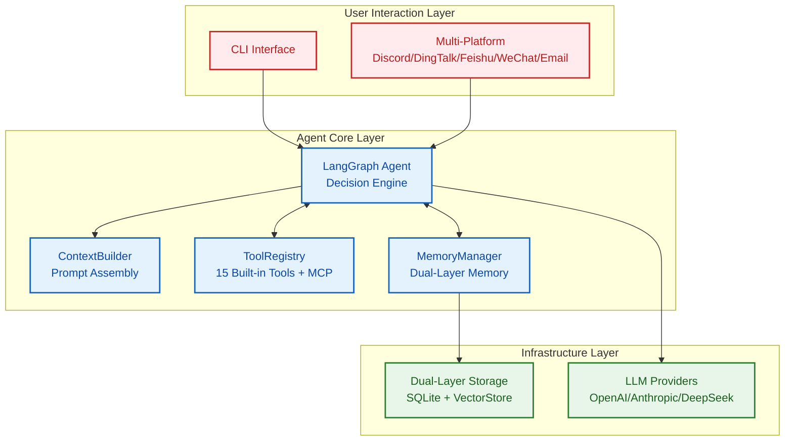

### Data Flow

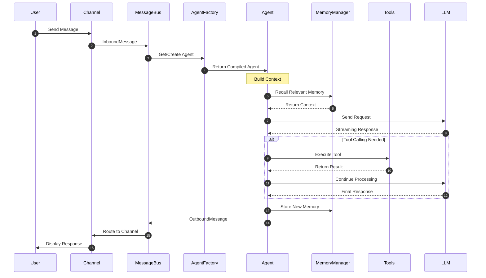

### Directory Structure

```
finchbot/
├── agent/              # Agent Core
│   ├── core.py        # Agent creation and execution
│   ├── factory.py     # AgentFactory component assembly
│   ├── context.py     # ContextBuilder prompt assembly
│   ├── capabilities.py # CapabilitiesBuilder capability building
│   └── skills.py      # SkillsLoader Markdown skill loading
├── channels/           # Multi-platform messaging (via LangBot)
│   ├── base.py        # BaseChannel abstract base class
│   ├── bus.py         # MessageBus async router
│   ├── manager.py     # ChannelManager coordinator
│   ├── schema.py      # Message models
│   └── langbot_integration.py  # LangBot integration guide
├── cli/                # Command Line Interface
│   ├── chat_session.py
│   ├── config_manager.py
│   ├── providers.py
│   └── ui.py
├── config/             # Configuration Management
│   ├── loader.py
│   ├── schema.py      # Includes MCPConfig, ChannelsConfig
│   └── utils.py
├── constants.py        # Unified constants
├── i18n/               # Internationalization
│   ├── loader.py      # Language loader
│   └── locales/
├── memory/             # Memory System
│   ├── manager.py
│   ├── types.py
│   ├── services/       # Service Layer
│   ├── storage/        # Storage Layer
│   └── vector_sync.py
├── providers/          # LLM Providers
│   └── factory.py
├── sessions/           # Session Management
│   ├── metadata.py
│   ├── selector.py
│   └── title_generator.py
├── skills/             # Skill System
│   ├── skill-creator/
│   ├── summarize/
│   └── weather/
├── tools/              # Tool System
│   ├── base.py
│   ├── factory.py     # ToolFactory (MCP tools via langchain-mcp-adapters)
│   ├── registry.py
│   ├── filesystem.py
│   ├── memory.py
│   ├── shell.py
│   ├── web.py
│   ├── session_title.py
│   └── search/
└── utils/              # Utilities
    ├── cache.py
    ├── logger.py
    └── model_downloader.py
```

---

## 3. Core Components

### 3.1 Memory Architecture: Dual-Layer Storage + Agentic RAG

FinchBot implements an advanced **dual-layer memory architecture**, completely solving LLM context window limitations and long-term memory forgetting problems.

#### Why Agentic RAG?

|     Comparison Dimension      | Traditional RAG     | Agentic RAG (FinchBot)          |
| :----------------------------: | :------------------ | :------------------------------ |
|      **Retrieval Trigger**   | Fixed flow         | Agent autonomous decision       |
|      **Retrieval Strategy**   | Single vector      | Hybrid + dynamic weights        |
|      **Memory Management**   | Passive storage    | Active remember/recall/forget   |
|       **Classification**      | None               | Auto classification + scoring   |
|       **Update Mechanism**    | Full rebuild       | Incremental sync                |

#### Dual-Layer Storage Architecture

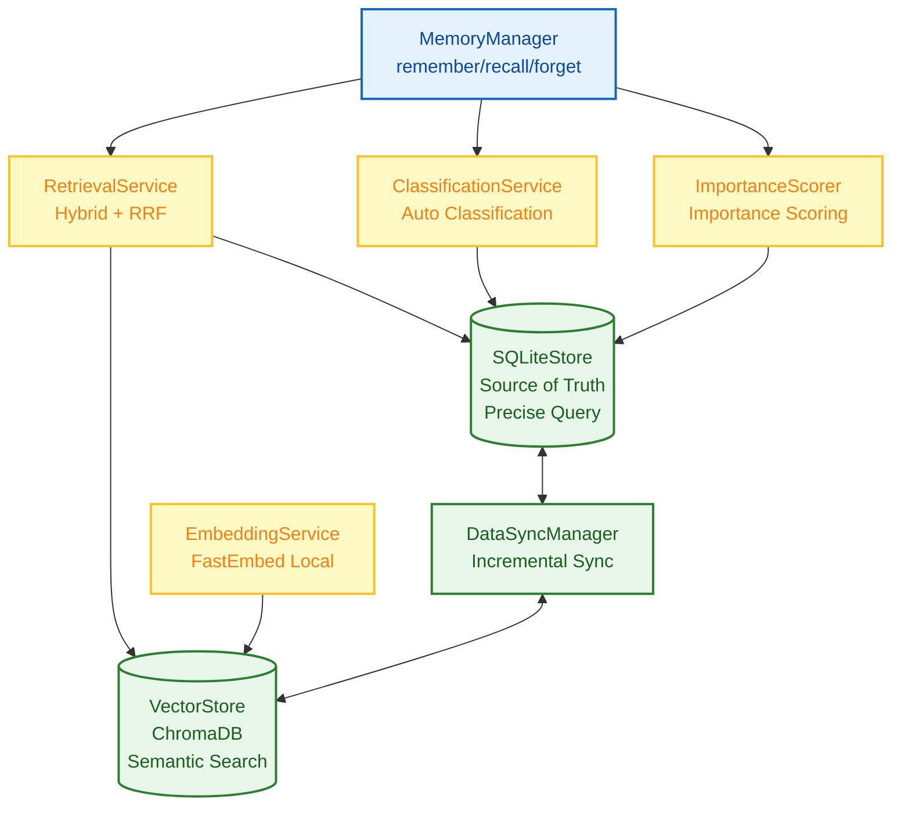

#### Hybrid Retrieval Strategy

FinchBot uses **Weighted RRF (Weighted Reciprocal Rank Fusion)** strategy:

```python
class QueryType(StrEnum):
    """Query type determines retrieval weights"""
    KEYWORD_ONLY = "keyword_only"      # Pure keyword (1.0/0.0)
    SEMANTIC_ONLY = "semantic_only"    # Pure semantic (0.0/1.0)
    FACTUAL = "factual"                # Factual (0.8/0.2)
    CONCEPTUAL = "conceptual"          # Conceptual (0.2/0.8)
    COMPLEX = "complex"                # Complex (0.5/0.5)
    AMBIGUOUS = "ambiguous"            # Ambiguous (0.3/0.7)
```

### 3.2 Dynamic Prompt System: User-Editable Agent Brain

FinchBot's prompt system uses **file system + modular assembly** design.

#### Bootstrap File System

```
~/.finchbot/
├── config.json              # Main configuration file
└── workspace/
    ├── bootstrap/           # Bootstrap files directory
    │   ├── SYSTEM.md        # Role definition
    │   ├── MEMORY_GUIDE.md  # Memory usage guide
    │   ├── SOUL.md          # Soul settings (personality)
    │   └── AGENT_CONFIG.md  # Agent configuration
    ├── config/              # Configuration directory
    │   └── mcp.json         # MCP server configuration
    ├── generated/           # Auto-generated files
    │   ├── TOOLS.md         # Tool documentation
    │   └── CAPABILITIES.md  # Capabilities info
    ├── skills/              # Custom skills
    ├── memory/              # Memory storage
    └── sessions/            # Session data
```

#### Prompt Loading Process

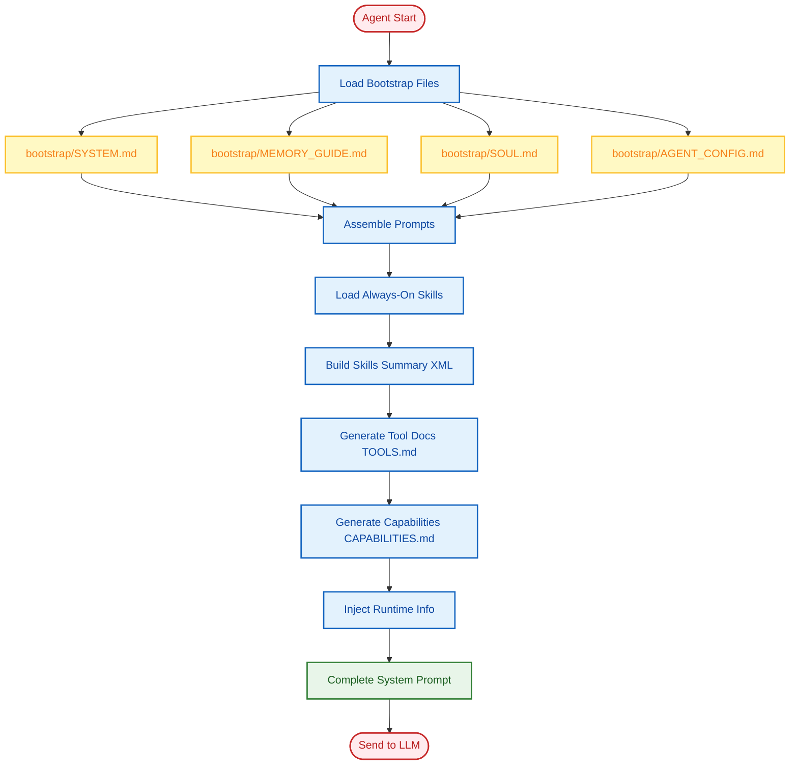

### 3.3 Tool System: Code-Level Capability Extension

Tools are the bridge between Agent and the external world. FinchBot provides 15 built-in tools with easy extensibility.

#### Tool System Architecture

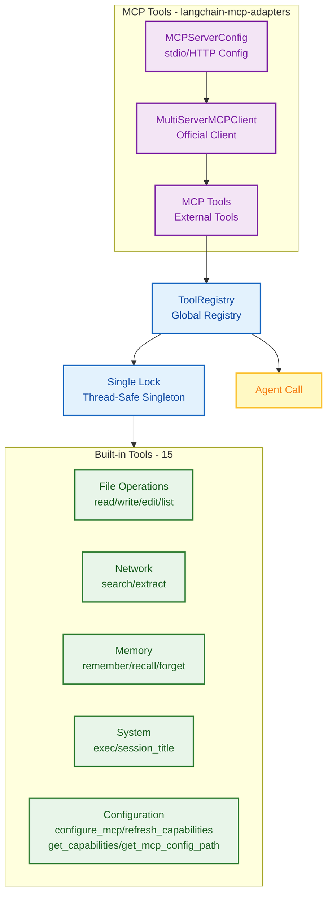

#### Built-in Tools Overview

|       Category       | Tool              | Function                       |
| :------------------: | :---------------- | :------------------------------ |
| **File Operations** | `read_file`     | Read local files               |
|                     | `write_file`    | Write local files              |
|                     | `edit_file`     | Edit file content              |
|                     | `list_dir`      | List directory contents        |
|  **Network**        | `web_search`    | Web search (Tavily/Brave/DDG)  |
|                     | `web_extract`   | Web content extraction         |
|  **Memory**         | `remember`      | Active memory storage          |
|                     | `recall`        | Memory retrieval               |
|                     | `forget`        | Delete/archive memory          |
|  **System**         | `exec`          | Safe shell command execution   |
|                     | `session_title` | Manage session title           |
|  **Configuration**  | `configure_mcp` | Dynamically configure MCP servers (supports enable/disable) |
|                     | `refresh_capabilities` | Refresh capabilities file |
|                     | `get_capabilities` | Get current capabilities  |
|                     | `get_mcp_config_path` | Get MCP config path   |

#### Web Search: Three-Engine Fallback Design

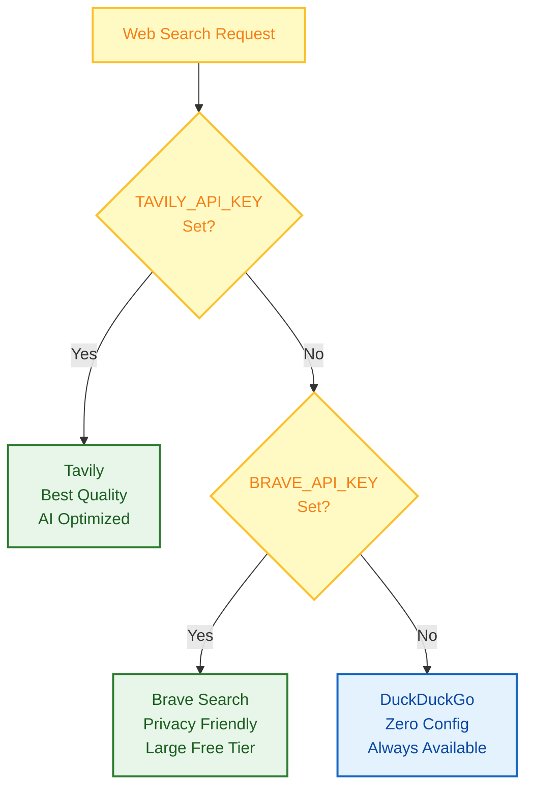

| Priority |      Engine       | API Key | Features                                |
| :-------: | :---------------: | :------: | :-------------------------------------- |
|    1    |    **Tavily**    | Required | Best quality, AI optimized, deep search |
|    2    | **Brave Search** | Required | Large free tier, privacy friendly      |
|    3    |  **DuckDuckGo**  | Not required | Always available, zero config      |

**How it works**:

1. If `TAVILY_API_KEY` is set → Use Tavily (best quality)
2. Otherwise if `BRAVE_API_KEY` is set → Use Brave Search
3. Otherwise → Use DuckDuckGo (no API Key needed, always available)

This design ensures **web search works out of the box even without any API Key configured**!

#### Agent Self-Configuration: Dynamic MCP Management

FinchBot's Agent can autonomously manage MCP servers through the `configure_mcp` tool, enabling dynamic capability expansion without manual configuration file editing.

**Supported Operations**:

| Operation | Description |
| :--- | :--- |
| `add` | Add new MCP server |
| `update` | Update existing server configuration |
| `remove` | Delete MCP server |
| `enable` | Enable disabled MCP server |
| `disable` | Temporarily disable MCP server |
| `list` | List all configured servers |

**Dynamic Prompt Updates**:

When MCP configuration changes, the Agent can refresh capability descriptions through `refresh_capabilities`, ensuring the system prompt always reflects current capabilities.

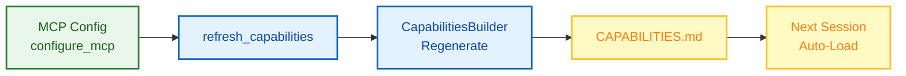

### 3.4 Skill System: Define Agent Capabilities with Markdown

Skills are FinchBot's unique innovation — **define Agent capability boundaries using Markdown files**.

#### Killer Feature: Agent Auto-Creates Skills

FinchBot has a built-in **skill-creator** skill, the ultimate embodiment of the out-of-box philosophy:

> **Just tell the Agent what skill you want, and it will automatically create it!**

```
User: Help me create a translation skill that translates Chinese to English.

Agent: Sure, I'll create a translation skill for you...
       [Calling skill-creator skill]
       Created skills/translator/SKILL.md
       You can now use the translation feature!
```

No need to manually create files or write code — **one sentence extends Agent capabilities**!

#### Skill File Structure

```
skills/
├── skill-creator/        # Skill Creator (built-in) - Core feature
│   └── SKILL.md
├── summarize/            # Smart Summary (built-in)
│   └── SKILL.md
├── weather/              # Weather Query (built-in)
│   └── SKILL.md
└── my-custom-skill/      # Auto-created by Agent or user-defined
    └── SKILL.md
```

#### Core Design Highlights

|        Feature         | Description                                |
| :--------------------: | :---------------------------------------- |
| **Agent Auto-Create** | Tell Agent requirements, auto-generate   |
|  **Dual-Layer Source** | Workspace skills first, built-in backup |
|   **Dependency Check** | Auto-check CLI tools and env vars        |
|  **Cache Invalidation** | Based on file modification time        |
|   **Progressive Load** | Always-on skills first, on-demand others  |

### 3.5 Channel System: Multi-Platform Messaging Support

FinchBot provides production-grade multi-platform messaging support via [LangBot](https://github.com/langbot-app/LangBot).

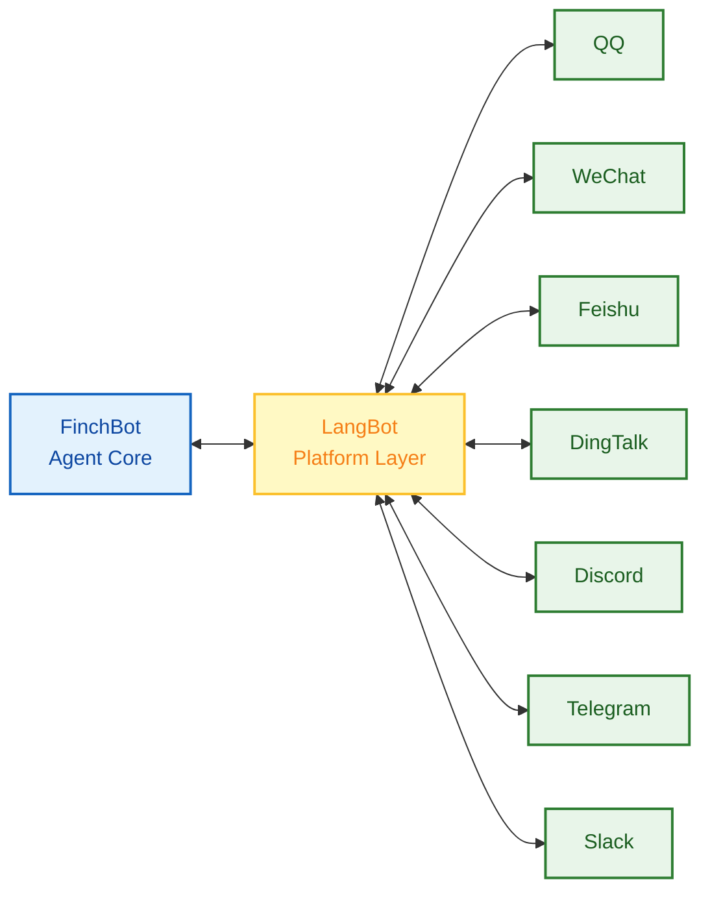

**LangBot Features**:
- **15k+ GitHub Stars**, actively maintained
- **Supports 12+ platforms**: QQ, WeChat, WeCom, Feishu, DingTalk, Discord, Telegram, Slack, LINE, KOOK, Satori
- **Built-in WebUI**: Visual configuration for all platforms
- **Plugin ecosystem**: Supports MCP and other extensions

### 3.6 LangChain 1.2 Architecture Practice

FinchBot is built on **LangChain v1.2** and **LangGraph v1.0**, using the latest Agent architecture.

```python
from langchain.agents import create_agent
from langgraph.checkpoint.sqlite import SqliteSaver

def create_finch_agent(
    model: BaseChatModel,
    workspace: Path,
    tools: Sequence[BaseTool] | None = None,
    use_persistent: bool = True,
) -> tuple[CompiledStateGraph, SqliteSaver | MemorySaver]:

    # 1. Initialize checkpointer (persistent state)
    if use_persistent:
        checkpointer = SqliteSaver.from_conn_string(str(db_path))
    else:
        checkpointer = MemorySaver()

    # 2. Build system prompt
    system_prompt = build_system_prompt(workspace)

    # 3. Create Agent (using LangChain official API)
    agent = create_agent(
        model=model,
        tools=list(tools) if tools else None,
        system_prompt=system_prompt,
        checkpointer=checkpointer,
    )

    return agent, checkpointer
```

#### Supported LLM Providers

|   Provider   | Models                        | Features              |
| :-----------: | :---------------------------- | :-------------------- |
|   OpenAI   | GPT-5, GPT-5.2, O3-mini      | Most capable         |
|  Anthropic  | Claude Sonnet 4.5, Opus 4.6  | High security, long  |
|  DeepSeek   | DeepSeek Chat, Reasoner       | Best value           |
|   Gemini   | Gemini 2.5 Flash              | Google's latest      |
|    Groq    | Llama 4 Scout/Maverick       | Fastest inference    |
|  Moonshot   | Kimi K1.5/K2.5               | Long context          |

---

## 4. Quick Start

### Prerequisites

|    Item    | Requirement                |
| :--------: | :------------------------ |
|    OS      | Windows / Linux / macOS  |
|  Python    | 3.13+                     |
|   Package Manager | uv (recommended)   |

### Installation Steps

```bash
# Clone repository (choose one)
# Gitee (recommended for China)
git clone https://gitee.com/xt765/FinchBot.git
# or GitHub
git clone https://github.com/xt765/FinchBot.git

cd finchbot

# Install dependencies
uv sync
```

> **Note**: The embedding model (~95MB) will be automatically downloaded to local on first run (e.g., running `finchbot chat`). No manual intervention needed.

### Best Practice: Three Steps to Start

```bash
# Step 1: Configure API Key and default model
uv run finchbot config

# Step 2: Manage your sessions
uv run finchbot sessions

# Step 3: Start chatting
uv run finchbot chat
```

That's it! These three commands cover the complete workflow:

- `finchbot config` — Interactive configuration of LLM provider, API keys, and settings
- `finchbot sessions` — Full-screen session manager, create/rename/delete sessions
- `finchbot chat` — Start or continue interactive dialogue

### Docker Deployment

FinchBot provides official Docker support for one-click deployment:

```bash
# Clone repository
git clone https://gitee.com/xt765/FinchBot.git
cd finchbot

# Create .env file and configure API keys
cp .env.example .env
# Edit .env to add your API keys

# Build and run
docker-compose up -d

# Use CLI
docker exec -it finchbot finchbot chat
```

|      Feature       | Description                              |
| :----------------: | :--------------------------------------- |
| **One-click deploy** | `docker-compose up -d`                 |
| **Persistent storage** | Manage workspace and cache via volumes |
|  **Health check**  | Built-in container health monitoring   |
| **Multi-arch**     | Supports x86_64 and ARM64              |

---

## 5. Tech Stack

|      Layer      | Technology              |  Version  |
| :-------------: | :--------------------- | :--------: |
|  Base Language  | Python                 |   3.13+    |
|  Agent Framework | LangChain              | 1.2.10+    |
|  State Management| LangGraph             |  1.0.8+    |
| Data Validation | Pydantic               |    v2      |
| Vector Store    | ChromaDB               |  0.5.0+    |
| Local Embedding | FastEmbed              |  0.4.0+    |
| Search Enhance  | BM25                   |  0.2.2+    |
|  CLI Framework  | Typer                  | 0.23.0+    |
|    Rich Text    | Rich                   |  14.3+     |
|     Logging     | Loguru                 |  0.7.3+    |
|  Config Manage  | Pydantic Settings     | 2.12.0+    |

---

## 6. Project Advantages

|       Advantage        | Description                                                                 |
| :-------------------: | :-------------------------------------------------------------------------- |
|   **Breaks Capability Boundaries**   | Agent self-configures MCP and creates skills when facing limits              |
|   **Non-Blocking Execution**   | Long tasks run in background, conversations continue              |
|   **Autonomous Scheduling**   | Agent self-creates Cron tasks, runs 24/7             |
| **Safe Autonomy** | File operations restricted to workspace, dangerous shell commands blocked |
|   **Persistent Memory**   | Dual-layer storage + Agentic RAG, never forgets      |
|   **Privacy First**   | Using FastEmbed for local vector generation, no data uploaded to cloud     |
|  **Production Ready** | Single lock mode, auto-retry, timeout control                               |
|  **Flexible Extension** | Inherit FinchTool or create SKILL.md to extend, no core code changes      |
|  **Model Agnostic**   | Supports OpenAI, Anthropic, Gemini, DeepSeek, Moonshot, Groq, etc.        |
| **Multi-Platform**    | Via LangBot supports QQ, WeChat, Feishu, DingTalk, Discord, Telegram, Slack and 12+ platforms |
| **MCP Support**       | Via official langchain-mcp-adapters supporting stdio and HTTP transports |

---

## 4. Agent Autonomy Architecture

**Core Philosophy**: FinchBot is designed to give agents **true autonomy**—not just responding to user requests, but self-deciding, self-executing, and self-extending.

### Autonomy Pyramid

```mermaid
flowchart LR
    subgraph L1["Response Layer"]
        R1["Dialog System"]
        R2["Tool Calls"]
        R3["Context Memory"]
    end

    subgraph L2["Execution Layer"]
        X1["Background Tasks"]
        X2["Async Processing"]
        X3["Non-Blocking"]
    end

    subgraph L3["Planning Layer"]
        P1["Cron Tasks"]
        P2["Heartbeat Monitor"]
        P3["Auto Trigger"]
    end

    subgraph L4["Extension Layer"]
        E1["MCP Auto-Config"]
        E2["Skill Creation"]
        E3["Dynamic Loading"]
    end

    L1 --> L2 --> L3 --> L4

    style L1 fill:#e8f5e9,stroke:#2e7d32,stroke-width:2px,color:#1b5e20
    style L2 fill:#e3f2fd,stroke:#1565c0,stroke-width:2px,color:#0d47a1
    style L3 fill:#f3e5f5,stroke:#7b1fa2,stroke-width:2px,color:#4a148c
    style L4 fill:#fff9c4,stroke:#f9a825,stroke-width:2px,color:#f57f17
```

| Layer | Capability | Implementation | User Value |
|:---:|:---|:---|:---|
| **Response Layer** | Respond to user requests | Dialog system + Tool calls | Basic interaction |
| **Execution Layer** | Self-execute tasks | Background task system | Non-blocking dialog |
| **Planning Layer** | Self-create plans | Scheduled tasks + Heartbeat | Automated execution |
| **Extension Layer** | Self-extend capabilities | MCP config + Skill creation | Infinite extension |

### Autonomy Comparison

| Capability | Traditional Agent | FinchBot Autonomous Agent |
|:---|:---|:---|
| **Task Execution** | User-triggered, blocking wait | Agent self-starts background tasks |
| **Task Scheduling** | User manually sets | Agent self-creates scheduled tasks |
| **Self-Monitoring** | None | Heartbeat service self-checks status |
| **Capability Extension** | Developer writes code | Agent self-configures MCP |
| **Behavior Definition** | Hardcoded prompts | Agent self-creates skills |

### Background Task System (Subagent)

FinchBot implements an advanced background task system using a **three-tool pattern** that allows agents to asynchronously execute long-running tasks.

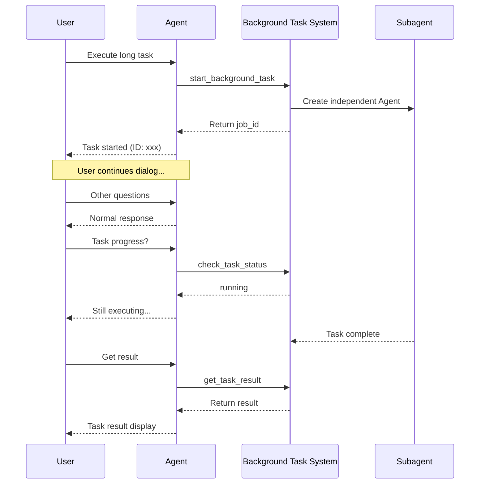

| Tool | Function | Agent Autonomy |
|:---|:---|:---|
| `start_background_task` | Start background task | Agent self-determines if background execution needed |
| `check_task_status` | Check task status | Agent self-decides when to check |
| `get_task_result` | Get task result | Agent self-decides when to get result |
| `cancel_task` | Cancel task | Agent self-decides whether to cancel |

### Scheduled Task System (Cron)

FinchBot provides a complete scheduled task solution supporting both **CLI interactive management** and **tool calls**.

**Cron Expression Examples**:

| Expression | Description |
|:---|:---|
| `0 9 * * *` | Daily at 9:00 AM |
| `0 */2 * * *` | Every 2 hours |
| `30 18 * * 1-5` | Weekdays at 6:30 PM |
| `0 0 1 * *` | First day of month at midnight |

**Interactive Interface**:

| Key | Action |
|:---:|:---|
| ↑ / ↓ | Navigate task list |
| Enter | View task details |
| n | Create new task |
| d | Delete selected task |
| e | Enable/disable task |
| r | Execute immediately |
| q | Quit management |

### Heartbeat Service

The heartbeat service is FinchBot's background monitoring service, implementing automated task triggering through periodic reading of the `HEARTBEAT.md` file.

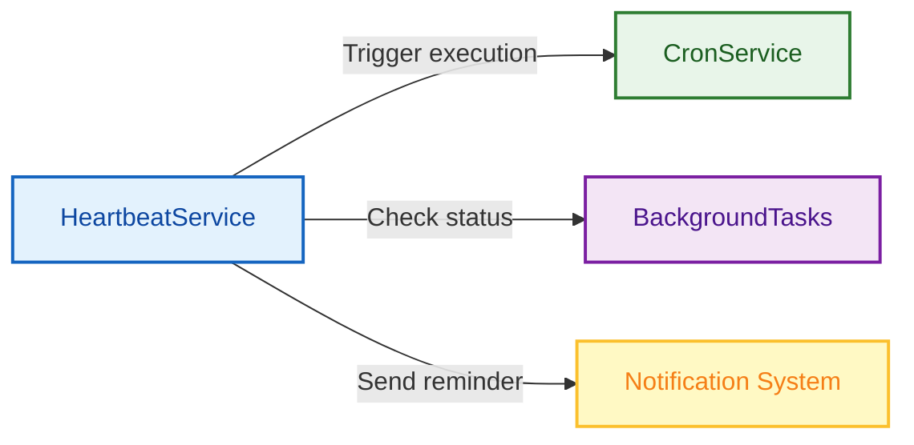

### MCP Self-Configuration

**Core Philosophy**: Enable agents to autonomously configure MCP servers, dynamically extending their tool capabilities.

```mermaid
flowchart TB
    classDef need fill:#fff9c4,stroke:#fbc02d,stroke-width:2px,color:#f57f17;
    classDef config fill:#e8f5e9,stroke:#2e7d32,stroke-width:2px,color:#1b5e20;
    classDef tool fill:#e3f2fd,stroke:#1565c0,stroke-width:2px,color:#0d47a1;
    classDef use fill:#f3e5f5,stroke:#7b1fa2,stroke-width:2px,color:#4a148c;

    Need[Agent Discovers Need<br/>"I need database capability"]:::need
    Search[Search Available MCP Servers]:::config
    Config[configure_mcp<br/>Self-Configure]:::config
    Load[Dynamically Load New Tools]:::tool
    Use[Agent Uses New Tools]:::use

    Need --> Search --> Config --> Load --> Use
```

**Agent Self-Extension Example**:

```
User: Help me analyze this SQLite database

Agent thinks:
1. Current tool check: No database operation tools
2. Capability gap: Need SQLite operation capability
3. Solution: Configure SQLite MCP server

Agent acts:
1. Call configure_mcp(action="add", server_name="sqlite", ...)
2. Call refresh_capabilities() to refresh capability description
3. New tools auto-loaded: query_sqlite, list_tables, ...

Agent uses new capability:
1. Call list_tables() to view schema
2. Call query_sqlite("SELECT * FROM users LIMIT 10")
3. Return to user: Database analysis results...
```

---

## Links

- **Project**: [GitHub - FinchBot](https://github.com/xt765/FinchBot) | [Gitee - FinchBot](https://gitee.com/xt765/FinchBot)
- **Documentation**: [FinchBot Docs](https://github.com/xt765/FinchBot/tree/main/docs)
- **Issues**: [GitHub Issues](https://github.com/xt765/FinchBot/issues)

---

> If this is helpful, please give a Star⭐ to support!
