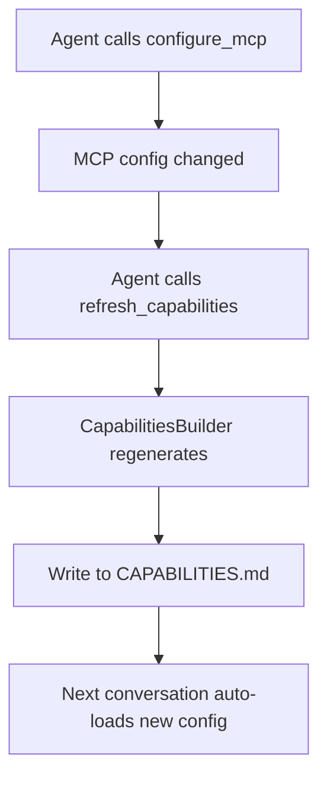

# Configuration Guide

FinchBot uses a flexible hierarchical configuration system that supports **configuration files** and **environment variables**.

**Priority**: **Environment Variables** > **User Config File** (`~/.finchbot/config.json`) > **Default Values**

## Table of Contents

1. [Configuration File Structure](#1-configuration-file-structure)
2. [Environment Variables](#2-environment-variables)
3. [Quick Setup](#3-quick-setup)
4. [Example Configurations](#4-example-configurations)
5. [Advanced Configuration](#5-advanced-configuration)

---

## 1. Configuration File Structure

The user configuration file is located at `~/.finchbot/config.json` by default.

### Root Object

| Field | Type | Default | Description |
| :--- | :--- | :--- | :--- |
| `language` | string | `"en-US"` | Interface and prompt language. Supports `zh-CN`, `en-US`. |
| `language_set_by_user` | boolean | `false` | Whether language was manually set by user (for auto-detection). |
| `default_model` | string | `"gpt-5"` | Default LLM model name to use. |
| `default_model_set_by_user` | boolean | `false` | Whether default model was manually set by user. |
| `agents` | object | - | Agent behavior configuration. |
| `providers` | object | - | LLM provider configuration. |
| `tools` | object | - | Tool-specific configuration. |

### `agents` Configuration

| Field | Type | Default | Description |
| :--- | :--- | :--- | :--- |
| `defaults.workspace` | string | `~/.finchbot/workspace` | Agent workspace directory. All file operations will be restricted to this directory. |
| `defaults.model` | string | `"gpt-5"` | Default model to use. |
| `defaults.temperature` | float | `0.7` | Model temperature (0.0-1.0). 0.0 is most deterministic, 1.0 is most creative. |
| `defaults.max_tokens` | int | `8192` | Maximum output tokens. |
| `defaults.max_tool_iterations` | int | `20` | Maximum tool calls per conversation (prevents infinite loops). |

### `providers` Configuration

Supported providers: `openai`, `anthropic`, `gemini`, `deepseek`, `moonshot`, `dashscope`, `groq`, `openrouter`, `custom`.

Each provider contains the following fields:

| Field | Type | Description |
| :--- | :--- | :--- |
| `api_key` | string | API Key. Recommended to configure via environment variables. |
| `api_base` | string | API Base URL. For proxies or self-hosted models. |
| `extra_headers` | dict | Additional request headers (optional). |
| `models` | list[str] | List of supported models for this provider (optional). |
| `openai_compatible` | bool | Whether compatible with OpenAI API format (default: true). |

**Built-in Provider List**:

| Provider | Description | Env Var Prefix | Recommended Models |
| :--- | :--- | :--- | :--- |
| `openai` | OpenAI Official | `OPENAI_*` | gpt-5, gpt-5.2, o3-mini |
| `anthropic` | Anthropic Claude | `ANTHROPIC_*` | claude-sonnet-4.5, claude-opus-4.6 |
| `gemini` | Google Gemini | `GOOGLE_*` | gemini-2.5-flash |
| `deepseek` | DeepSeek | `DEEPSEEK_*` | deepseek-chat, deepseek-reasoner |
| `moonshot` | Moonshot (Kimi) | `MOONSHOT_*` | kimi-k1.5, kimi-k2.5 |
| `dashscope` | Alibaba Cloud Tongyi | `DASHSCOPE_*` | qwen-turbo, qwen-max |
| `groq` | Groq | `GROQ_*` | llama-4-scout, llama-4-maverick |
| `openrouter` | OpenRouter | `OPENROUTER_*` | (various models) |
| `custom` | Custom Providers | None | - |

### `tools` Configuration

| Field | Type | Default | Description |
| :--- | :--- | :--- | :--- |
| `restrict_to_workspace` | bool | `false` | Whether to restrict file operations to workspace. Recommended to keep enabled for security. |
| `web.search.max_results` | int | `5` | Maximum number of search results per query. |
| `web.search.api_key` | string | - | Tavily Search API Key. |
| `web.search.brave_api_key` | string | - | Brave Search API Key. |
| `exec.timeout` | int | `60` | Shell command execution timeout in seconds. |

---

## 2. Environment Variables

All configuration items can be overridden via environment variables. Environment variable prefixes are typically `FINCHBOT_` or provider-specific prefixes.

Nested configuration uses double underscores `__` for separation (Pydantic Settings format).

### LLM Providers

| Provider | API Key Variable | API Base Variable |
| :--- | :--- | :--- |
| OpenAI | `OPENAI_API_KEY` | `OPENAI_API_BASE` |
| Anthropic | `ANTHROPIC_API_KEY` | `ANTHROPIC_API_BASE` |
| Gemini | `GOOGLE_API_KEY` | - |
| DeepSeek | `DEEPSEEK_API_KEY` | `DEEPSEEK_API_BASE` |
| Groq | `GROQ_API_KEY` | `GROQ_API_BASE` |
| Moonshot | `MOONSHOT_API_KEY` | `MOONSHOT_API_BASE` |
| DashScope | `DASHSCOPE_API_KEY` | `DASHSCOPE_API_BASE` |
| OpenRouter | `OPENROUTER_API_KEY` | `OPENROUTER_API_BASE` |

### Search Tools

| Tool | API Key Variable | Note |
| :--- | :--- | :--- |
| Tavily | `TAVILY_API_KEY` | Best quality, requires API Key |
| Brave | `BRAVE_API_KEY` | Free tier, requires API Key |
| DuckDuckGo | - | No API Key required (Fallback) |

### General Configuration

| Variable Name | Corresponding Config Item | Example |
| :--- | :--- | :--- |
| `FINCHBOT_LANGUAGE` | `language` | `zh-CN` |
| `FINCHBOT_DEFAULT_MODEL` | `default_model` | `gpt-4o` |
| `FINCHBOT_AGENTS__DEFAULTS__WORKSPACE` | `agents.defaults.workspace` | `/path/to/workspace` |
| `FINCHBOT_TOOLS__RESTRICT_TO_WORKSPACE` | `tools.restrict_to_workspace` | `true` |

---

## 3. Quick Setup

### Method 1: Interactive Configuration (Recommended)

Run the configuration wizard:

```bash
uv run finchbot config
```

This command launches an interactive interface that guides you through:
- Language selection
- Default model setup
- Provider API Key configuration
- Workspace settings

### Method 2: Manual Configuration File

1.  If no config file exists, the system will automatically create default config
2.  Edit `~/.finchbot/config.json`

### Method 3: Environment Variables

Set in `.env` file (project root):

```bash
OPENAI_API_KEY=sk-...
OPENAI_API_BASE=https://api.openai.com/v1
FINCHBOT_LANGUAGE=en-US
FINCHBOT_DEFAULT_MODEL=gpt-5
```

---

## 4. Example Configurations

### Minimal Configuration

```json
{
  "language": "en-US",
  "default_model": "gpt-5",
  "providers": {
    "openai": {
      "api_key": "sk-proj-..."
    }
  }
}
```

### Full Configuration Example

```json
{
  "language": "en-US",
  "language_set_by_user": true,
  "default_model": "gpt-5",
  "default_model_set_by_user": true,
  "agents": {
    "defaults": {
      "workspace": "~/.finchbot/workspace",
      "model": "gpt-5",
      "temperature": 0.7,
      "max_tokens": 8192,
      "max_tool_iterations": 20
    }
  },
  "providers": {
    "openai": {
      "api_key": "sk-proj-...",
      "api_base": "https://api.openai.com/v1"
    },
    "anthropic": {
      "api_key": "sk-ant-..."
    },
    "deepseek": {
      "api_key": "sk-...",
      "api_base": "https://api.deepseek.com"
    },
    "moonshot": {
      "api_key": "sk-...",
      "api_base": "https://api.moonshot.cn/v1"
    },
    "custom": {
      "my-provider": {
        "api_key": "sk-...",
        "api_base": "https://my-provider.com/v1",
        "openai_compatible": true
      }
    }
  },
  "tools": {
    "restrict_to_workspace": false,
    "web": {
      "search": {
        "api_key": "tvly-...",
        "brave_api_key": "...",
        "max_results": 5
      }
    },
    "exec": {
      "timeout": 60
    }
  }
}
```

### Using DeepSeek Configuration

```json
{
  "language": "en-US",
  "default_model": "deepseek-chat",
  "providers": {
    "deepseek": {
      "api_key": "sk-...",
      "api_base": "https://api.deepseek.com"
    }
  }
}
```

### Using Local Ollama Configuration

```json
{
  "language": "en-US",
  "default_model": "llama3",
  "providers": {
    "custom": {
      "ollama": {
        "api_base": "http://localhost:11434/v1",
        "api_key": "dummy-key",
        "openai_compatible": true
      }
    }
  }
}
```

---

## 5. Advanced Configuration

### Bootstrap File System

FinchBot uses a file system to manage Agent prompts and behaviors:

```
~/.finchbot/
├── config.json              # Main configuration file
└── workspace/
    ├── bootstrap/           # Bootstrap files directory
    │   ├── SYSTEM.md        # Role definition
    │   ├── MEMORY_GUIDE.md  # Memory usage guide
    │   ├── SOUL.md          # Soul definition (personality)
    │   └── AGENT_CONFIG.md  # Agent configuration
    ├── config/              # Configuration directory
    │   └── mcp.json         # MCP server configuration
    ├── generated/           # Auto-generated files
    │   ├── TOOLS.md         # Tool documentation
    │   └── CAPABILITIES.md  # Capabilities info
    ├── skills/              # Custom skills
    │   └── my-skill/
    │       └── SKILL.md
    ├── memory/              # Memory storage
    │   └── memory.db
    ├── memory_vectors/      # Vector database
    └── sessions/            # Session data
        ├── checkpoints.db   # Conversation state persistence
        └── metadata.db      # Session metadata
```

### Custom SYSTEM.md

```markdown
# Role Definition

You are a professional AI assistant named FinchBot.

## Core Capabilities
- Intelligent conversation and Q&A
- File operations and management
- Web search and information extraction
- Long-term memory management

## Behavioral Guidelines
- Always maintain professionalism and friendliness
- Proactively use tools to solve problems
- Reasonably use memory functions to store important information
```

### Custom SOUL.md

```markdown
# Soul Definition

## Personality Traits
- Enthusiastic and helpful
- Rigorous and detail-oriented
- Eager to learn and continuously improve

## Communication Style
- Concise and to the point
- Appropriately use emojis for approachability
- Provide detailed explanations when necessary
```

### Log Level Configuration

Control log output via command-line arguments:

```bash
# Default: WARNING and above
finchbot chat

# INFO and above
finchbot -v chat

# DEBUG and above (debug mode)
finchbot -vv chat
```

---

## Verifying Configuration

View currently configured providers:

```bash
uv run finchbot config
```

Or directly run a chat test:

```bash
uv run finchbot chat
```

---

## Configuration File Locations

| File/Directory | Path | Description |
| :--- | :--- | :--- |
| User config | `~/.finchbot/config.json` | Main configuration file |
| MCP config | `{workspace}/config/mcp.json` | MCP server configuration |
| Bootstrap files | `{workspace}/bootstrap/` | System prompt files directory |
| Generated files | `{workspace}/generated/` | Auto-generated files directory |
| Memory database | `{workspace}/memory/memory.db` | SQLite storage database |
| Vector database | `{workspace}/memory_vectors/` | ChromaDB vector storage |
| Conversation state | `{workspace}/sessions/checkpoints.db` | LangGraph persistence |
| Session metadata | `{workspace}/sessions/metadata.db` | Session info database |

---

## 6. MCP Configuration

MCP (Model Context Protocol) allows integration of external tool servers to dynamically extend Agent capabilities.

FinchBot uses the official `langchain-mcp-adapters` library for MCP integration, supporting both **stdio** and **HTTP** transports.

> **Note**: MCP configuration is stored in the workspace's `config/mcp.json` file, not in the global configuration file. Agents can dynamically modify MCP configuration via the `configure_mcp` tool.

### `mcp` Configuration

| Field | Type | Default | Description |
| :--- | :--- | :--- | :--- |
| `servers` | dict | `{}` | MCP server configuration dictionary |

### MCPServerConfig Fields

| Field | Type | Required | Description |
| :--- | :--- | :---: | :--- |
| `command` | string | stdio required | Command to start the MCP server |
| `args` | list[str] | | Command line arguments for stdio transport |
| `env` | dict | | Environment variables for stdio transport |
| `url` | string | HTTP required | MCP server HTTP URL |
| `headers` | dict | | HTTP request headers (e.g., authentication) |
| `disabled` | bool | `false` | Whether to disable this server |

### Transport Types

#### stdio Transport

Suitable for local MCP servers, started via command line:

```json
{
  "command": "mcp-filesystem",
  "args": ["/path/to/allowed/dir"],
  "env": {}
}
```

#### HTTP Transport

Suitable for remote MCP servers, connected via HTTP:

```json
{
  "url": "https://api.example.com/mcp",
  "headers": {
    "Authorization": "Bearer your-token"
  }
}
```

### Full MCP Configuration Example

```json
{
  "mcp": {
    "servers": {
      "filesystem": {
        "command": "mcp-filesystem",
        "args": ["/path/to/allowed/dir"],
        "env": {}
      },
      "remote-api": {
        "url": "https://api.example.com/mcp",
        "headers": {
          "Authorization": "Bearer your-token"
        }
      },
      "github": {
        "command": "mcp-github",
        "args": [],
        "env": {
          "GITHUB_TOKEN": "ghp_..."
        },
        "disabled": true
      }
    }
  }
}
```

### Dependencies

MCP functionality requires installing `langchain-mcp-adapters`:

```bash
pip install langchain-mcp-adapters
```

Or using uv:

```bash
uv add langchain-mcp-adapters
```

### Configure MCP via CLI

```bash
finchbot config
# Select "MCP Configuration" option
```

### Agent Self-Configuration of MCP

FinchBot's Agent can autonomously manage MCP servers through the `configure_mcp` tool, without requiring users to manually edit configuration files.

#### Supported Actions

| Action | Description | Example Dialog |
| :--- | :--- | :--- |
| `add` | Add a new server | "Help me add a GitHub MCP server" |
| `update` | Update server configuration | "Update GitHub server's environment variables" |
| `remove` | Delete a server | "Delete test server" |
| `enable` | Enable a server | "Enable GitHub server" |
| `disable` | Disable a server | "Temporarily disable GitHub server" |
| `list` | List all servers | "Show currently configured MCP servers" |

#### Usage Examples

**Adding a Server**:

```
User: Help me add a GitHub MCP server with command mcp-github
Agent: [Calls configure_mcp tool]
       ✅ MCP server 'github' has been added successfully.
```

**Disabling a Server**:

```
User: Temporarily disable GitHub server
Agent: [Calls configure_mcp tool]
       ✅ MCP server 'github' has been disabled successfully.
```

**Listing Servers**:

```
User: Show currently configured MCP servers
Agent: [Calls configure_mcp tool]
       Configured MCP servers:
         - github (disabled)
           command: mcp-github
         - filesystem (enabled)
           command: mcp-filesystem
```

### Prompt Dynamic Update Mechanism

FinchBot's prompt system supports dynamic updates. Agents can refresh capability descriptions through tools.

#### Core Components

| Component | File | Function |
| :--- | :--- | :--- |
| `ContextBuilder` | `agent/context.py` | Assembles system prompts, loads Bootstrap files and skills |
| `CapabilitiesBuilder` | `agent/capabilities.py` | Builds capability descriptions, writes to CAPABILITIES.md |
| `ToolsGenerator` | `tools/tools_generator.py` | Generates tool documentation, writes to TOOLS.md |

#### Dynamic Update Flow



#### Related Tools

| Tool | Description |
| :--- | :--- |
| `refresh_capabilities` | Refresh CAPABILITIES.md file to reflect current MCP and tool configuration |
| `get_capabilities` | Return current capability description without writing to file |
| `get_mcp_config_path` | Return MCP config file path for manual editing |

---

## 7. Channel Configuration

> **Note**: Multi-platform messaging functionality has been migrated to the [LangBot](https://github.com/langbot-app/LangBot) platform.
> 
> LangBot supports **QQ, WeChat, WeCom, Feishu, DingTalk, Discord, Telegram, Slack, LINE, KOOK** and 12+ other platforms.
> 
> Please use LangBot's WebUI to configure platforms: https://langbot.app

### LangBot Quick Start

```bash
# Terminal 1: Start FinchBot Webhook Server
uv run finchbot webhook --port 8000

# Terminal 2: Start LangBot
uvx langbot

# Access LangBot WebUI at http://localhost:5300
# Configure your platform and set webhook URL:
# http://localhost:8000/webhook
```

### Webhook Configuration

FinchBot includes a built-in FastAPI Webhook server to receive messages from LangBot.

| Setting | Description | Default |
| :--- | :--- | :--- |
| `langbot_url` | LangBot API URL | `http://localhost:5300` |
| `langbot_api_key` | LangBot API Key | - |
| `langbot_webhook_path` | Webhook endpoint path | `/webhook` |

### Webhook Server Startup Options

```bash
# Use default port 8000
uv run finchbot webhook

# Specify port
uv run finchbot webhook --port 9000

# Specify host and port
uv run finchbot webhook --host 127.0.0.1 --port 8000
```

### Retained Configuration (Compatibility)

The following configuration fields are retained for backward compatibility and will be removed in future versions:

| Field | Type | Default | Description |
| :--- | :--- | :--- | :--- |
| `langbot_enabled` | bool | `false` | Whether to enable LangBot integration |

```json
{
  "channels": {
    "langbot_enabled": true
  }
}
```

### Legacy Configuration Example (Deprecated)

<details>
<summary>Click to view legacy configuration (for reference only)</summary>

```json
{
  "channels": {
    "discord": {
      "enabled": true,
      "token": "your-bot-token"
    },
    "feishu": {
      "enabled": true,
      "app_id": "cli_xxx",
      "app_secret": "xxx"
    },
    "dingtalk": {
      "enabled": false,
      "client_id": "",
      "client_secret": ""
    },
    "wechat": {
      "enabled": false,
      "corp_id": "",
      "agent_id": "",
      "secret": ""
    },
    "email": {
      "enabled": false,
      "smtp_host": "smtp.example.com",
      "smtp_port": 587,
      "smtp_user": "user@example.com",
      "smtp_password": "password",
      "from_address": "user@example.com",
      "use_tls": true
    }
  }
}
```

</details>
