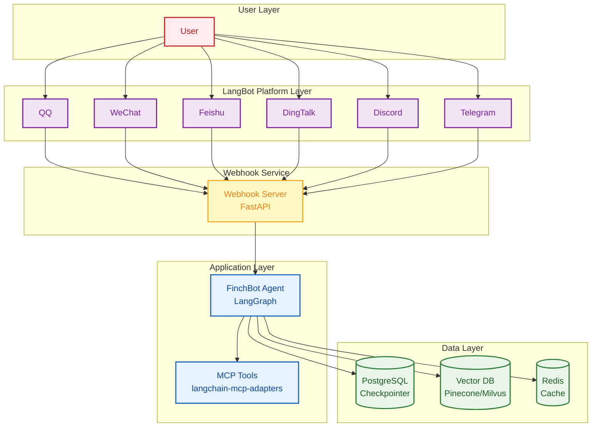
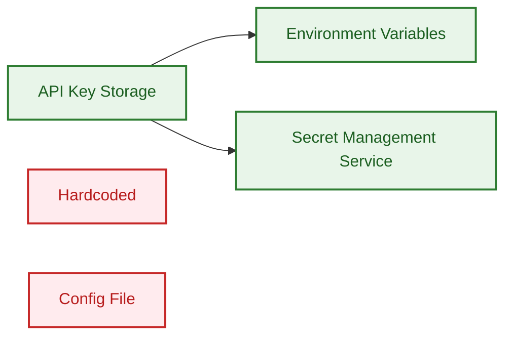

# Deployment Guide

This document covers FinchBot deployment methods, including local deployment, Docker deployment, and production environment recommendations.

## Table of Contents

1. [Local Deployment](#1-local-deployment)
2. [Docker Deployment](#2-docker-deployment)
3. [Production Recommendations](#3-production-recommendations)
4. [Security Considerations](#4-security-considerations)

---

## 1. Local Deployment

### Prerequisites

| Requirement | Description |
| :--- | :--- |
| OS | Windows / Linux / macOS |
| Python | 3.13+ |
| Package Manager | uv (Recommended) |
| Disk Space | ~500MB (including embedding model) |

### Quick Deployment

```bash
# 1. Clone repository
git clone https://gitee.com/xt765/finchbot.git
# or git clone https://github.com/xt765/FinchBot.git

cd finchbot

# 2. Install dependencies
uv sync

# 3. Configure
uv run finchbot config

# 4. Run
uv run finchbot chat
```

---

## 2. Docker Deployment

FinchBot provides complete Docker support with one-command deployment.

### Quick Start

```bash
# 1. Clone repository
git clone https://github.com/xt765/finchbot.git
cd finchbot

# 2. Configure environment variables
cp .env.example .env
# Edit .env file and add your API keys

# 3. Build and start (interactive mode)
docker-compose up -d

# 4. Attach to container for interaction
docker attach finchbot
```

### Dockerfile

The project root includes a production-ready `Dockerfile`:

```dockerfile
FROM python:3.13-slim

WORKDIR /app

# Install system dependencies
RUN apt-get update && apt-get install -y --no-install-recommends \
    curl ca-certificates \
    && rm -rf /var/lib/apt/lists/* \
    && mkdir -p /root/.finchbot/workspace

# Install Python package manager
RUN pip install --no-cache-dir uv

# Copy project files
COPY pyproject.toml uv.toml README.md ./
COPY src/ ./src/

# Create virtual environment and install dependencies
RUN uv venv /opt/venv
ENV PATH="/opt/venv/bin:$PATH"
ENV VIRTUAL_ENV="/opt/venv"
ENV PYTHONPATH="/app/src"
RUN uv pip install --no-cache -e .

# Configure environment
ENV FINCHBOT_WORKSPACE=/root/.finchbot/workspace
ENV PYTHONUNBUFFERED=1
ENV PYTHONDONTWRITEBYTECODE=1

# Start CLI
CMD ["finchbot", "chat"]
```

### Docker Compose

The project root includes `docker-compose.yml`:

```yaml
services:
  finchbot:
    build:
      context: .
      dockerfile: Dockerfile
    container_name: finchbot
    stdin_open: true
    tty: true
    environment:
      - OPENAI_API_KEY=${OPENAI_API_KEY}
      - ANTHROPIC_API_KEY=${ANTHROPIC_API_KEY}
      - GOOGLE_API_KEY=${GOOGLE_API_KEY}
      - DEEPSEEK_API_KEY=${DEEPSEEK_API_KEY}
      - MOONSHOT_API_KEY=${MOONSHOT_API_KEY}
      - DASHSCOPE_API_KEY=${DASHSCOPE_API_KEY}
      - AZURE_OPENAI_API_KEY=${AZURE_OPENAI_API_KEY}
      - AZURE_OPENAI_API_BASE=${AZURE_OPENAI_API_BASE}
      - AZURE_OPENAI_API_VERSION=${AZURE_OPENAI_API_VERSION}
      - AZURE_OPENAI_DEPLOYMENT_NAME=${AZURE_OPENAI_DEPLOYMENT_NAME}
      - OLLAMA_API_BASE=${OLLAMA_API_BASE}
      - TAVILY_API_KEY=${TAVILY_API_KEY}
      - BRAVE_API_KEY=${BRAVE_API_KEY}
      - FINCHBOT_LANGUAGE=${FINCHBOT_LANGUAGE:-en-US}
      - FINCHBOT_DEFAULT_MODEL=${FINCHBOT_DEFAULT_MODEL:-gpt-4o}
    volumes:
      - finchbot_workspace:/root/.finchbot/workspace
      - finchbot_models:/root/.cache/huggingface
    restart: unless-stopped

volumes:
  finchbot_workspace:
    driver: local
  finchbot_models:
    driver: local
```

### Common Commands

```bash
# Start service (background)
docker-compose up -d

# Attach to container for interaction
docker attach finchbot

# Exit interaction (without stopping container)
# Press Ctrl+P then Ctrl+Q

# View logs
docker logs -f finchbot

# Stop service
docker-compose down

# Rebuild
docker-compose up -d --build

# Debug in container
docker exec -it finchbot /bin/bash
```

### Environment Variables

| Variable | Description | Required |
| :------- | :---------- | :------- |
| `OPENAI_API_KEY` | OpenAI API key | One of two |
| `ANTHROPIC_API_KEY` | Anthropic API key | One of two |
| `GOOGLE_API_KEY` | Google Gemini API key | No |
| `DEEPSEEK_API_KEY` | DeepSeek API key | No |
| `MOONSHOT_API_KEY` | Moonshot (Kimi) API key | No |
| `DASHSCOPE_API_KEY` | DashScope (Qwen) API key | No |
| `AZURE_OPENAI_API_KEY` | Azure OpenAI API key | No |
| `AZURE_OPENAI_API_BASE` | Azure OpenAI API base URL | No |
| `AZURE_OPENAI_API_VERSION` | Azure OpenAI API version | No |
| `AZURE_OPENAI_DEPLOYMENT_NAME` | Azure OpenAI deployment name | No |
| `OLLAMA_API_BASE` | Ollama API base URL | No |
| `TAVILY_API_KEY` | Tavily search API key | No |
| `BRAVE_API_KEY` | Brave search API key | No |
| `FINCHBOT_LANGUAGE` | UI language (zh-CN/en-US) | No |
| `FINCHBOT_DEFAULT_MODEL` | Default model name | No |
| `FINCHBOT_WORKSPACE` | Workspace path | No |

### Persistent Storage

Docker Compose configures two persistent volumes:

| Volume | Path | Description |
| :----- | :--- | :---------- |
| `finchbot_workspace` | `/root/.finchbot/workspace` | Session data, config files |
| `finchbot_models` | `/root/.cache/huggingface` | Embedding model cache |

---

## 3. Production Recommendations

### Architecture Recommendations



### LangBot + Webhook Deployment

For production, we recommend using LangBot + FinchBot Webhook architecture:

```bash
# Terminal 1: Start FinchBot Webhook Server
uv run finchbot webhook --host 0.0.0.0 --port 8000

# Terminal 2: Start LangBot
uvx langbot

# Configure in LangBot WebUI:
# - Platform adapters (QQ/WeChat/Feishu, etc.)
# - Webhook URL: http://your-server:8000/webhook
```

#### Docker Compose Full Deployment

```yaml
services:
  finchbot-webhook:
    build:
      context: .
      dockerfile: Dockerfile
    container_name: finchbot-webhook
    command: ["finchbot", "webhook", "--host", "0.0.0.0", "--port", "8000"]
    ports:
      - "8000:8000"
    environment:
      - OPENAI_API_KEY=${OPENAI_API_KEY}
      - ANTHROPIC_API_KEY=${ANTHROPIC_API_KEY}
      - TAVILY_API_KEY=${TAVILY_API_KEY}
    volumes:
      - finchbot_workspace:/root/.finchbot/workspace
    restart: unless-stopped

  langbot:
    image: langbot/langbot:latest
    container_name: langbot
    ports:
      - "5300:5300"
    volumes:
      - langbot_data:/app/data
    restart: unless-stopped

volumes:
  finchbot_workspace:
  langbot_data:
```

### Database Upgrade

| Component | Development | Production |
| :--- | :--- | :--- |
| Checkpointer | SQLite | PostgreSQL |
| Vector DB | ChromaDB (local) | Pinecone / Milvus |
| Cache | None | Redis |

### Log Management

```python
# Configure log output to ELK Stack
import logging
from loguru import logger

# Remove default handler
logger.remove()

# Add JSON format output
logger.add(
    "logs/finchbot.json",
    format="{message}",
    serialize=True,
    rotation="100 MB",
    retention="7 days"
)
```

### Monitoring Metrics

| Metric | Description |
| :--- | :--- |
| Response Time | API request latency |
| Token Usage | LLM call statistics |
| Memory Storage | SQLite / Vector DB size |
| Tool Call Frequency | Tool usage statistics |

---

## 4. Security Considerations

### API Key Management



| Method | Security | Recommended For |
| :--- | :---: | :--- |
| Environment Variables |  High | All environments |
| Secret Management Service |  High | Production |
| Config File |  Medium | Development |
| Hardcoded |  Low | Not recommended |

### Shell Execution Security

`ExecTool` has potential risks. Recommendations:

1. **Blacklist Filtering**: Disable high-risk commands by default (`rm -rf /`, `mkfs`, `dd`)
2. **Sandbox Isolation**: Run in Docker container
3. **Permission Restriction**: Run as non-root user
4. **Timeout Control**: Set command execution timeout

```python
# Configure Shell execution limits
tools:
  exec:
    timeout: 60
    disabled_commands:
      - "rm -rf /"
      - "mkfs"
      - "dd"
      - "shutdown"
```

### File System Security

```python
# Restrict file operations scope
tools:
  restrict_to_workspace: true
```

| Setting | Description |
| :--- | :--- |
| `restrict_to_workspace: true` | File operations restricted to workspace |
| `restrict_to_workspace: false` | Allow access to any path (not recommended) |

---

## Deployment Checklist

- [ ] API Key configured as environment variable
- [ ] File operations restricted to workspace
- [ ] Shell execution blacklist configured
- [ ] Log output configured
- [ ] Database backup strategy set
- [ ] Monitoring alerts configured
