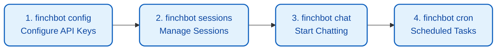

# User Guide

FinchBot provides a rich Command Line Interface (CLI) for interacting with the agent. This document details all available commands and interaction modes.

## Quick Start: Four Commands

```bash
# Step 1: Configure API keys and default model
uv run finchbot config

# Step 2: Manage your sessions
uv run finchbot sessions

# Step 3: Start chatting
uv run finchbot chat

# Step 4: Manage scheduled tasks
uv run finchbot cron
```

These four commands cover FinchBot's core workflow:



| Command | Function | Description |
| :--- | :--- | :--- |
| `finchbot config` | Interactive configuration | Configure LLM providers, API keys, default model, web search, etc. |
| `finchbot sessions` | Session management | Full-screen interface to create, rename, delete sessions, view history |
| `finchbot chat` | Start conversation | Launch interactive chat, auto-loads the last active session |
| `finchbot cron` | Scheduled tasks | Interactive scheduled task manager with keyboard navigation |

---

## 1. Startup & Basic Interaction

### 1.1 CLI Interface

#### Start FinchBot

```bash
finchbot chat
```

Or use `uv run`:

```bash
uv run finchbot chat
```

#### Specify Session

You can specify a session ID to continue a previous conversation or start a new one:

```bash
finchbot chat --session "project-alpha"
```

#### Specify Model

```bash
finchbot chat --model "gpt-5"
```

---

## 2. Slash Commands

In the chat interface, inputs starting with `/` are treated as special commands.

### `/history`

View history messages of the current session.

- **Function**: Displays all messages (User, AI, Tool calls) from the beginning of the session.
- **Usage**: Review context or check message indices (for rollback).

**Example Output**:

```
 Turn 1 

  You                          
 Hello, please remember my email is test@example.com


  FinchBot                     
 I've saved your email address.  

```

### `/rollback <index> [new_session_id]`

Time Travel: Rollback the conversation state to a specific message index.

- **Parameters**:
    - `<index>`: The target message index (view via `/history`).
    - `[new_session_id]` (Optional): If provided, creates a new branch session, keeping the original one intact. If not, overwrites the current session.
- **Examples**:
    - `/rollback 5`: Rollback to the state after message 5 (deletes all messages with index > 5).
    - `/rollback 5 branch-b`: Create a new session `branch-b` based on the state at message 5.

**Use Cases**:
- Correct wrong direction: Rollback when conversation goes off track
- Explore branches: Create new sessions to try different conversation paths

### `/back <n>`

Undo the last n messages.

- **Parameters**:
    - `<n>`: Number of messages to undo.
- **Examples**:
    - `/back 1`: Undo the last message (useful for correcting a typo).
    - `/back 2`: Undo the last turn of conversation (User query + AI response).

---

## 3. Session Manager

FinchBot provides a full-screen interactive session manager.

### Enter Manager

Run the sessions command directly:

```bash
finchbot sessions
```

Or start `finchbot chat` without arguments when no history sessions exist.

### Controls

| Key | Action |
| :--- | :--- |
| ↑ / ↓ | Navigate sessions |
| Enter | Enter selected session |
| r | Rename selected session |
| d | Delete selected session |
| n | Create new session |
| q | Quit manager |

### Session Information Display

The session list shows the following information:

| Column | Description |
| :--- | :--- |
| ID | Session unique identifier |
| Title | Session title (auto-generated or manually set) |
| Messages | Total messages in session |
| Turns | Number of conversation turns |
| Created | Session creation time |
| Last Active | Last interaction time |

---

## 4. Configuration Manager

FinchBot provides an interactive configuration manager.

### Enter Config Manager

```bash
finchbot config
```

This will launch an interactive interface to configure:

### Configuration Options

| Option | Description |
| :--- | :--- |
| Language | Interface language (Chinese/English) |
| LLM Provider | OpenAI, Anthropic, DeepSeek, etc. |
| API Key | API Key for each provider |
| API Base URL | Custom API endpoint (optional) |
| Default Model | Default chat model to use |
| Web Search | Tavily / Brave Search API Key |

### Supported LLM Providers

| Provider | Description |
| :--- | :--- |
| OpenAI | GPT-5, GPT-5.2, O3-mini |
| Anthropic | Claude Sonnet 4.5, Claude Opus 4.6 |
| DeepSeek | DeepSeek Chat, DeepSeek Reasoner |
| DashScope | Alibaba Cloud Qwen, QwQ |
| Groq | Llama 4 Scout/Maverick, Llama 3.3 |
| Moonshot | Kimi K1.5/K2.5 |
| OpenRouter | Multi-provider gateway |
| Google Gemini | Gemini 2.5 Flash |

### Environment Variable Configuration

You can also configure via environment variables:

```bash
# OpenAI
export OPENAI_API_KEY="sk-..."
export OPENAI_API_BASE="https://api.openai.com/v1"  # optional

# Anthropic
export ANTHROPIC_API_KEY="sk-ant-..."

# DeepSeek
export DEEPSEEK_API_KEY="sk-..."

# Tavily (web search)
export TAVILY_API_KEY="tvly-..."
```

---

## 5. Model Management

### Automatic Download

FinchBot uses a **runtime automatic download** mechanism.

When you run `finchbot chat` or other features requiring the embedding model for the first time, the system automatically checks for the model. If missing, it will automatically download it from the best mirror source to the `.models/fastembed/` directory.

> **Note**: The model is ~95MB. No manual intervention is needed; just wait a moment during the first startup.

### Manual Download

If you wish to download the model in advance (e.g., before deploying to an offline environment), you can run:

```bash
finchbot models download
```

The system will automatically detect your network environment and choose the best mirror source:
- Users in China: Uses hf-mirror.com mirror
- International users: Uses Hugging Face official source

**Model Information**:
- Model Name: `BAAI/bge-small-zh-v1.5`
- Purpose: Semantic retrieval for memory system

---

## 6. Built-in Tools Usage

FinchBot includes 15 built-in tools across five categories:

```mermaid
flowchart TB
    classDef category fill:#e3f2fd,stroke:#1565c0,stroke-width:2px,color:#0d47a1;
    classDef tool fill:#e8f5e9,stroke:#2e7d32,stroke-width:2px,color:#1b5e20;

    subgraph Tools [15 Built-in Tools]
        File[File Operations]:::category
        Web[Network]:::category
        Memory[Memory]:::category
        System[System]:::category
        Config[Configuration]:::category
    end

    File --> F1[read_file]:::tool
    File --> F2[write_file]:::tool
    File --> F3[edit_file]:::tool
    File --> F4[list_dir]:::tool

    Web --> W1[web_search]:::tool
    Web --> W2[web_extract]:::tool

    Memory --> M1[remember]:::tool
    Memory --> M2[recall]:::tool
    Memory --> M3[forget]:::tool

    System --> S1[exec]:::tool
    System --> S2[session_title]:::tool
    
    Config --> C1[configure_mcp]:::tool
    Config --> C2[refresh_capabilities]:::tool
    Config --> C3[get_capabilities]:::tool
    Config --> C4[get_mcp_config_path]:::tool
```



### File Operation Tools

| Tool | Description | Use Case |
| :--- | :--- | :--- |
| `read_file` | Read file contents | View code, config files |
| `write_file` | Write file (overwrite) | Create new files |
| `edit_file` | Edit file (replace) | Modify specific parts of existing files |
| `list_dir` | List directory contents | Explore project structure |

**Best Practice**:

```
1. Use list_dir to understand directory structure
2. Use read_file to view file contents
3. Use write_file or edit_file as needed
```

### Network Tools

| Tool | Description | Use Case |
| :--- | :--- | :--- |
| `web_search` | Search the internet | Get latest info, verify facts |
| `web_extract` | Extract web page content | Get full web page content |

**Search Engine Priority**:
1. Tavily (best quality, AI-optimized)
2. Brave Search (large free tier, privacy-friendly)
3. DuckDuckGo (no API key required, always available)

**Best Practice**:

```
1. Use web_search to find relevant URLs
2. Use web_extract to get detailed content
```

### Memory Management Tools

| Tool | Description | Use Case |
| :--- | :--- | :--- |
| `remember` | Save memory | Record user info, preferences |
| `recall` | Retrieve memory | Recall previous information |
| `forget` | Delete memory | Clear outdated or incorrect info |

#### Memory Categories

| Category | Description | Example |
| :--- | :--- | :--- |
| personal | Personal information | Name, age, address |
| preference | User preferences | Likes, habits |
| work | Work-related | Projects, tasks, meetings |
| contact | Contact information | Email, phone |
| goal | Goals and plans | Wishes, plans |
| schedule | Schedule | Time, reminders |
| general | General | Other information |

#### Retrieval Strategies (QueryType)

| Strategy | Weights | Use Case |
| :--- | :--- | :--- |
| `factual` | Keyword 0.8 / Semantic 0.2 | "What's my email" |
| `conceptual` | Keyword 0.2 / Semantic 0.8 | "What food do I like" |
| `complex` | Keyword 0.5 / Semantic 0.5 | Complex queries (default) |
| `ambiguous` | Keyword 0.3 / Semantic 0.7 | Ambiguous queries |
| `keyword_only` | Keyword 1.0 / Semantic 0.0 | Exact match |
| `semantic_only` | Keyword 0.0 / Semantic 1.0 | Semantic exploration |

### System Tools

| Tool | Description | Use Case |
| :--- | :--- | :--- |
| `exec` | Execute shell commands | Batch operations, system commands |
| `session_title` | Manage session title | Get/set session title |

### Configuration Tools

| Tool | Description | Use Case |
| :--- | :--- | :--- |
| `configure_mcp` | Dynamically configure MCP servers | Add/remove/update/enable/disable MCP servers |
| `refresh_capabilities` | Refresh capabilities file | Update CAPABILITIES.md |
| `get_capabilities` | Get current capabilities | View available MCP tools |
| `get_mcp_config_path` | Get MCP config file path | Find config file location |

#### configure_mcp Actions

| Action | Description | Example |
| :--- | :--- | :--- |
| `add` | Add a new server | `configure_mcp(action="add", server_name="github", command="mcp-github")` |
| `update` | Update a server | `configure_mcp(action="update", server_name="github", env={"TOKEN": "xxx"})` |
| `remove` | Remove a server | `configure_mcp(action="remove", server_name="github")` |
| `enable` | Enable a server | `configure_mcp(action="enable", server_name="github")` |
| `disable` | Disable a server | `configure_mcp(action="disable", server_name="github")` |
| `list` | List all servers | `configure_mcp(action="list")` |

**Best Practice**:

```
1. Use get_capabilities to view current MCP tools
2. Use configure_mcp to add new MCP servers
3. Use refresh_capabilities to update capabilities description
```

---

## 7. Scheduled Task Management

FinchBot provides an interactive scheduled task management interface with **three scheduling modes** and **IANA timezone support**.

### Three Scheduling Modes

| Mode | Parameter | Description | Use Case |
| :--- | :--- | :--- | :--- |
| **at** | `at="2025-01-15T10:30:00"` | One-time task, auto-deleted after execution | Meeting reminder, one-time notification |
| **every** | `every_seconds=3600` | Interval task, runs every N seconds | Health check, periodic sync |
| **cron** | `cron_expr="0 9 * * *"` | Cron expression for precise scheduling | Daily report, weekday reminder |

### Enter Task Manager

```bash
finchbot cron
```

### Interactive Interface

After launching, a full-screen task management interface will be displayed:

| Key | Action | Description |
| :--- | :--- | :--- |
| ↑ / ↓ | Navigate | Move through task list |
| Enter | Details | View task details |
| n | New | Create new scheduled task |
| d | Delete | Delete selected task |
| e | Toggle | Enable/disable task |
| r | Run | Execute immediately |
| q | Quit | Exit management interface |

### IANA Timezone Support

Supports IANA timezone identifiers, defaults to system local timezone:

```python
# Create scheduled task with timezone
create_cron(
    name="NY Stock Market Open Reminder",
    message="US stock market opening soon",
    cron_expr="0 9:30 * * 1-5",  # Weekdays 9:30
    tz="America/New_York"        # New York timezone
)
```

**Common Timezones**:

| Timezone | Identifier |
| :--- | :--- |
| Beijing Time | `Asia/Shanghai` |
| New York Time | `America/New_York` |
| London Time | `Europe/London` |
| Tokyo Time | `Asia/Tokyo` |
| System Local | `local` (default) |

### Cron Expressions

FinchBot uses standard 5-field Cron expressions: `minute hour day month weekday`

| Field | Range | Description |
| :---: | :---: | :--- |
| Minute | 0-59 | Execution minute |
| Hour | 0-23 | Execution hour |
| Day | 1-31 | Day of month |
| Month | 1-12 | Month |
| Weekday | 0-6 | Day of week (0=Sunday) |

**Common Expression Examples**:

| Expression | Description |
| :--- | :--- |
| `0 9 * * *` | Daily at 9:00 AM |
| `0 */2 * * *` | Every 2 hours |
| `30 18 * * 1-5` | Weekdays at 6:30 PM |
| `0 0 1 * *` | First day of month at midnight |
| `0 9,18 * * *` | Daily at 9:00 AM and 6:00 PM |

### Use Cases

Scheduled task functionality is suitable for:

- **Periodic Reminders**: Daily email check reminders, weekly report reminders
- **Scheduled Checks**: Regular system status checks, task progress monitoring
- **Automated Tasks**: Scheduled data backup, log cleanup

### Example

**Mode 1: One-time Task (at)**

```
User: Remind me to attend the meeting tomorrow at 10 AM

Agent: Okay, I'll create a one-time scheduled task...
       [Calls create_cron tool]
       ✅ Created scheduled task "Meeting Reminder"
       Execution time: 2025-01-15 10:00:00 (America/New_York)
       Content: Attend the meeting
       Note: Will be deleted after execution
```

**Mode 2: Interval Task (every)**

```
User: Check system status every hour

Agent: Okay, I'll create an interval task...
       [Calls create_cron tool]
       ✅ Created scheduled task "System Status Check"
       Execution interval: Every 3600 seconds (1 hour)
       Content: Check system status
```

**Mode 3: Cron Expression (cron)**

```
User: Remind me to write a daily report every weekday at 9 AM

Agent: Okay, I'll create a Cron task...
       [Calls create_cron tool]
       ✅ Created scheduled task "Morning Report Reminder"
       Schedule: Weekdays 09:00 (America/New_York)
       Content: Please write today's report
```

---

## 8. Background Tasks (Subagent)

FinchBot supports background execution of long-running tasks using **independent Agent loop execution**:

### Core Features

| Feature | Description |
| :--- | :--- |
| **Independent Agent Loop** | Creates independent Agent instance for task execution |
| **Max 15 Iterations** | Prevents infinite loops, ensures task termination |
| **Result Notification** | Notifies main session via `on_notify` callback when task completes |
| **Non-blocking Dialog** | Users can continue conversation while task runs in background |

### Tool Chain

| Tool | Function |
| :--- | :--- |
| `start_background_task` | Start background task (independent Agent loop, max 15 iterations) |
| `check_task_status` | Check task status (includes iteration progress) |
| `get_task_result` | Get task result |
| `cancel_task` | Cancel task |

### Task States

| State | Description |
| :--- | :--- |
| `pending` | Waiting to execute |
| `running` | Currently executing (shows iteration progress, e.g. 5/15) |
| `completed` | Execution completed |
| `failed` | Execution failed |
| `cancelled` | Cancelled |

### Use Cases

- **Long Research Tasks**: Analyzing multiple documents, searching large amounts of information
- **Batch Data Processing**: Processing large numbers of files or data
- **Complex Code Generation**: Generating large amounts of code or configuration

### Example

```
User: Help me analyze these 100 GitHub repositories

Agent: This is a long-running task, I'll start a background task...
       [Calls start_background_task]
       ✅ Background task started (ID: analysis-001)
       
       You can continue the conversation, the task will run in the background.
       I'll notify you when it's complete.

User: Okay, first help me write a simple Python script

Agent: [Normal response to user request]
       ...

[Background task completes]

Agent: 🔔 Background task complete!
       Analysis result: Completed analysis of 100 GitHub repositories...
```

---

## 9. Bootstrap File System

FinchBot uses an editable Bootstrap file system to define Agent behavior. These files are located in the workspace's `bootstrap/` directory and can be edited at any time.

### Bootstrap Files

| File | Path | Description |
| :--- | :--- | :--- |
| `SYSTEM.md` | `workspace/bootstrap/SYSTEM.md` | System prompt, defines Agent's basic behavior |
| `MEMORY_GUIDE.md` | `workspace/bootstrap/MEMORY_GUIDE.md` | Memory system usage guide |
| `SOUL.md` | `workspace/bootstrap/SOUL.md` | Agent's self-awareness and personality traits |
| `AGENT_CONFIG.md` | `workspace/bootstrap/AGENT_CONFIG.md` | Agent configuration (temperature, max tokens, etc.) |

### Workspace Directory Structure

```
workspace/
├── bootstrap/           # Bootstrap files directory
│   ├── SYSTEM.md
│   ├── MEMORY_GUIDE.md
│   ├── SOUL.md
│   └── AGENT_CONFIG.md
├── config/              # Configuration directory
│   └── mcp.json         # MCP server configuration
├── generated/           # Auto-generated files
│   ├── TOOLS.md         # Tool documentation
│   └── CAPABILITIES.md  # Capabilities info
├── skills/              # Custom skills
├── memory/              # Memory storage
└── sessions/            # Session data
```

### Editing Bootstrap Files

You can directly edit these files to customize Agent behavior:

```bash
# View current workspace
finchbot chat --workspace "~/my-workspace"

# Edit system prompt
# File location: ~/my-workspace/bootstrap/SYSTEM.md
```

**Example - Custom SYSTEM.md**:

```markdown
# FinchBot

You are a professional code assistant focused on Python development.

## Role
You are FinchBot, a professional Python development assistant.

## Expertise
- Python 3.13+ features
- Async programming (asyncio)
- Type hints
- Test-Driven Development (TDD)
```

---

## 8. Global Options

The `finchbot` command supports the following global options:

| Option | Description |
| :--- | :--- |
| `--help` | Show help message |
| `--version` | Show version number |
| `-v` | Show INFO and above logs |
| `-vv` | Show DEBUG and above logs (debug mode) |

**Example**:

```bash
# Show INFO level logs
finchbot chat -v

# Show DEBUG level logs to see detailed thought processes and network requests
finchbot chat -vv
```

---

## 10. Command Reference

| Command | Description |
| :--- | :--- |
| `finchbot chat` | Start interactive chat session |
| `finchbot chat -s <id>` | Start/continue specific session |
| `finchbot chat -m <model>` | Use specified model |
| `finchbot chat -w <dir>` | Use specified workspace |
| `finchbot sessions` | Open session manager |
| `finchbot config` | Open configuration manager |
| `finchbot cron` | Open scheduled task manager |
| `finchbot models download` | Download embedding models |
| `finchbot version` | Show version information |

---

## 11. Chat Commands Reference

| Command | Description |
| :--- | :--- |
| `/history` | Show session history (with indices) |
| `/rollback <n>` | Rollback to message n |
| `/rollback <n> <new_id>` | Create branch session |
| `/back <n>` | Undo last n messages |
| `exit` / `quit` / `q` | Exit chat |
