<div align="center"> 
   
  <h1><strong>玄同 765</strong></h1> 
  <p><strong>大语言模型 (LLM) 开发工程师 | 中国传媒大学 · 数字媒体技术（智能交互与游戏设计）</strong></p> 
  <p> 
    <a href="https://blog.csdn.net/Yunyi_Chi" target="_blank" style="text-decoration: none;"> 
      <span style="background-color: #f39c12; color: white; padding: 2px 8px; border-radius: 4px; font-size: 12px; font-weight: bold; display: inline-block;">CSDN · 个人主页 |</span> 
    </a> 
    <a href="https://github.com/xt765" target="_blank" style="text-decoration: none; margin-left: 8px;"> 
      <span style="background-color: #24292e; color: white; padding: 2px 8px; border-radius: 4px; font-size: 12px; font-weight: bold; display: inline-block;">GitHub · Follow</span> 
    </a> 
  </p> 
</div> 

--- 

### **关于作者** 

- **深耕领域**：大语言模型开发 / RAG 知识库 / AI Agent 落地 / 模型微调 
- **技术栈**：Python | RAG (LangChain / Dify + Milvus) | FastAPI + Docker 
- **工程能力**：专注模型工程化部署、知识库构建与优化，擅长全流程解决方案 

> **「让 AI 交互更智能，让技术落地更高效」** 
> 欢迎技术探讨与项目合作，解锁大模型与智能交互的无限可能！

---

# FinchBot (雀翎) — 当 AI 说"让我想办法"而不是"我不会"

<p align="center"> 
    
 </p>

<p align="center">
  <em>基于 LangChain v1.2 与 LangGraph v1.0 构建<br>
  具备持久记忆、动态提示词、自主能力扩展</em>
</p>

**🎉 Gitee 官方推荐项目** — FinchBot 已获得 Gitee 官方推荐！

---

## 摘要

想象这样一个对话：

> 用户："帮我分析这个 SQLite 数据库"
> 
> **传统 AI**："抱歉，我没有数据库操作的能力，无法完成这个任务。"
> 
> **FinchBot**：*[思考：我还没有数据库工具...]* 
> "让我配置一下数据库工具。" 
> *[调用 configure_mcp 添加 SQLite MCP]* 
> *[新工具已加载：query_sqlite, list_tables...]* 
> "好了！现在可以分析你的数据库了。数据库包含 3 张表..."

**这就是 FinchBot 的核心差异**：遇到能力边界时，不是"放弃"，而是"想办法"。

基于 **LangChain v1.2** 和 **LangGraph v1.0**，FinchBot 赋予智能体真正的自主性：

| 边界 | 传统 AI | FinchBot |
|:---|:---|:---|
| **能力边界** | "我没有这个能力" | 自主配置 MCP，扩展能力 |
| **时间边界** | 阻塞对话，等待完成 | 后台执行，对话继续 |
| **规划边界** | "你需要自己设置" | 自主创建定时任务 |

**而且它是安全的**：所有自主操作都在安全边界内 — 文件操作限制在 workspace 目录，危险 Shell 命令被黑名单阻止，只有注册的工具才能执行。

---

## 1. 为什么选择 FinchBot？

### 能力边界问题

| 用户请求 | 传统 AI 回应 | FinchBot 回应 |
|:---|:---|:---|
| "分析这个数据库" | "我没有数据库工具" | 自主配置 SQLite MCP，然后分析 |
| "帮我监控 24 小时" | "我只能在你问的时候响应" | 创建定时任务，自主监控 |
| "处理这个大文件" | 阻塞对话，用户等待 | 后台执行，用户继续 |
| "学会做某事" | "等开发者添加功能" | 通过 skill-creator 自主创建技能 |

### 设计哲学

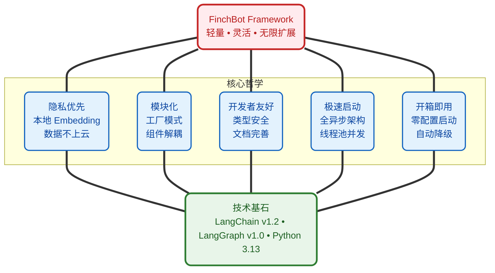

### 多平台消息支持

FinchBot 通过 [LangBot](https://github.com/langbot-app/LangBot) 平台提供生产级多平台支持：

**支持平台**：QQ、微信（公众号/企业微信）、飞书、钉钉、Discord、Telegram、Slack、LINE、KOOK 等 12+ 平台

```bash
# 安装 LangBot
uvx langbot

# 访问 WebUI http://localhost:5300
# 配置你的平台并连接到 FinchBot
```

### MCP (Model Context Protocol) 支持

FinchBot 使用官方 `langchain-mcp-adapters` 库集成 MCP，支持 **stdio** 和 **HTTP** 两种传输方式：

```bash
# 安装依赖
uv add langchain-mcp-adapters

# 配置 MCP 服务器
finchbot config
# 选择 "MCP Configuration" 选项
```

支持的 MCP 功能：
- 动态工具发现和注册
- stdio 和 HTTP 传输
- 标准化的工具调用接口
- 支持多种 MCP 服务器

### 命令行界面

FinchBot 提供功能完整的命令行界面，四步快速上手：

```bash
# 第一步：配置 API 密钥和默认模型
uv run finchbot config

# 第二步：管理你的会话
uv run finchbot sessions

# 第三步：开始对话
uv run finchbot chat

# 第四步：管理定时任务
uv run finchbot cron
```

|          特性          | 说明                                                                         |
| :---------------------: | :--------------------------------------------------------------------------- |
| **环境变量配置** | 所有配置均可通过环境变量设置（`OPENAI_API_KEY`、`ANTHROPIC_API_KEY` 等） |
|  **i18n 国际化**  | 内置中英文支持，自动检测系统语言                                             |
|   **自动降级**   | 网页搜索自动降级：Tavily → Brave → DuckDuckGo                              |
| **定时任务管理** | 交互式 Cron 管理器，支持键盘导航                                             |
| **后台任务执行** | 三工具模式异步执行长时间任务                                                 |

---

## 2. 系统架构

FinchBot 采用 **LangChain v1.2** + **LangGraph v1.0** 构建，是一个具备持久化记忆、动态工具调度和多平台消息支持的 Agent 系统。

### 整体架构

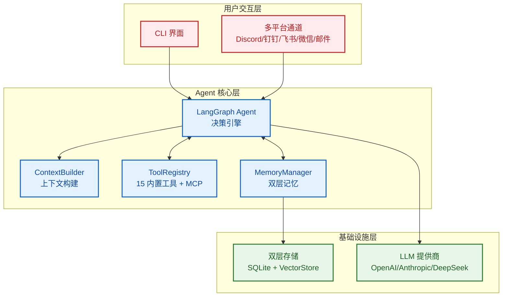

### 数据流

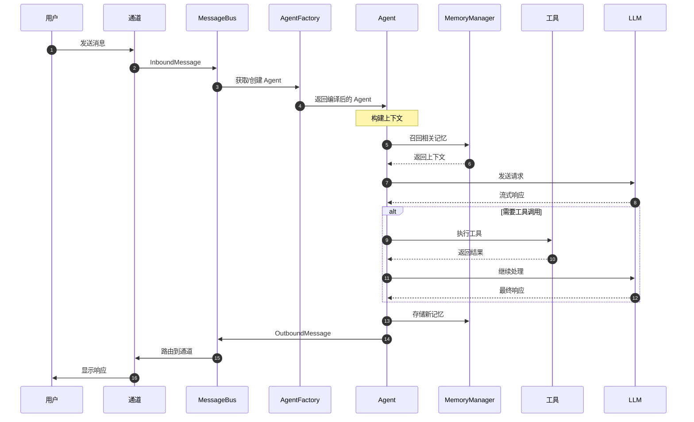

### 目录结构

```
finchbot/
├── agent/              # Agent 核心
│   ├── core.py        # Agent 创建与运行
│   ├── factory.py     # AgentFactory 组件装配
│   ├── context.py     # ContextBuilder 提示词组装
│   ├── capabilities.py # CapabilitiesBuilder 能力构建
│   └── skills.py      # SkillsLoader Markdown 技能加载
├── channels/           # 多平台消息（通过 LangBot）
│   ├── base.py        # BaseChannel 抽象基类
│   ├── bus.py         # MessageBus 异步路由器
│   ├── manager.py     # ChannelManager 协调器
│   ├── schema.py      # 消息模型
│   └── langbot_integration.py  # LangBot 集成指南
├── cli/                # 命令行界面
│   ├── chat_session.py
│   ├── config_manager.py
│   ├── providers.py
│   └── ui.py
├── config/             # 配置管理
│   ├── loader.py
│   ├── schema.py      # 包含 MCPConfig, ChannelsConfig
│   └── utils.py
├── constants.py        # 统一常量定义
├── i18n/               # 国际化
│   ├── loader.py      # 语言加载器
│   └── locales/
├── memory/             # 记忆系统
│   ├── manager.py
│   ├── types.py
│   ├── services/       # 服务层
│   ├── storage/        # 存储层
│   └── vector_sync.py
├── providers/          # LLM 提供商
│   └── factory.py
├── sessions/           # 会话管理
│   ├── metadata.py
│   ├── selector.py
│   └── title_generator.py
├── skills/             # 技能系统
│   ├── skill-creator/
│   ├── summarize/
│   └── weather/
├── tools/              # 工具系统
│   ├── base.py
│   ├── factory.py     # ToolFactory（MCP 工具通过 langchain-mcp-adapters）
│   ├── registry.py
│   ├── filesystem.py
│   ├── memory.py
│   ├── shell.py
│   ├── web.py
│   ├── session_title.py
│   └── search/
└── utils/              # 工具函数
    ├── cache.py
    ├── logger.py
    └── model_downloader.py
```

---

## 3. 核心组件

### 3.1 记忆架构：双层存储 + Agentic RAG

FinchBot 实现了先进的**双层记忆架构**，彻底解决了 LLM 上下文窗口限制和长期记忆遗忘问题。

#### 为什么是 Agentic RAG？

|      对比维度      | 传统 RAG     | Agentic RAG (FinchBot)      |
| :----------------: | :----------- | :-------------------------- |
| **检索触发** | 固定流程     | Agent 自主决策              |
| **检索策略** | 单一向量检索 | 混合检索 + 权重动态调整     |
| **记忆管理** | 被动存储     | 主动 remember/recall/forget |
| **分类能力** | 无           | 自动分类 + 重要性评分       |
| **更新机制** | 全量重建     | 增量同步                    |

#### 双层存储架构

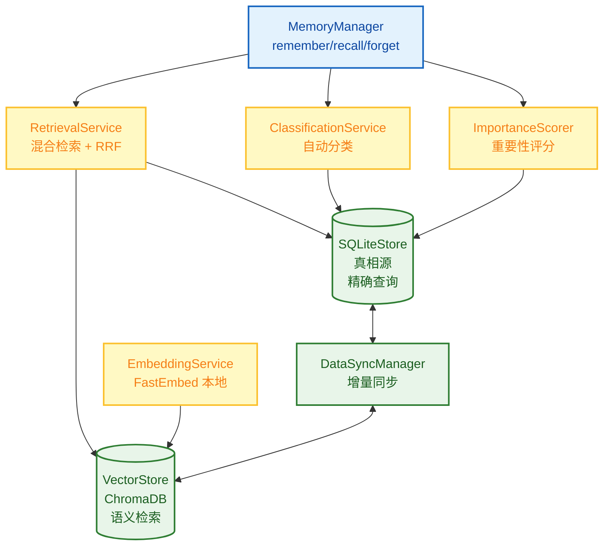

#### 混合检索策略

FinchBot 采用**加权 RRF (Weighted Reciprocal Rank Fusion)** 策略：

```python
class QueryType(StrEnum):
    """查询类型，决定检索权重"""
    KEYWORD_ONLY = "keyword_only"      # 纯关键词 (1.0/0.0)
    SEMANTIC_ONLY = "semantic_only"    # 纯语义 (0.0/1.0)
    FACTUAL = "factual"                # 事实型 (0.8/0.2)
    CONCEPTUAL = "conceptual"          # 概念型 (0.2/0.8)
    COMPLEX = "complex"                # 复杂型 (0.5/0.5)
    AMBIGUOUS = "ambiguous"            # 歧义型 (0.3/0.7)
```

### 3.2 动态提示词系统：用户可编辑的 Agent 大脑

FinchBot 的提示词系统采用**文件系统 + 模块化组装**的设计。

#### Bootstrap 文件系统

```
~/.finchbot/
├── config.json              # 主配置文件
└── workspace/
    ├── bootstrap/           # Bootstrap 文件目录
    │   ├── SYSTEM.md        # 角色设定
    │   ├── MEMORY_GUIDE.md  # 记忆使用指南
    │   ├── SOUL.md          # 灵魂设定（性格特征）
    │   └── AGENT_CONFIG.md  # Agent 配置
    ├── config/              # 配置目录
    │   └── mcp.json         # MCP 服务器配置
    ├── generated/           # 自动生成文件
    │   ├── TOOLS.md         # 工具文档
    │   └── CAPABILITIES.md  # 能力信息
    ├── skills/              # 自定义技能
    ├── memory/              # 记忆存储
    └── sessions/            # 会话数据
```

#### 提示词加载流程

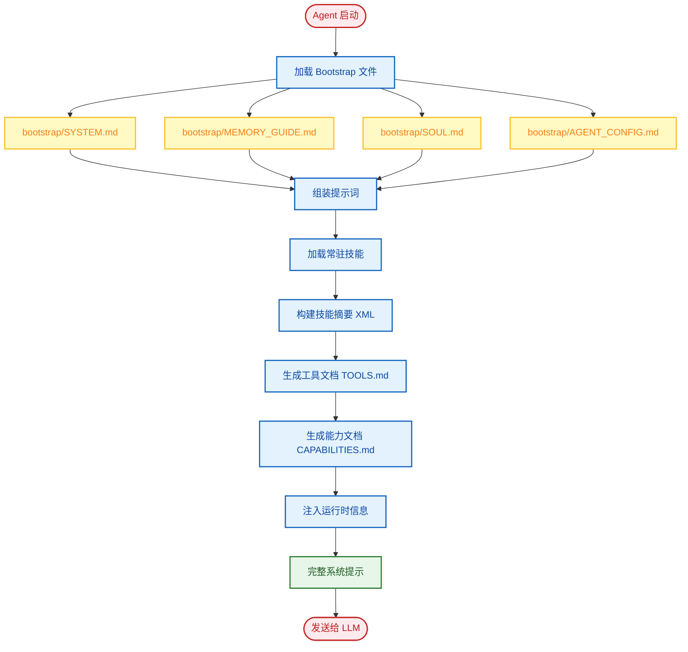

### 3.3 工具系统：代码级能力扩展

工具是 Agent 与外部世界交互的桥梁。FinchBot 提供了 15 个内置工具，并支持轻松扩展。

#### 工具系统架构

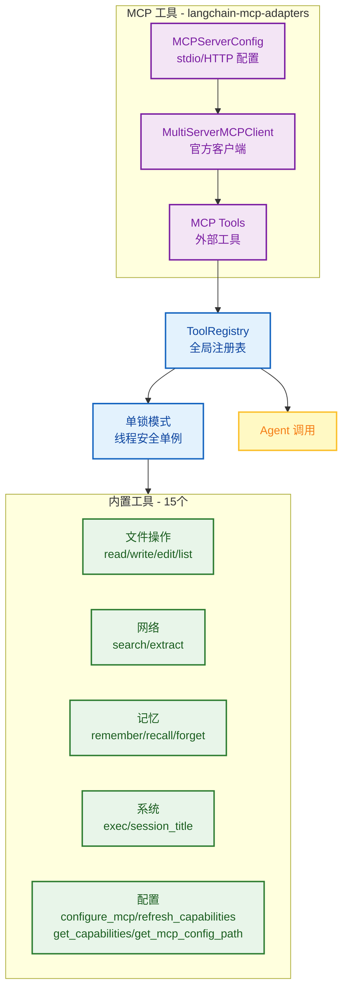

#### 内置工具一览

|        类别        | 工具              | 功能                        |
| :----------------: | :---------------- | :-------------------------- |
| **文件操作** | `read_file`     | 读取本地文件                |
|                    | `write_file`    | 写入本地文件                |
|                    | `edit_file`     | 编辑文件内容                |
|                    | `list_dir`      | 列出目录内容                |
| **网络能力** | `web_search`    | 联网搜索 (Tavily/Brave/DDG) |
|                    | `web_extract`   | 网页内容提取                |
| **记忆管理** | `remember`      | 主动存储记忆                |
|                    | `recall`        | 检索记忆                    |
|                    | `forget`        | 删除/归档记忆               |
| **系统控制** | `exec`          | 安全执行 Shell 命令         |
|                    | `session_title` | 管理会话标题                |
| **配置管理** | `configure_mcp` | 动态配置 MCP 服务器（支持启用/禁用） |
|                    | `refresh_capabilities` | 刷新能力描述文件   |
|                    | `get_capabilities` | 获取当前能力描述        |
|                    | `get_mcp_config_path` | 获取 MCP 配置路径    |

#### 网页搜索：三引擎降级设计

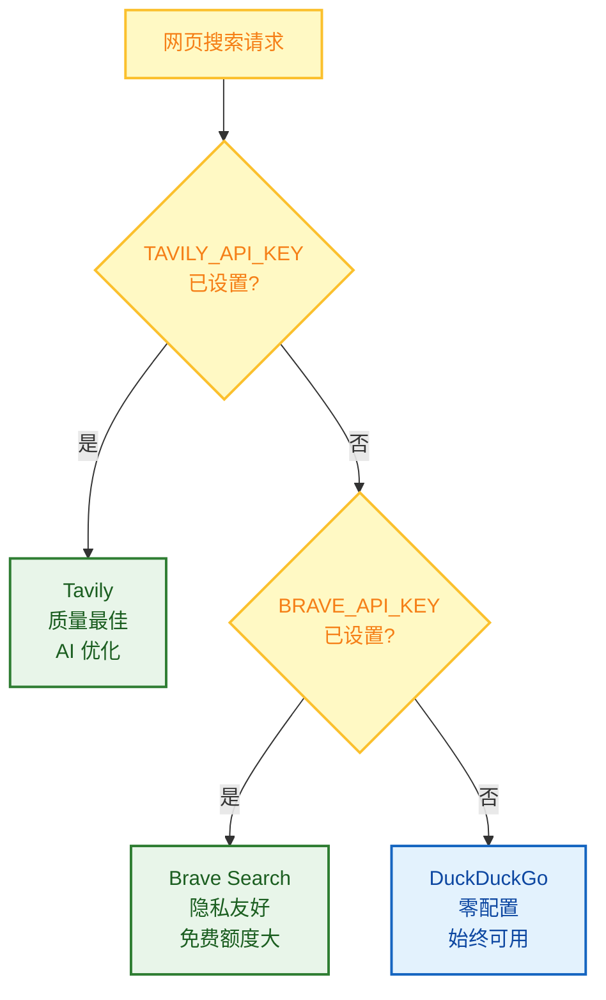

| 优先级 |          引擎          | API Key | 特点                             |
| :----: | :--------------------: | :-----: | :------------------------------- |
|   1   |    **Tavily**    |  需要  | 质量最佳，专为 AI 优化，深度搜索 |
|   2   | **Brave Search** |  需要  | 免费额度大，隐私友好             |
|   3   |  **DuckDuckGo**  |  无需  | 始终可用，零配置                 |

**工作原理**：

1. 如果设置了 `TAVILY_API_KEY` → 使用 Tavily（质量最佳）
2. 否则如果设置了 `BRAVE_API_KEY` → 使用 Brave Search
3. 否则 → 使用 DuckDuckGo（无需 API Key，始终可用）

这个设计确保**即使没有任何 API Key 配置，网页搜索也能开箱即用**！

#### Agent 自主配置：动态 MCP 管理

FinchBot 的 Agent 可以通过 `configure_mcp` 工具自主管理 MCP 服务器，实现动态能力扩展，无需手动编辑配置文件。

**支持的操作**：

| 操作 | 说明 |
| :--- | :--- |
| `add` | 添加新 MCP 服务器 |
| `update` | 更新现有服务器配置 |
| `remove` | 删除 MCP 服务器 |
| `enable` | 启用已禁用的 MCP 服务器 |
| `disable` | 暂时禁用 MCP 服务器 |
| `list` | 列出所有已配置的服务器 |

**动态提示词更新**：

当 MCP 配置变更时，Agent 可通过 `refresh_capabilities` 刷新能力描述，确保系统提示词始终反映当前能力。

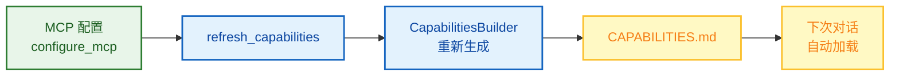

### 3.4 技能系统：用 Markdown 定义 Agent 能力

技能是 FinchBot 的独特创新——**用 Markdown 文件定义 Agent 的能力边界**。

#### 最大特色：Agent 自动创建技能

FinchBot 内置了 **skill-creator** 技能，这是开箱即用理念的极致体现：

> **只需告诉 Agent 你想要什么技能，Agent 就会自动创建好！**

```
用户: 帮我创建一个翻译技能，可以把中文翻译成英文

Agent: 好的，我来为你创建翻译技能...
       [调用 skill-creator 技能]
       ✅ 已创建 skills/translator/SKILL.md
       现在你可以直接使用翻译功能了！
```

无需手动创建文件、无需编写代码，**一句话就能扩展 Agent 能力**！

#### 技能文件结构

```
skills/
├── skill-creator/        # 技能创建器（内置）- 开箱即用的核心
│   └── SKILL.md
├── summarize/            # 智能总结（内置）
│   └── SKILL.md
├── weather/              # 天气查询（内置）
│   └── SKILL.md
└── my-custom-skill/      # Agent 自动创建或用户自定义
    └── SKILL.md
```

#### 核心设计亮点

|           特性           | 说明                              |
| :----------------------: | :-------------------------------- |
| **Agent 自动创建** | 告诉 Agent 需求，自动生成技能文件 |
|   **双层技能源**   | 工作区技能优先，内置技能兜底      |
|    **依赖检查**    | 自动检查 CLI 工具和环境变量       |
|  **缓存失效检测**  | 基于文件修改时间，智能缓存        |
|   **渐进式加载**   | 常驻技能优先，按需加载其他        |

### 3.5 通道系统：多平台消息支持

FinchBot 通过 [LangBot](https://github.com/langbot-app/LangBot) 平台提供生产级多平台消息支持。

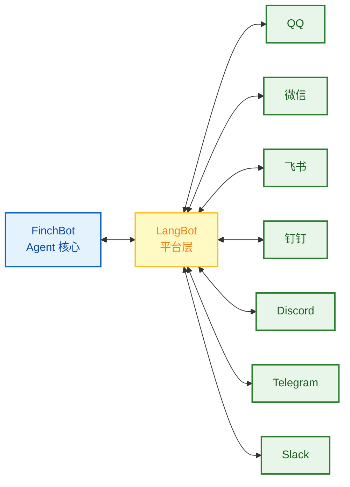

**LangBot 特点**：
- **15k+ GitHub Stars**，活跃维护
- **支持 12+ 平台**：QQ、微信、企业微信、飞书、钉钉、Discord、Telegram、Slack、LINE、KOOK、Satori
- **内置 WebUI**：可视化配置各平台
- **插件生态**：支持 MCP 等扩展

### 3.6 LangChain 1.2 架构实践

FinchBot 基于 **LangChain v1.2** 和 **LangGraph v1.0** 构建，采用最新的 Agent 架构。

```python
from langchain.agents import create_agent
from langgraph.checkpoint.sqlite import SqliteSaver

def create_finch_agent(
    model: BaseChatModel,
    workspace: Path,
    tools: Sequence[BaseTool] | None = None,
    use_persistent: bool = True,
) -> tuple[CompiledStateGraph, SqliteSaver | MemorySaver]:

    # 1. 初始化检查点（持久化状态）
    if use_persistent:
        checkpointer = SqliteSaver.from_conn_string(str(db_path))
    else:
        checkpointer = MemorySaver()

    # 2. 构建系统提示
    system_prompt = build_system_prompt(workspace)

    # 3. 创建 Agent（使用 LangChain 官方 API）
    agent = create_agent(
        model=model,
        tools=list(tools) if tools else None,
        system_prompt=system_prompt,
        checkpointer=checkpointer,
    )

    return agent, checkpointer
```

#### 支持的 LLM 提供商

|  提供商  | 模型                        | 特点             |
| :-------: | :-------------------------- | :--------------- |
|  OpenAI  | GPT-5, GPT-5.2, O3-mini     | 综合能力最强     |
| Anthropic | Claude Sonnet 4.5, Opus 4.6 | 安全性高，长文本 |
| DeepSeek | DeepSeek Chat, Reasoner     | 国产，性价比高   |
|  Gemini  | Gemini 2.5 Flash            | Google 最新      |
|   Groq   | Llama 4 Scout/Maverick      | 极速推理         |
| Moonshot | Kimi K1.5/K2.5              | 长文本，国产     |

---

## 4. 快速开始

### 前置要求

|   项目   | 要求                    |
| :------: | :---------------------- |
| 操作系统 | Windows / Linux / macOS |
|  Python  | 3.13+                   |
| 包管理器 | uv (推荐)               |

### 安装步骤

```bash
# 克隆仓库（二选一）
# Gitee（国内推荐）
git clone https://gitee.com/xt765/FinchBot.git
# 或 GitHub
git clone https://github.com/xt765/FinchBot.git

cd finchbot

# 安装依赖
uv sync
```

> **注意**：嵌入模型（约 95MB）会在首次运行时（如运行 `finchbot chat`）自动下载到本地。无需手动干预。

### 最佳实践：三步上手

```bash
# 第一步：配置 API 密钥和默认模型
uv run finchbot config

# 第二步：管理你的会话
uv run finchbot sessions

# 第三步：开始对话
uv run finchbot chat
```

就这么简单！这三个命令覆盖了完整的工作流程：

- `finchbot config` — 交互式配置 LLM 提供商、API 密钥和设置
- `finchbot sessions` — 全屏会话管理器，创建、重命名、删除会话
- `finchbot chat` — 开始或继续交互式对话

### Docker 部署

FinchBot 提供官方 Docker 支持，一键部署：

```bash
# 克隆仓库
git clone https://gitee.com/xt765/FinchBot.git
cd finchbot

# 创建 .env 文件配置 API 密钥
cp .env.example .env
# 编辑 .env 填入你的 API 密钥

# 构建并运行
docker-compose up -d

# 使用 CLI
docker exec -it finchbot finchbot chat
```

| 特性 | 说明 |
| :--: | :--- |
| **一键部署** | `docker-compose up -d` |
| **持久化存储** | 通过卷持久化工作区和模型缓存 |
| **健康检查** | 内置容器健康监控 |
| **多架构支持** | 支持 x86_64 和 ARM64 |

---

## 5. 技术栈

|    层级    | 技术              |  版本  |
| :--------: | :---------------- | :-----: |
|  基础语言  | Python            |  3.13+  |
| Agent 框架 | LangChain         | 1.2.10+ |
|  状态管理  | LangGraph         | 1.0.8+ |
|  数据验证  | Pydantic          |   v2   |
|  向量存储  | ChromaDB          | 0.5.0+ |
|  本地嵌入  | FastEmbed         | 0.4.0+ |
|  搜索增强  | BM25              | 0.2.2+ |
|  CLI 框架  | Typer             | 0.23.0+ |
|   富文本   | Rich              | 14.3.0+ |
|    日志    | Loguru            | 0.7.3+ |
|  配置管理  | Pydantic Settings | 2.12.0+ |

---

## 6. 项目优势

|         优势         | 说明                                                        |
| :------------------: | :---------------------------------------------------------- |
|  **突破能力边界** | 遇到能力缺口时，智能体自主配置 MCP、创建技能 |
|  **非阻塞执行** | 长任务后台运行，对话继续进行 |
|  **自主调度** | 智能体自主创建 Cron 任务，7×24 运行 |
|  **安全自主** | 文件操作限制在 workspace，危险 Shell 命令被阻止 |
|  **持久记忆** | 双层存储 + Agentic RAG，永不遗忘 |
|  **隐私优先**  | 使用 FastEmbed 本地生成向量，无需上传云端数据               |
| **生产级稳定** | 单锁模式、自动重试、超时控制机制                          |
|  **灵活扩展**  | 继承 FinchTool 或创建 SKILL.md 即可扩展，无需修改核心代码   |
|  **模型无关**  | 支持 OpenAI, Anthropic, Gemini, DeepSeek, Moonshot, Groq 等 |
| **多平台支持** | 通过 LangBot 支持 QQ、微信、飞书、钉钉、Discord、Telegram、Slack 等 12+ 平台 |
| **MCP 支持** | 通过官方 langchain-mcp-adapters 支持 stdio 和 HTTP 传输 |

---

## 4. 智能体自主性架构

**核心理念**: FinchBot 的设计目标是让智能体具备**真正的自主性**——不仅能响应用户请求，更能自主决策、自主执行、自主扩展。

### 自主性金字塔

```mermaid
flowchart LR
    subgraph L1["响应层"]
        R1["对话系统"]
        R2["工具调用"]
        R3["上下文记忆"]
    end

    subgraph L2["执行层"]
        X1["后台任务"]
        X2["异步处理"]
        X3["非阻塞"]
    end

    subgraph L3["规划层"]
        P1["定时任务"]
        P2["心跳监控"]
        P3["自动触发"]
    end

    subgraph L4["扩展层"]
        E1["MCP 自动配置"]
        E2["技能创建"]
        E3["动态加载"]
    end

    L1 --> L2 --> L3 --> L4

    style L1 fill:#e8f5e9,stroke:#2e7d32,stroke-width:2px,color:#1b5e20
    style L2 fill:#e3f2fd,stroke:#1565c0,stroke-width:2px,color:#0d47a1
    style L3 fill:#f3e5f5,stroke:#7b1fa2,stroke-width:2px,color:#4a148c
    style L4 fill:#fff9c4,stroke:#f9a825,stroke-width:2px,color:#f57f17
```

| 层级 | 能力 | 实现机制 | 用户价值 |
|:---:|:---|:---|:---|
| **响应层** | 响应用户请求 | 对话系统 + 工具调用 | 基础交互 |
| **执行层** | 自主执行任务 | 后台任务系统 | 不阻塞对话 |
| **规划层** | 自主设定计划 | 定时任务 + 心跳服务 | 自动化执行 |
| **扩展层** | 自主扩展能力 | MCP 配置 + 技能创建 | 无限扩展 |

### 自主性对比

| 能力 | 传统 Agent | FinchBot 自主 Agent |
|:---|:---|:---|
| **任务执行** | 用户触发，阻塞等待 | 智能体自主启动后台任务 |
| **任务调度** | 用户手动设置 | 智能体自主创建定时任务 |
| **自我监控** | 无 | 心跳服务自主检查状态 |
| **能力扩展** | 开发者编写代码 | 智能体自主配置 MCP |
| **行为定义** | 硬编码提示词 | 智能体自主创建技能 |

### 后台任务系统 (Subagent)

FinchBot 实现了先进的后台任务系统，采用**三工具模式**让 Agent 能够异步执行长时间任务。

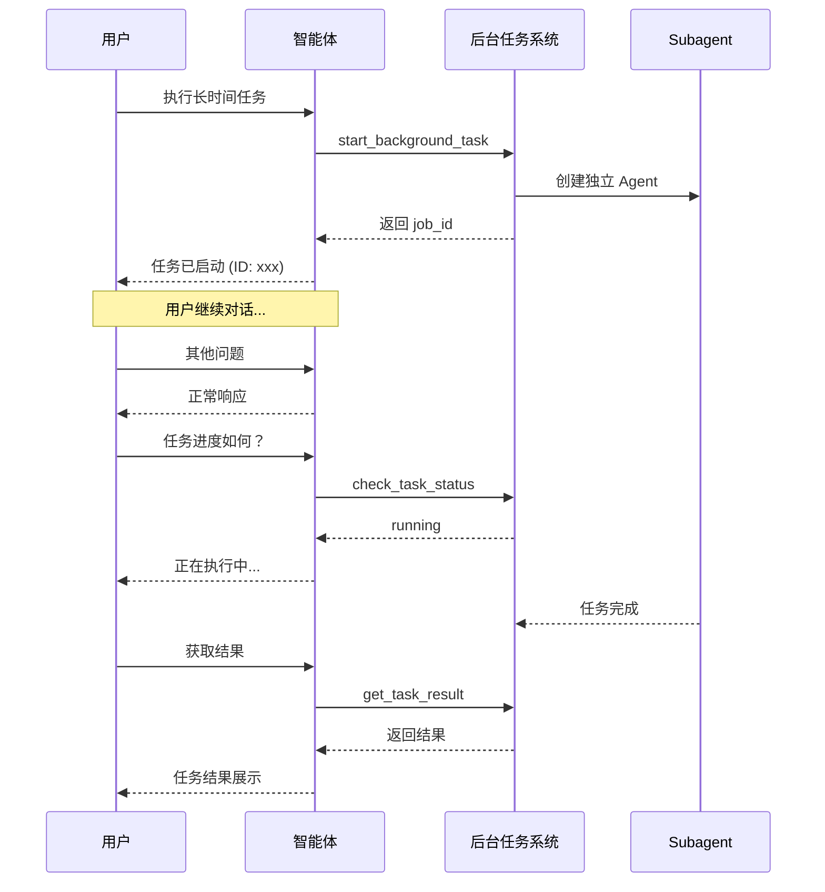

| 工具 | 功能 | 智能体自主性 |
|:---|:---|:---|
| `start_background_task` | 启动后台任务 | 智能体自主判断是否需要后台执行 |
| `check_task_status` | 检查任务状态 | 智能体自主决定何时检查 |
| `get_task_result` | 获取任务结果 | 智能体自主决定何时获取结果 |
| `cancel_task` | 取消任务 | 智能体自主决定是否取消 |

### 定时任务系统 (Cron)

FinchBot 提供了完整的定时任务解决方案，支持 **CLI 交互式管理** 和 **工具调用** 两种方式。

**Cron 表达式示例**：

| 表达式 | 说明 |
|:---|:---|
| `0 9 * * *` | 每天上午 9:00 |
| `0 */2 * * *` | 每 2 小时 |
| `30 18 * * 1-5` | 工作日下午 6:30 |
| `0 0 1 * *` | 每月 1 日零点 |

**交互式界面**：

| 按键 | 操作 |
|:---:|:---|
| ↑ / ↓ | 导航任务列表 |
| Enter | 查看任务详情 |
| n | 创建新任务 |
| d | 删除选中任务 |
| e | 启用/禁用任务 |
| r | 立即执行任务 |
| q | 退出管理 |

### 心跳服务 (Heartbeat)

心跳服务是 FinchBot 的后台监控服务，通过周期性读取 `HEARTBEAT.md` 文件来实现自动化任务触发。

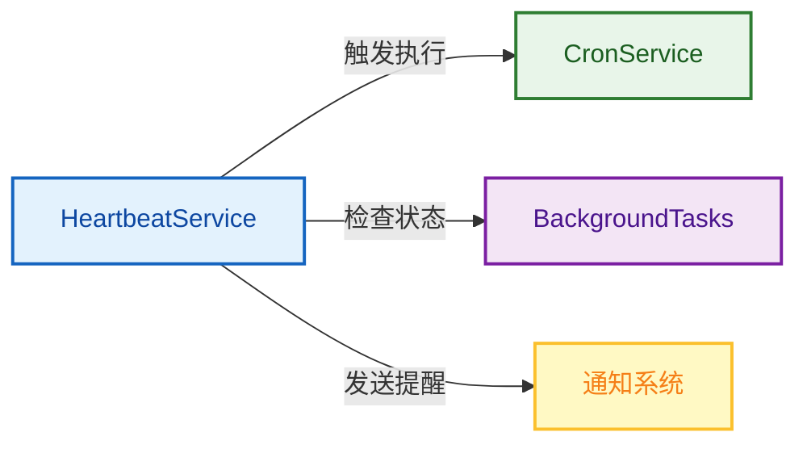

### MCP 自主配置

**核心理念**: 让智能体能够自主配置 MCP 服务器，动态扩展自己的工具能力。

```mermaid
flowchart TB
    classDef need fill:#fff9c4,stroke:#fbc02d,stroke-width:2px,color:#f57f17;
    classDef config fill:#e8f5e9,stroke:#2e7d32,stroke-width:2px,color:#1b5e20;
    classDef tool fill:#e3f2fd,stroke:#1565c0,stroke-width:2px,color:#0d47a1;
    classDef use fill:#f3e5f5,stroke:#7b1fa2,stroke-width:2px,color:#4a148c;

    Need[智能体发现需求<br/>"我需要数据库能力"]:::need
    Search[搜索可用 MCP 服务器]:::config
    Config[configure_mcp<br/>自主配置]:::config
    Load[动态加载新工具]:::tool
    Use[智能体使用新工具]:::use

    Need --> Search --> Config --> Load --> Use
```

**智能体自主扩展示例**：

```
用户：帮我分析这个 SQLite 数据库

智能体思考：
1. 当前工具检查：没有数据库操作工具
2. 能力缺口：需要 SQLite 操作能力
3. 解决方案：配置 SQLite MCP 服务器

智能体行动：
1. 调用 configure_mcp(action="add", server_name="sqlite", ...)
2. 调用 refresh_capabilities() 刷新能力描述
3. 新工具自动加载：query_sqlite, list_tables, ...

智能体使用新能力：
1. 调用 list_tables() 查看表结构
2. 调用 query_sqlite("SELECT * FROM users LIMIT 10")
3. 返回用户：数据库分析结果...
```

---

## 链接

- **项目地址**：[GitHub - FinchBot](https://github.com/xt765/FinchBot) | [Gitee - FinchBot](https://gitee.com/xt765/FinchBot)
- **文档**：[FinchBot 文档](https://github.com/xt765/FinchBot/tree/main/docs)
- **问题反馈**：[GitHub Issues](https://github.com/xt765/FinchBot/issues)

---

> 如果对你有帮助，请给个 Star⭐，支持一下！
