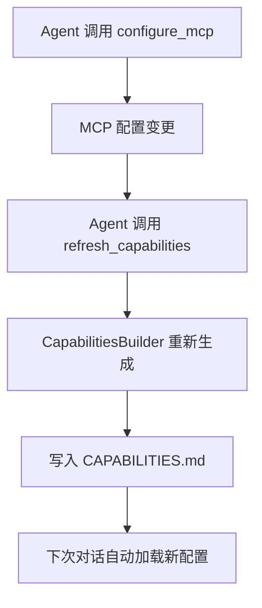

# 配置指南

FinchBot 使用灵活的分层配置系统，支持**配置文件**和**环境变量**两种方式。

**优先级**：**环境变量** > **用户配置文件**（`~/.finchbot/config.json`）> **默认值**

## 目录

1. [配置文件结构](#1-配置文件结构)
2. [环境变量](#2-环境变量)
3. [快速配置](#3-快速配置)
4. [配置示例](#4-配置示例)
5. [高级配置](#5-高级配置)

---

## 1. 配置文件结构

用户配置文件默认位于 `~/.finchbot/config.json`。

### 根对象

| 字段 | 类型 | 默认值 | 说明 |
| :--- | :--- | :--- | :--- |
| `language` | string | `"en-US"` | 界面和提示词语言。支持 `zh-CN`、`en-US`。 |
| `language_set_by_user` | boolean | `false` | 语言是否由用户手动设置（用于自动检测）。 |
| `default_model` | string | `"gpt-5"` | 默认使用的 LLM 模型名称。 |
| `default_model_set_by_user` | boolean | `false` | 默认模型是否由用户手动设置。 |
| `agents` | object | - | Agent 行为配置。 |
| `providers` | object | - | LLM 提供商配置。 |
| `tools` | object | - | 工具特定配置。 |

### `agents` 配置

| 字段 | 类型 | 默认值 | 说明 |
| :--- | :--- | :--- | :--- |
| `defaults.workspace` | string | `~/.finchbot/workspace` | Agent 工作区目录。所有文件操作将限制在此目录内。 |
| `defaults.model` | string | `"gpt-5"` | 默认使用的模型。 |
| `defaults.temperature` | float | `0.7` | 模型温度（0.0-1.0）。0.0 最确定性，1.0 最具创造性。 |
| `defaults.max_tokens` | int | `8192` | 最大输出令牌数。 |
| `defaults.max_tool_iterations` | int | `20` | 每次对话最大工具调用次数（防止无限循环）。 |

### `providers` 配置

支持的提供商：`openai`、`anthropic`、`gemini`、`deepseek`、`moonshot`、`dashscope`、`groq`、`openrouter`、`custom`。

每个提供商包含以下字段：

| 字段 | 类型 | 说明 |
| :--- | :--- | :--- |
| `api_key` | string | API Key。建议通过环境变量配置。 |
| `api_base` | string | API Base URL。用于代理或自托管模型。 |
| `extra_headers` | dict | 额外请求头（可选）。 |
| `models` | list[str] | 此提供商支持的模型列表（可选）。 |
| `openai_compatible` | bool | 是否兼容 OpenAI API 格式（默认：true）。 |

**内置提供商列表**：

| 提供商 | 说明 | 环境变量前缀 | 推荐模型 |
| :--- | :--- | :--- | :--- |
| `openai` | OpenAI 官方 | `OPENAI_*` | gpt-5, gpt-5.2, o3-mini |
| `anthropic` | Anthropic Claude | `ANTHROPIC_*` | claude-sonnet-4.5, claude-opus-4.6 |
| `gemini` | Google Gemini | `GOOGLE_*` | gemini-2.5-flash |
| `deepseek` | DeepSeek | `DEEPSEEK_*` | deepseek-chat, deepseek-reasoner |
| `moonshot` | Moonshot（Kimi） | `MOONSHOT_*` | kimi-k1.5, kimi-k2.5 |
| `dashscope` | 阿里云通义 | `DASHSCOPE_*` | qwen-turbo, qwen-max |
| `groq` | Groq | `GROQ_*` | llama-4-scout, llama-4-maverick |
| `openrouter` | OpenRouter | `OPENROUTER_*` | （多种模型） |
| `custom` | 自定义提供商 | 无 | - |

### `tools` 配置

| 字段 | 类型 | 默认值 | 说明 |
| :--- | :--- | :--- | :--- |
| `restrict_to_workspace` | bool | `false` | 是否将文件操作限制在工作区内。建议启用以确保安全。 |
| `web.search.max_results` | int | `5` | 每次查询的最大搜索结果数。 |
| `web.search.api_key` | string | - | Tavily 搜索 API Key。 |
| `web.search.brave_api_key` | string | - | Brave 搜索 API Key。 |
| `exec.timeout` | int | `60` | Shell 命令执行超时时间（秒）。 |

---

## 2. 环境变量

所有配置项都可以通过环境变量覆盖。环境变量前缀通常为 `FINCHBOT_` 或提供商特定前缀。

嵌套配置使用双下划线 `__` 分隔（Pydantic Settings 格式）。

### LLM 提供商

| 提供商 | API Key 变量 | API Base 变量 |
| :--- | :--- | :--- |
| OpenAI | `OPENAI_API_KEY` | `OPENAI_API_BASE` |
| Anthropic | `ANTHROPIC_API_KEY` | `ANTHROPIC_API_BASE` |
| Gemini | `GOOGLE_API_KEY` | - |
| DeepSeek | `DEEPSEEK_API_KEY` | `DEEPSEEK_API_BASE` |
| Groq | `GROQ_API_KEY` | `GROQ_API_BASE` |
| Moonshot | `MOONSHOT_API_KEY` | `MOONSHOT_API_BASE` |
| DashScope | `DASHSCOPE_API_KEY` | `DASHSCOPE_API_BASE` |
| OpenRouter | `OPENROUTER_API_KEY` | `OPENROUTER_API_BASE` |

### 搜索工具

| 工具 | API Key 变量 | 说明 |
| :--- | :--- | :--- |
| Tavily | `TAVILY_API_KEY` | 质量最佳，需要 API Key |
| Brave | `BRAVE_API_KEY` | 免费额度，需要 API Key |
| DuckDuckGo | - | 无需 API Key（降级选项） |

### 通用配置

| 变量名 | 对应配置项 | 示例 |
| :--- | :--- | :--- |
| `FINCHBOT_LANGUAGE` | `language` | `zh-CN` |
| `FINCHBOT_DEFAULT_MODEL` | `default_model` | `gpt-4o` |
| `FINCHBOT_AGENTS__DEFAULTS__WORKSPACE` | `agents.defaults.workspace` | `/path/to/workspace` |
| `FINCHBOT_TOOLS__RESTRICT_TO_WORKSPACE` | `tools.restrict_to_workspace` | `true` |

---

## 3. 快速配置

### 方法一：交互式配置（推荐）

运行配置向导：

```bash
uv run finchbot config
```

此命令启动交互式界面，引导您完成：
- 语言选择
- 默认模型设置
- 提供商 API Key 配置
- 工作区设置

### 方法二：手动配置文件

1. 如果不存在配置文件，系统会自动创建默认配置
2. 编辑 `~/.finchbot/config.json`

### 方法三：环境变量

在项目根目录的 `.env` 文件中设置：

```bash
OPENAI_API_KEY=sk-...
OPENAI_API_BASE=https://api.openai.com/v1
FINCHBOT_LANGUAGE=zh-CN
FINCHBOT_DEFAULT_MODEL=gpt-5
```

---

## 4. 配置示例

### 最小配置

```json
{
  "language": "zh-CN",
  "default_model": "gpt-5",
  "providers": {
    "openai": {
      "api_key": "sk-proj-..."
    }
  }
}
```

### 完整配置示例

```json
{
  "language": "zh-CN",
  "language_set_by_user": true,
  "default_model": "gpt-5",
  "default_model_set_by_user": true,
  "agents": {
    "defaults": {
      "workspace": "~/.finchbot/workspace",
      "model": "gpt-5",
      "temperature": 0.7,
      "max_tokens": 8192,
      "max_tool_iterations": 20
    }
  },
  "providers": {
    "openai": {
      "api_key": "sk-proj-...",
      "api_base": "https://api.openai.com/v1"
    },
    "anthropic": {
      "api_key": "sk-ant-..."
    },
    "deepseek": {
      "api_key": "sk-...",
      "api_base": "https://api.deepseek.com"
    },
    "moonshot": {
      "api_key": "sk-...",
      "api_base": "https://api.moonshot.cn/v1"
    },
    "custom": {
      "my-provider": {
        "api_key": "sk-...",
        "api_base": "https://my-provider.com/v1",
        "openai_compatible": true
      }
    }
  },
  "tools": {
    "restrict_to_workspace": false,
    "web": {
      "search": {
        "api_key": "tvly-...",
        "brave_api_key": "...",
        "max_results": 5
      }
    },
    "exec": {
      "timeout": 60
    }
  }
}
```

### 使用 DeepSeek 配置

```json
{
  "language": "zh-CN",
  "default_model": "deepseek-chat",
  "providers": {
    "deepseek": {
      "api_key": "sk-...",
      "api_base": "https://api.deepseek.com"
    }
  }
}
```

### 使用本地 Ollama 配置

```json
{
  "language": "zh-CN",
  "default_model": "llama3",
  "providers": {
    "custom": {
      "ollama": {
        "api_base": "http://localhost:11434/v1",
        "api_key": "dummy-key",
        "openai_compatible": true
      }
    }
  }
}
```

---

## 5. 高级配置

### Bootstrap 文件系统

FinchBot 使用文件系统管理 Agent 提示词和行为：

```
~/.finchbot/
├── config.json              # 主配置文件
└── workspace/
    ├── bootstrap/           # Bootstrap 文件目录
    │   ├── SYSTEM.md        # 角色设定
    │   ├── MEMORY_GUIDE.md  # 记忆使用指南
    │   ├── SOUL.md          # 灵魂设定（性格特征）
    │   └── AGENT_CONFIG.md  # Agent 配置
    ├── config/              # 配置目录
    │   └── mcp.json         # MCP 服务器配置
    ├── generated/           # 自动生成文件
    │   ├── TOOLS.md         # 工具文档
    │   └── CAPABILITIES.md  # 能力信息
    ├── skills/              # 自定义技能
    │   └── my-skill/
    │       └── SKILL.md
    ├── memory/              # 记忆存储
    │   └── memory.db
    ├── memory_vectors/      # 向量数据库
    └── sessions/            # 会话数据
        ├── checkpoints.db   # 对话状态持久化
        └── metadata.db      # 会话元数据
```

### 自定义 SYSTEM.md

```markdown
# 角色定义

你是一个名为 FinchBot 的专业 AI 助手。

## 核心能力
- 智能对话和问答
- 文件操作和管理
- 网页搜索和信息提取
- 长期记忆管理

## 行为准则
- 始终保持专业和友好
- 主动使用工具解决问题
- 合理使用记忆功能存储重要信息
```

### 自定义 SOUL.md

```markdown
# 灵魂定义

## 性格特征
- 热情助人
- 严谨细致
- 渴望学习、持续进步

## 沟通风格
- 简洁明了
- 适当使用表情符号增加亲和力
- 必要时提供详细解释
```

### 日志级别配置

通过命令行参数控制日志输出：

```bash
# 默认：WARNING 及以上
finchbot chat

# INFO 及以上
finchbot -v chat

# DEBUG 及以上（调试模式）
finchbot -vv chat
```

---

## 验证配置

查看当前配置的提供商：

```bash
uv run finchbot config
```

或直接运行聊天测试：

```bash
uv run finchbot chat
```

---

## 配置文件位置

| 文件/目录 | 路径 | 说明 |
| :--- | :--- | :--- |
| 用户配置 | `~/.finchbot/config.json` | 主配置文件 |
| MCP 配置 | `{workspace}/config/mcp.json` | MCP 服务器配置 |
| Bootstrap 文件 | `{workspace}/bootstrap/` | 系统提示词文件目录 |
| 生成文件 | `{workspace}/generated/` | 自动生成的文件目录 |
| 记忆数据库 | `{workspace}/memory/memory.db` | SQLite 存储数据库 |
| 向量数据库 | `{workspace}/memory_vectors/` | ChromaDB 向量存储 |
| 对话状态 | `{workspace}/sessions/checkpoints.db` | LangGraph 持久化 |
| 会话元数据 | `{workspace}/sessions/metadata.db` | 会话信息数据库 |

---

## 6. MCP 配置

MCP (Model Context Protocol) 允许集成外部工具服务器，动态扩展 Agent 能力。

FinchBot 使用官方 `langchain-mcp-adapters` 库集成 MCP，支持 **stdio** 和 **HTTP** 两种传输方式。

> **注意**：MCP 配置存储在工作区的 `config/mcp.json` 文件中，而不是全局配置文件。Agent 可以通过 `configure_mcp` 工具动态修改 MCP 配置。

### `mcp` 配置

| 字段 | 类型 | 默认值 | 说明 |
| :--- | :--- | :--- | :--- |
| `servers` | dict | `{}` | MCP 服务器配置字典 |

### MCPServerConfig 字段

| 字段 | 类型 | 必需 | 说明 |
| :--- | :--- | :---: | :--- |
| `command` | string | stdio 传输必需 | 启动 MCP 服务器的命令 |
| `args` | list[str] | | stdio 传输的命令行参数 |
| `env` | dict | | stdio 传输的环境变量 |
| `url` | string | HTTP 传输必需 | MCP 服务器 HTTP URL |
| `headers` | dict | | HTTP 传输的请求头（如认证） |
| `disabled` | bool | `false` | 是否禁用此服务器 |

### 传输方式

#### stdio 传输

适用于本地 MCP 服务器，通过命令行启动：

```json
{
  "command": "mcp-filesystem",
  "args": ["/path/to/allowed/dir"],
  "env": {}
}
```

#### HTTP 传输

适用于远程 MCP 服务器，通过 HTTP 连接：

```json
{
  "url": "https://api.example.com/mcp",
  "headers": {
    "Authorization": "Bearer your-token"
  }
}
```

### MCP 完整配置示例

```json
{
  "mcp": {
    "servers": {
      "filesystem": {
        "command": "mcp-filesystem",
        "args": ["/path/to/allowed/dir"],
        "env": {}
      },
      "remote-api": {
        "url": "https://api.example.com/mcp",
        "headers": {
          "Authorization": "Bearer your-token"
        }
      },
      "github": {
        "command": "mcp-github",
        "args": [],
        "env": {
          "GITHUB_TOKEN": "ghp_..."
        },
        "disabled": true
      }
    }
  }
}
```

### 依赖

MCP 功能需要安装 `langchain-mcp-adapters`：

```bash
pip install langchain-mcp-adapters
```

或使用 uv：

```bash
uv add langchain-mcp-adapters
```

### 通过 CLI 配置 MCP

```bash
finchbot config
# 选择 "MCP Configuration" 选项
```

### Agent 自主配置 MCP

FinchBot 的 Agent 可以通过 `configure_mcp` 工具自主管理 MCP 服务器，无需用户手动编辑配置文件。

#### 支持的操作

| 操作 | 说明 | 示例对话 |
| :--- | :--- | :--- |
| `add` | 添加新服务器 | "帮我添加一个 GitHub MCP 服务器" |
| `update` | 更新服务器配置 | "更新 GitHub 服务器的环境变量" |
| `remove` | 删除服务器 | "删除 test 服务器" |
| `enable` | 启用服务器 | "启用 GitHub 服务器" |
| `disable` | 禁用服务器 | "暂时禁用 GitHub 服务器" |
| `list` | 列出所有服务器 | "查看当前配置的 MCP 服务器" |

#### 使用示例

**添加服务器**：

```
用户: 帮我添加一个 GitHub MCP 服务器，命令是 mcp-github
Agent: [调用 configure_mcp 工具]
       ✅ MCP server 'github' has been added successfully.
```

**禁用服务器**：

```
用户: 暂时禁用 GitHub 服务器
Agent: [调用 configure_mcp 工具]
       ✅ MCP server 'github' has been disabled successfully.
```

**列出服务器**：

```
用户: 查看当前配置的 MCP 服务器
Agent: [调用 configure_mcp 工具]
       Configured MCP servers:
         - github (disabled)
           command: mcp-github
         - filesystem (enabled)
           command: mcp-filesystem
```

### 提示词动态更新机制

FinchBot 的提示词系统支持动态更新，Agent 可以通过工具刷新能力描述。

#### 核心组件

| 组件 | 文件 | 功能 |
| :--- | :--- | :--- |
| `ContextBuilder` | `agent/context.py` | 组装系统提示词，加载 Bootstrap 文件和技能 |
| `CapabilitiesBuilder` | `agent/capabilities.py` | 构建能力描述，写入 CAPABILITIES.md |
| `ToolsGenerator` | `tools/tools_generator.py` | 生成工具文档，写入 TOOLS.md |

#### 动态更新流程



#### 相关工具

| 工具 | 说明 |
| :--- | :--- |
| `refresh_capabilities` | 刷新 CAPABILITIES.md 文件，反映当前的 MCP 和工具配置 |
| `get_capabilities` | 返回当前配置的能力描述，不写入文件 |
| `get_mcp_config_path` | 返回 MCP 配置文件路径，方便用户手动编辑 |

---

## 7. Channel 配置

> **注意**：多平台消息功能已迁移到 [LangBot](https://github.com/langbot-app/LangBot) 平台。
> 
> LangBot 支持 **QQ、微信、企业微信、飞书、钉钉、Discord、Telegram、Slack、LINE、KOOK** 等 12+ 平台。
> 
> 请使用 LangBot 的 WebUI 配置各平台：https://langbot.app

### LangBot 快速开始

```bash
# 终端 1：启动 FinchBot Webhook 服务器
uv run finchbot webhook --port 8000

# 终端 2：启动 LangBot
uvx langbot

# 访问 LangBot WebUI http://localhost:5300
# 配置你的平台并设置 Webhook URL：
# http://localhost:8000/webhook
```

### Webhook 配置

FinchBot 内置 FastAPI Webhook 服务器，用于接收 LangBot 的消息。

| 配置项 | 说明 | 默认值 |
| :--- | :--- | :--- |
| `langbot_url` | LangBot API URL | `http://localhost:5300` |
| `langbot_api_key` | LangBot API Key | - |
| `langbot_webhook_path` | Webhook 端点路径 | `/webhook` |

### Webhook 服务器启动选项

```bash
# 使用默认端口 8000
uv run finchbot webhook

# 指定端口
uv run finchbot webhook --port 9000

# 指定主机和端口
uv run finchbot webhook --host 127.0.0.1 --port 8000
```

### 保留配置（兼容性）

以下配置字段保留用于向后兼容，后续版本将移除：

| 字段 | 类型 | 默认值 | 说明 |
| :--- | :--- | :--- | :--- |
| `langbot_enabled` | bool | `false` | 是否启用 LangBot 集成 |

```json
{
  "channels": {
    "langbot_enabled": true
  }
}
```

### 旧版配置示例（已弃用）

<details>
<summary>点击查看旧版配置（仅供参考）</summary>

```json
{
  "channels": {
    "discord": {
      "enabled": true,
      "token": "your-bot-token"
    },
    "feishu": {
      "enabled": true,
      "app_id": "cli_xxx",
      "app_secret": "xxx"
    },
    "dingtalk": {
      "enabled": false,
      "client_id": "",
      "client_secret": ""
    },
    "wechat": {
      "enabled": false,
      "corp_id": "",
      "agent_id": "",
      "secret": ""
    },
    "email": {
      "enabled": false,
      "smtp_host": "smtp.example.com",
      "smtp_port": 587,
      "smtp_user": "user@example.com",
      "smtp_password": "password",
      "from_address": "user@example.com",
      "use_tls": true
    }
  }
}
```

</details>
