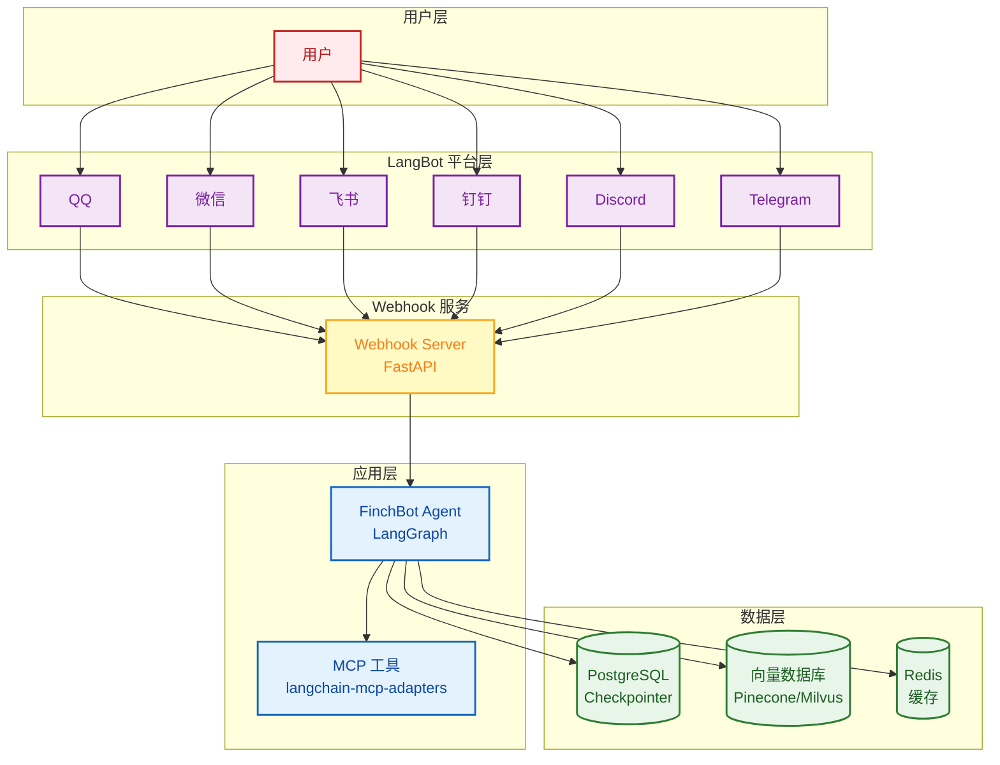
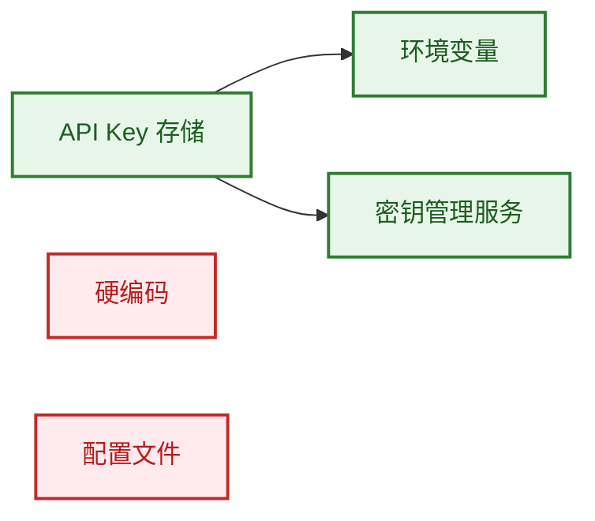

# 部署指南

本文档介绍 FinchBot 的部署方式，包括本地部署、Docker 部署和生产环境建议。

## 目录

1. [本地部署](#1-本地部署)
2. [Docker 部署](#2-docker-部署)
3. [生产环境建议](#3-生产环境建议)
4. [安全注意事项](#4-安全注意事项)

---

## 1. 本地部署

### 系统要求

| 要求 | 说明 |
| :--- | :--- |
| 操作系统 | Windows / Linux / macOS |
| Python | 3.13+ |
| 包管理器 | uv（推荐） |
| 磁盘空间 | 约 500MB（包含嵌入模型） |

### 快速部署

```bash
# 1. 克隆仓库
git clone https://gitee.com/xt765/FinchBot.git
# 或 git clone https://github.com/xt765/FinchBot.git

cd finchbot

# 2. 安装依赖
uv sync

# 3. 配置
uv run finchbot config

# 4. 运行
uv run finchbot chat
```

---

## 2. Docker 部署

FinchBot 提供完整的 Docker 支持，可一键部署。

### 快速开始

```bash
# 1. 克隆仓库
git clone https://github.com/xt765/FinchBot.git
cd finchbot

# 2. 配置环境变量
cp .env.example .env
# 编辑 .env 文件，添加您的 API Key

# 3. 构建并启动（交互模式）
docker-compose up -d

# 4. 进入容器交互
docker attach finchbot
```

### Dockerfile

项目根目录包含生产就绪的 `Dockerfile`：

```dockerfile
FROM python:3.13-slim

WORKDIR /app

# 安装系统依赖
RUN apt-get update && apt-get install -y --no-install-recommends \
    curl ca-certificates \
    && rm -rf /var/lib/apt/lists/* \
    && mkdir -p /root/.finchbot/workspace

# 安装 Python 包管理器
RUN pip install --no-cache-dir uv

# 复制项目文件
COPY pyproject.toml uv.toml README.md ./
COPY src/ ./src/

# 创建虚拟环境并安装依赖
RUN uv venv /opt/venv
ENV PATH="/opt/venv/bin:$PATH"
ENV VIRTUAL_ENV="/opt/venv"
ENV PYTHONPATH="/app/src"
RUN uv pip install --no-cache -e .

# 配置环境
ENV FINCHBOT_WORKSPACE=/root/.finchbot/workspace
ENV PYTHONUNBUFFERED=1
ENV PYTHONDONTWRITEBYTECODE=1

# 启动 CLI
CMD ["finchbot", "chat"]
```

### Docker Compose

项目根目录包含 `docker-compose.yml`：

```yaml
services:
  finchbot:
    build:
      context: .
      dockerfile: Dockerfile
    container_name: finchbot
    stdin_open: true
    tty: true
    environment:
      - OPENAI_API_KEY=${OPENAI_API_KEY}
      - ANTHROPIC_API_KEY=${ANTHROPIC_API_KEY}
      - GOOGLE_API_KEY=${GOOGLE_API_KEY}
      - DEEPSEEK_API_KEY=${DEEPSEEK_API_KEY}
      - MOONSHOT_API_KEY=${MOONSHOT_API_KEY}
      - DASHSCOPE_API_KEY=${DASHSCOPE_API_KEY}
      - AZURE_OPENAI_API_KEY=${AZURE_OPENAI_API_KEY}
      - AZURE_OPENAI_API_BASE=${AZURE_OPENAI_API_BASE}
      - AZURE_OPENAI_API_VERSION=${AZURE_OPENAI_API_VERSION}
      - AZURE_OPENAI_DEPLOYMENT_NAME=${AZURE_OPENAI_DEPLOYMENT_NAME}
      - OLLAMA_API_BASE=${OLLAMA_API_BASE}
      - TAVILY_API_KEY=${TAVILY_API_KEY}
      - BRAVE_API_KEY=${BRAVE_API_KEY}
      - FINCHBOT_LANGUAGE=${FINCHBOT_LANGUAGE:-zh-CN}
      - FINCHBOT_DEFAULT_MODEL=${FINCHBOT_DEFAULT_MODEL:-gpt-4o}
    volumes:
      - finchbot_workspace:/root/.finchbot/workspace
      - finchbot_models:/root/.cache/huggingface
    restart: unless-stopped

volumes:
  finchbot_workspace:
    driver: local
  finchbot_models:
    driver: local
```

### 常用命令

```bash
# 启动服务（后台运行）
docker-compose up -d

# 进入容器交互
docker attach finchbot

# 退出交互（不停止容器）
# 按 Ctrl+P 然后 Ctrl+Q

# 查看日志
docker logs -f finchbot

# 停止服务
docker-compose down

# 重新构建
docker-compose up -d --build

# 进入容器调试
docker exec -it finchbot /bin/bash
```

### 环境变量

| 变量 | 说明 | 必需 |
| :--- | :--- | :---: |
| `OPENAI_API_KEY` | OpenAI API Key | 二选一 |
| `ANTHROPIC_API_KEY` | Anthropic API Key | 二选一 |
| `GOOGLE_API_KEY` | Google Gemini API Key | 否 |
| `DEEPSEEK_API_KEY` | DeepSeek API Key | 否 |
| `MOONSHOT_API_KEY` | Moonshot (Kimi) API Key | 否 |
| `DASHSCOPE_API_KEY` | DashScope (通义千问) API Key | 否 |
| `AZURE_OPENAI_API_KEY` | Azure OpenAI API Key | 否 |
| `AZURE_OPENAI_API_BASE` | Azure OpenAI API Base URL | 否 |
| `AZURE_OPENAI_API_VERSION` | Azure OpenAI API Version | 否 |
| `AZURE_OPENAI_DEPLOYMENT_NAME` | Azure OpenAI Deployment Name | 否 |
| `OLLAMA_API_BASE` | Ollama API Base URL | 否 |
| `TAVILY_API_KEY` | Tavily 搜索 API Key | 否 |
| `BRAVE_API_KEY` | Brave 搜索 API Key | 否 |
| `FINCHBOT_LANGUAGE` | 界面语言（zh-CN/en-US） | 否 |
| `FINCHBOT_DEFAULT_MODEL` | 默认模型名称 | 否 |
| `FINCHBOT_WORKSPACE` | 工作目录路径 | 否 |

### 持久化存储

Docker Compose 配置了两个持久化卷：

| 卷 | 路径 | 说明 |
| :--- | :--- | :--- |
| `finchbot_workspace` | `/root/.finchbot/workspace` | 会话数据、配置文件 |
| `finchbot_models` | `/root/.cache/huggingface` | 嵌入模型缓存 |

---

## 3. 生产环境建议

### 架构建议



### LangBot + Webhook 部署

生产环境推荐使用 LangBot + FinchBot Webhook 架构：

```bash
# 终端 1：启动 FinchBot Webhook 服务器
uv run finchbot webhook --host 0.0.0.0 --port 8000

# 终端 2：启动 LangBot
uvx langbot

# 在 LangBot WebUI 中配置：
# - 平台适配器（QQ/微信/飞书等）
# - Webhook URL: http://your-server:8000/webhook
```

#### Docker Compose 完整部署

```yaml
services:
  finchbot-webhook:
    build:
      context: .
      dockerfile: Dockerfile
    container_name: finchbot-webhook
    command: ["finchbot", "webhook", "--host", "0.0.0.0", "--port", "8000"]
    ports:
      - "8000:8000"
    environment:
      - OPENAI_API_KEY=${OPENAI_API_KEY}
      - ANTHROPIC_API_KEY=${ANTHROPIC_API_KEY}
      - TAVILY_API_KEY=${TAVILY_API_KEY}
    volumes:
      - finchbot_workspace:/root/.finchbot/workspace
    restart: unless-stopped

  langbot:
    image: langbot/langbot:latest
    container_name: langbot
    ports:
      - "5300:5300"
    volumes:
      - langbot_data:/app/data
    restart: unless-stopped

volumes:
  finchbot_workspace:
  langbot_data:
```

### 数据库升级

| 组件 | 开发环境 | 生产环境 |
| :--- | :--- | :--- |
| Checkpointer | SQLite | PostgreSQL |
| 向量数据库 | ChromaDB（本地） | Pinecone / Milvus |
| 缓存 | 无 | Redis |

### 日志管理

```python
# 配置日志输出到 ELK Stack
import logging
from loguru import logger

# 移除默认处理器
logger.remove()

# 添加 JSON 格式输出
logger.add(
    "logs/finchbot.json",
    format="{message}",
    serialize=True,
    rotation="100 MB",
    retention="7 days"
)
```

### 监控指标

| 指标 | 说明 |
| :--- | :--- |
| 响应时间 | API 请求延迟 |
| Token 使用量 | LLM 调用统计 |
| 记忆存储量 | SQLite / 向量数据库大小 |
| 工具调用频率 | 工具使用统计 |

---

## 4. 安全注意事项

### API Key 管理



| 方法 | 安全性 | 推荐场景 |
| :--- | :---: | :--- |
| 环境变量 | 高 | 所有环境 |
| 密钥管理服务 | 高 | 生产环境 |
| 配置文件 | 中 | 开发环境 |
| 硬编码 | 低 | 不推荐 |

### Shell 执行安全

`ExecTool` 存在潜在风险。建议：

1. **黑名单过滤**：默认禁用高危命令（`rm -rf /`、`mkfs`、`dd`）
2. **沙箱隔离**：在 Docker 容器中运行
3. **权限限制**：以非 root 用户运行
4. **超时控制**：设置命令执行超时

```python
# 配置 Shell 执行限制
tools:
  exec:
    timeout: 60
    disabled_commands:
      - "rm -rf /"
      - "mkfs"
      - "dd"
      - "shutdown"
```

### 文件系统安全

```python
# 限制文件操作范围
tools:
  restrict_to_workspace: true
```

| 设置 | 说明 |
| :--- | :--- |
| `restrict_to_workspace: true` | 文件操作限制在工作区内 |
| `restrict_to_workspace: false` | 允许访问任意路径（不推荐） |

---

## 部署检查清单

- [ ] API Key 已配置为环境变量
- [ ] 文件操作已限制在工作区内
- [ ] Shell 执行黑名单已配置
- [ ] 日志输出已配置
- [ ] 数据库备份策略已设置
- [ ] 监控告警已配置
