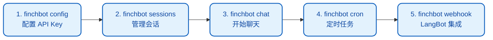
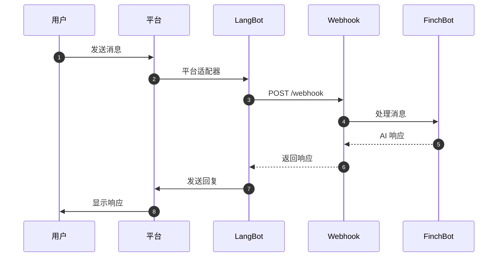

# 使用指南

FinchBot 提供了丰富的命令行界面（CLI）用于与 Agent 交互。本文档详细介绍所有可用命令和交互模式。

## 快速开始：五步上手

```bash
# 第一步：配置 API Key 和默认模型
uv run finchbot config

# 第二步：管理会话
uv run finchbot sessions

# 第三步：开始聊天
uv run finchbot chat

# 第四步：管理定时任务
uv run finchbot cron

# 第五步：启动 Webhook 服务器（用于 LangBot 集成）
uv run finchbot webhook --port 8000
```

这五个命令覆盖了 FinchBot 的核心工作流：



| 命令 | 功能 | 说明 |
| :--- | :--- | :--- |
| `finchbot config` | 交互式配置 | 配置 LLM 提供商、API Key、默认模型、网页搜索等 |
| `finchbot sessions` | 会话管理 | 全屏界面，创建、重命名、删除会话，查看历史 |
| `finchbot chat` | 开始对话 | 启动交互式聊天，自动加载上次活动会话 |
| `finchbot cron` | 定时任务 | 交互式管理定时任务，支持键盘导航 |
| `finchbot webhook` | Webhook 服务器 | 启动 FastAPI 服务器，用于 LangBot 集成 |

---

## 1. 启动与基本交互

### 1.1 CLI 界面

#### 启动 FinchBot

```bash
finchbot chat
```

或使用 `uv run`：

```bash
uv run finchbot chat
```

#### 指定会话

可以指定会话 ID 继续之前的对话或开始新会话：

```bash
finchbot chat --session "project-alpha"
```

#### 指定模型

```bash
finchbot chat --model "gpt-5"
```

---

## 2. 斜杠命令

在聊天界面中，以 `/` 开头的输入被视为特殊命令。

### `/history`

查看当前会话的历史消息。

- **功能**：显示会话开始以来的所有消息（用户、AI、工具调用）。
- **用途**：回顾上下文或检查消息索引（用于回滚）。

**示例输出**：

```
 Turn 1 

  你                          
 你好，请记住我的邮箱是 test@example.com


  FinchBot                     
 我已保存你的邮箱地址。

```

### `/rollback <index> [new_session_id]`

时光机：将对话状态回滚到指定消息索引。

- **参数**：
    - `<index>`：目标消息索引（通过 `/history` 查看）。
    - `[new_session_id]`（可选）：如果提供，将创建新的分支会话，保留原会话。如果不提供，则覆盖当前会话。
- **示例**：
    - `/rollback 5`：回滚到消息 5 之后的状态（删除所有索引 > 5 的消息）。
    - `/rollback 5 branch-b`：基于消息 5 的状态创建新会话 `branch-b`。

**使用场景**：
- 纠正错误方向：对话偏离时回滚
- 探索分支：创建新会话尝试不同的对话路径

### `/back <n>`

撤销最近 n 条消息。

- **参数**：
    - `<n>`：要撤销的消息数量。
- **示例**：
    - `/back 1`：撤销最后一条消息（适合纠正输入错误）。
    - `/back 2`：撤销最后一轮对话（用户提问 + AI 回复）。

---

## 3. 会话管理器

FinchBot 提供全屏交互式会话管理器。

### 进入管理器

直接运行 sessions 命令：

```bash
finchbot sessions
```

或在无历史会话时直接启动 `finchbot chat`。

### 操作按键

| 按键 | 操作 |
| :--- | :--- |
| ↑ / ↓ | 导航会话 |
| Enter | 进入选中会话 |
| r | 重命名选中会话 |
| d | 删除选中会话 |
| n | 创建新会话 |
| q | 退出管理器 |

### 会话信息显示

会话列表显示以下信息：

| 列 | 说明 |
| :--- | :--- |
| ID | 会话唯一标识 |
| Title | 会话标题（自动生成或手动设置） |
| Messages | 会话中消息总数 |
| Turns | 对话轮数 |
| Created | 会话创建时间 |
| Last Active | 最后交互时间 |

---

## 4. 配置管理器

FinchBot 提供交互式配置管理器。

### 进入配置管理器

```bash
finchbot config
```

这将启动交互式界面来配置：

### 配置选项

| 选项 | 说明 |
| :--- | :--- |
| 语言 | 界面语言（中文/英文） |
| LLM 提供商 | OpenAI、Anthropic、DeepSeek 等 |
| API Key | 各提供商的 API Key |
| API Base URL | 自定义 API 端点（可选） |
| 默认模型 | 默认使用的聊天模型 |
| 网页搜索 | Tavily / Brave Search API Key |

### 支持的 LLM 提供商

| 提供商 | 说明 |
| :--- | :--- |
| OpenAI | GPT-5、GPT-5.2、O3-mini |
| Anthropic | Claude Sonnet 4.5、Claude Opus 4.6 |
| DeepSeek | DeepSeek Chat、DeepSeek Reasoner |
| DashScope | 阿里云通义千问、QwQ |
| Groq | Llama 4 Scout/Maverick、Llama 3.3 |
| Moonshot | Kimi K1.5/K2.5 |
| OpenRouter | 多提供商网关 |
| Google Gemini | Gemini 2.5 Flash |

### 环境变量配置

也可以通过环境变量配置：

```bash
# OpenAI
export OPENAI_API_KEY="sk-..."
export OPENAI_API_BASE="https://api.openai.com/v1"  # 可选

# Anthropic
export ANTHROPIC_API_KEY="sk-ant-..."

# DeepSeek
export DEEPSEEK_API_KEY="sk-..."

# Tavily（网页搜索）
export TAVILY_API_KEY="tvly-..."
```

---

## 5. 模型管理

### 自动下载

FinchBot 采用**运行时自动下载**机制。

首次运行 `finchbot chat` 或其他需要嵌入模型的功能时，系统会自动检查模型。如果缺失，将从最佳镜像源自动下载到 `.models/fastembed/` 目录。

> **注意**：模型约 95MB。无需手动干预，首次启动时稍等片刻即可。

### 手动下载

如需提前下载模型（例如部署到离线环境前），可运行：

```bash
finchbot models download
```

系统会自动检测网络环境并选择最佳镜像源：
- 国内用户：使用 hf-mirror.com 镜像
- 国际用户：使用 Hugging Face 官方源

**模型信息**：
- 模型名称：`BAAI/bge-small-zh-v1.5`
- 用途：记忆系统的语义检索

---

## 6. 内置工具使用

FinchBot 包含 15 个内置工具，分为五大类：

```mermaid
flowchart TB
    classDef category fill:#e3f2fd,stroke:#1565c0,stroke-width:2px,color:#0d47a1;
    classDef tool fill:#e8f5e9,stroke:#2e7d32,stroke-width:2px,color:#1b5e20;

    subgraph Tools [15 个内置工具]
        File[文件操作]:::category
        Web[网络]:::category
        Memory[记忆]:::category
        System[系统]:::category
        Config[配置]:::category
    end

    File --> F1[read_file]:::tool
    File --> F2[write_file]:::tool
    File --> F3[edit_file]:::tool
    File --> F4[list_dir]:::tool

    Web --> W1[web_search]:::tool
    Web --> W2[web_extract]:::tool

    Memory --> M1[remember]:::tool
    Memory --> M2[recall]:::tool
    Memory --> M3[forget]:::tool

    System --> S1[exec]:::tool
    System --> S2[session_title]:::tool
    
    Config --> C1[configure_mcp]:::tool
    Config --> C2[refresh_capabilities]:::tool
    Config --> C3[get_capabilities]:::tool
    Config --> C4[get_mcp_config_path]:::tool
```



### 文件操作工具

| 工具 | 说明 | 使用场景 |
| :--- | :--- | :--- |
| `read_file` | 读取文件内容 | 查看代码、配置文件 |
| `write_file` | 写入文件（覆盖） | 创建新文件 |
| `edit_file` | 编辑文件（替换） | 修改现有文件的特定部分 |
| `list_dir` | 列出目录内容 | 探索项目结构 |

**最佳实践**：

```
1. 使用 list_dir 了解目录结构
2. 使用 read_file 查看文件内容
3. 根据需要使用 write_file 或 edit_file
```

### 网络工具

| 工具 | 说明 | 使用场景 |
| :--- | :--- | :--- |
| `web_search` | 搜索互联网 | 获取最新信息、验证事实 |
| `web_extract` | 提取网页内容 | 获取完整网页内容 |

**搜索引擎优先级**：
1. Tavily（质量最佳，专为 AI 优化）
2. Brave Search（免费额度大，隐私友好）
3. DuckDuckGo（无需 API Key，始终可用）

**最佳实践**：

```
1. 使用 web_search 查找相关 URL
2. 使用 web_extract 获取详细内容
```

### 记忆管理工具

| 工具 | 说明 | 使用场景 |
| :--- | :--- | :--- |
| `remember` | 保存记忆 | 记录用户信息、偏好 |
| `recall` | 检索记忆 | 回忆之前的信息 |
| `forget` | 删除记忆 | 清除过时或错误信息 |

#### 记忆分类

| 分类 | 说明 | 示例 |
| :--- | :--- | :--- |
| personal | 个人信息 | 姓名、年龄、地址 |
| preference | 用户偏好 | 喜好、习惯 |
| work | 工作相关 | 项目、任务、会议 |
| contact | 联系方式 | 邮箱、电话 |
| goal | 目标计划 | 愿望、计划 |
| schedule | 日程安排 | 时间、提醒 |
| general | 一般信息 | 其他信息 |

#### 检索策略（QueryType）

| 策略 | 权重 | 使用场景 |
| :--- | :--- | :--- |
| `factual` | 关键词 0.8 / 语义 0.2 | "我的邮箱是什么" |
| `conceptual` | 关键词 0.2 / 语义 0.8 | "我喜欢什么食物" |
| `complex` | 关键词 0.5 / 语义 0.5 | 复杂查询（默认） |
| `ambiguous` | 关键词 0.3 / 语义 0.7 | 歧义查询 |
| `keyword_only` | 关键词 1.0 / 语义 0.0 | 精确匹配 |
| `semantic_only` | 关键词 0.0 / 语义 1.0 | 语义探索 |

### 系统工具

| 工具 | 说明 | 使用场景 |
| :--- | :--- | :--- |
| `exec` | 执行 Shell 命令 | 批量操作、系统命令 |
| `session_title` | 管理会话标题 | 获取/设置会话标题 |

### 配置工具

| 工具 | 说明 | 使用场景 |
| :--- | :--- | :--- |
| `configure_mcp` | 动态配置 MCP 服务器 | 添加/删除/更新/启用/禁用 MCP 服务器 |
| `refresh_capabilities` | 刷新能力描述文件 | 更新 CAPABILITIES.md |
| `get_capabilities` | 获取当前能力描述 | 查看可用的 MCP 工具 |
| `get_mcp_config_path` | 获取 MCP 配置文件路径 | 查找配置文件位置 |

#### configure_mcp 操作

| Action | 说明 | 示例 |
| :--- | :--- | :--- |
| `add` | 添加新服务器 | `configure_mcp(action="add", server_name="github", command="mcp-github")` |
| `update` | 更新服务器 | `configure_mcp(action="update", server_name="github", env={"TOKEN": "xxx"})` |
| `remove` | 删除服务器 | `configure_mcp(action="remove", server_name="github")` |
| `enable` | 启用服务器 | `configure_mcp(action="enable", server_name="github")` |
| `disable` | 禁用服务器 | `configure_mcp(action="disable", server_name="github")` |
| `list` | 列出服务器 | `configure_mcp(action="list")` |

**最佳实践**：

```
1. 使用 get_capabilities 查看当前 MCP 工具
2. 使用 configure_mcp 添加新的 MCP 服务器
3. 使用 refresh_capabilities 更新能力描述
```

---

## 7. 定时任务管理

FinchBot 提供交互式的定时任务管理界面，支持**三种调度模式**和 **IANA 时区支持**。

### 三种调度模式

| 模式 | 参数 | 说明 | 使用场景 |
| :--- | :--- | :--- | :--- |
| **at** | `at="2025-01-15T10:30:00"` | 一次性任务，执行后自动删除 | 会议提醒、一次性通知 |
| **every** | `every_seconds=3600` | 间隔任务，每 N 秒执行一次 | 健康检查、定期同步 |
| **cron** | `cron_expr="0 9 * * *"` | Cron 表达式，精确时间调度 | 每日早报、工作日提醒 |

### 进入任务管理

```bash
finchbot cron
```

### 交互式界面

启动后将显示全屏任务管理界面：

| 按键 | 操作 | 说明 |
| :--- | :--- | :--- |
| ↑ / ↓ | 导航 | 在任务列表中移动 |
| Enter | 详情 | 查看任务详细信息 |
| n | 新建 | 创建新的定时任务 |
| d | 删除 | 删除选中的任务 |
| e | 切换 | 启用/禁用任务 |
| r | 运行 | 立即执行一次 |
| q | 退出 | 退出管理界面 |

### IANA 时区支持

支持 IANA 时区标识符，默认使用系统本地时区：

```python
# 创建带时区的定时任务
create_cron(
    name="纽约股市开盘提醒",
    message="美股即将开盘",
    cron_expr="0 9:30 * * 1-5",  # 工作日 9:30
    tz="America/New_York"        # 纽约时区
)
```

**常用时区**：

| 时区 | 标识符 |
| :--- | :--- |
| 北京时间 | `Asia/Shanghai` |
| 纽约时间 | `America/New_York` |
| 伦敦时间 | `Europe/London` |
| 东京时间 | `Asia/Tokyo` |
| 系统本地 | `local`（默认） |

### Cron 表达式

FinchBot 使用标准的 5 字段 Cron 表达式：`分 时 日 月 周`

| 字段 | 范围 | 说明 |
| :---: | :---: | :--- |
| 分钟 | 0-59 | 执行的分钟 |
| 小时 | 0-23 | 执行的小时 |
| 日期 | 1-31 | 月份中的日期 |
| 月份 | 1-12 | 月份 |
| 星期 | 0-6 | 星期几 (0=周日) |

**常用表达式示例**：

| 表达式 | 说明 |
| :--- | :--- |
| `0 9 * * *` | 每天上午 9:00 |
| `0 */2 * * *` | 每 2 小时 |
| `30 18 * * 1-5` | 工作日下午 6:30 |
| `0 0 1 * *` | 每月 1 日零点 |
| `0 9,18 * * *` | 每天 9:00 和 18:00 |

### 使用场景

定时任务功能适用于：

- **周期性提醒**：每天提醒查看邮件、每周提醒写周报
- **定时检查**：定期检查系统状态、监控任务进度
- **自动化任务**：定时执行数据备份、日志清理

### 示例

**模式 1: 一次性任务 (at)**

```
用户：明天上午 10 点提醒我参加会议

智能体：好的，我来创建一次性定时任务...
       [调用 create_cron 工具]
       ✅ 已创建定时任务 "会议提醒"
       执行时间：2025-01-15 10:00:00 (Asia/Shanghai)
       内容：参加会议
       说明：执行后自动删除
```

**模式 2: 间隔任务 (every)**

```
用户：每小时检查一次系统状态

智能体：好的，我来创建间隔任务...
       [调用 create_cron 工具]
       ✅ 已创建定时任务 "系统状态检查"
       执行间隔：每 3600 秒（1 小时）
       内容：检查系统状态
```

**模式 3: Cron 表达式 (cron)**

```
用户：每个工作日早上 9 点提醒我写日报

智能体：好的，我来创建 Cron 任务...
       [调用 create_cron 工具]
       ✅ 已创建定时任务 "晨间日报提醒"
       调度：工作日 09:00 (Asia/Shanghai)
       内容：请写今日日报
```

---

## 8. 后台任务（Subagent）

FinchBot 支持后台执行长时间任务，采用**独立 Agent 循环执行**机制：

### 核心特性

| 特性 | 说明 |
| :--- | :--- |
| **独立 Agent 循环** | 创建独立的 Agent 实例执行任务 |
| **最多 15 次迭代** | 防止无限循环，确保任务终止 |
| **结果通知** | 任务完成后通过 `on_notify` 回调通知主会话 |
| **非阻塞对话** | 用户可继续对话，任务在后台执行 |

### 工具链

| 工具 | 功能 |
| :--- | :--- |
| `start_background_task` | 启动后台任务（独立 Agent 循环，最多 15 次迭代） |
| `check_task_status` | 检查任务状态（包含迭代进度） |
| `get_task_result` | 获取任务结果 |
| `cancel_task` | 取消任务 |

### 任务状态

| 状态 | 说明 |
| :--- | :--- |
| `pending` | 等待执行 |
| `running` | 正在执行（显示迭代进度，如 5/15） |
| `completed` | 执行完成 |
| `failed` | 执行失败 |
| `cancelled` | 已取消 |

### 使用场景

- **长时间研究任务**：分析多个文档、搜索大量信息
- **批量数据处理**：处理大量文件或数据
- **复杂代码生成**：生成大量代码或配置

### 示例

```
用户：帮我分析这 100 个 GitHub 仓库

智能体：这是一个长时间任务，我将启动后台任务...
       [调用 start_background_task]
       ✅ 后台任务已启动 (ID: analysis-001)
       
       你可以继续对话，任务会在后台执行。
       完成后我会通知你结果。

用户：好的，那先帮我写一个简单的 Python 脚本

智能体：[正常响应用户请求]
       ...

[后台任务完成后]

智能体：🔔 后台任务完成！
       分析结果：已完成 100 个 GitHub 仓库的分析...
```

---

## 9. Bootstrap 文件系统

FinchBot 使用可编辑的 Bootstrap 文件系统来定义 Agent 行为。这些文件位于工作区的 `bootstrap/` 目录，可随时编辑。

### Bootstrap 文件

| 文件 | 路径 | 说明 |
| :--- | :--- | :--- |
| `SYSTEM.md` | `workspace/bootstrap/SYSTEM.md` | 系统提示词，定义 Agent 基本行为 |
| `MEMORY_GUIDE.md` | `workspace/bootstrap/MEMORY_GUIDE.md` | 记忆系统使用指南 |
| `SOUL.md` | `workspace/bootstrap/SOUL.md` | Agent 自我认知和性格特征 |
| `AGENT_CONFIG.md` | `workspace/bootstrap/AGENT_CONFIG.md` | Agent 配置（温度、最大令牌等） |

### 工作区目录结构

```
workspace/
├── bootstrap/           # Bootstrap 文件目录
│   ├── SYSTEM.md
│   ├── MEMORY_GUIDE.md
│   ├── SOUL.md
│   └── AGENT_CONFIG.md
├── config/              # 配置目录
│   └── mcp.json         # MCP 服务器配置
├── generated/           # 自动生成文件
│   ├── TOOLS.md         # 工具文档
│   └── CAPABILITIES.md  # 能力信息
├── skills/              # 自定义技能
├── memory/              # 记忆存储
└── sessions/            # 会话数据
```

### 编辑 Bootstrap 文件

可以直接编辑这些文件来自定义 Agent 行为：

```bash
# 查看当前工作区
finchbot chat --workspace "~/my-workspace"

# 编辑系统提示词
# 文件位置：~/my-workspace/bootstrap/SYSTEM.md
```

**示例 - 自定义 SYSTEM.md**：

```markdown
# FinchBot

你是一个专注于 Python 开发的专业代码助手。

## 角色
你是 FinchBot，一个专业的 Python 开发助手。

## 专长
- Python 3.13+ 新特性
- 异步编程（asyncio）
- 类型注解
- 测试驱动开发（TDD）
```

---

## 8. 全局选项

`finchbot` 命令支持以下全局选项：

| 选项 | 说明 |
| :--- | :--- |
| `--help` | 显示帮助信息 |
| `--version` | 显示版本号 |
| `-v` | 显示 INFO 及以上日志 |
| `-vv` | 显示 DEBUG 及以上日志（调试模式） |

**示例**：

```bash
# 显示 INFO 级别日志
finchbot chat -v

# 显示 DEBUG 级别日志，查看详细思考过程和网络请求
finchbot chat -vv
```

---

## 10. 命令参考

| 命令 | 说明 |
| :--- | :--- |
| `finchbot chat` | 启动交互式聊天会话 |
| `finchbot chat -s <id>` | 启动/继续指定会话 |
| `finchbot chat -m <model>` | 使用指定模型 |
| `finchbot chat -w <dir>` | 使用指定工作区 |
| `finchbot sessions` | 打开会话管理器 |
| `finchbot config` | 打开配置管理器 |
| `finchbot cron` | 打开定时任务管理器 |
| `finchbot webhook` | 启动 Webhook 服务器 |
| `finchbot webhook --port 9000` | 指定端口启动 Webhook |
| `finchbot models download` | 下载嵌入模型 |
| `finchbot version` | 显示版本信息 |

---

## 11. LangBot 集成

FinchBot 内置 FastAPI Webhook 服务器，可与 LangBot 平台集成，实现多平台消息支持。

### 快速开始

```bash
# 终端 1：启动 FinchBot Webhook 服务器
uv run finchbot webhook --port 8000

# 终端 2：启动 LangBot
uvx langbot

# 访问 LangBot WebUI http://localhost:5300
# 配置你的平台并设置 Webhook URL：
# http://localhost:8000/webhook
```

### Webhook 服务器选项

| 选项 | 说明 | 默认值 |
| :--- | :--- | :--- |
| `--host` | 监听地址 | `0.0.0.0` |
| `--port` | 监听端口 | `8000` |

### 支持的平台

通过 LangBot，FinchBot 支持 **12+ 平台**：

- QQ
- 微信 / 企业微信
- 飞书
- 钉钉
- Discord
- Telegram
- Slack
- LINE
- KOOK
- Satori

### 工作流程



### 配置说明

在 LangBot WebUI 中配置 Webhook：

1. 进入「平台配置」页面
2. 添加「Webhook」适配器
3. 设置 Webhook URL：`http://localhost:8000/webhook`
4. 保存配置并启用

更多详情请参阅 [LangBot 文档](https://docs.langbot.app)。

---

## 11. 聊天命令参考

| 命令 | 说明 |
| :--- | :--- |
| `/history` | 显示会话历史（含索引） |
| `/rollback <n>` | 回滚到消息 n |
| `/rollback <n> <new_id>` | 创建分支会话 |
| `/back <n>` | 撤销最近 n 条消息 |
| `exit` / `quit` / `q` | 退出聊天 |
